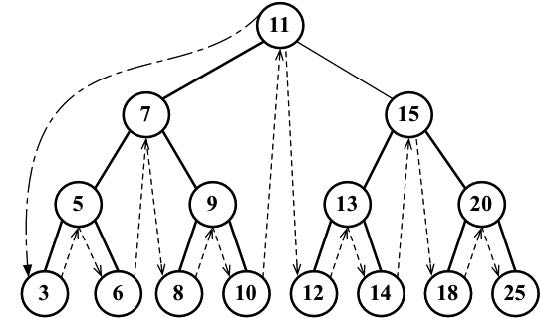
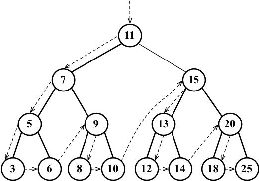
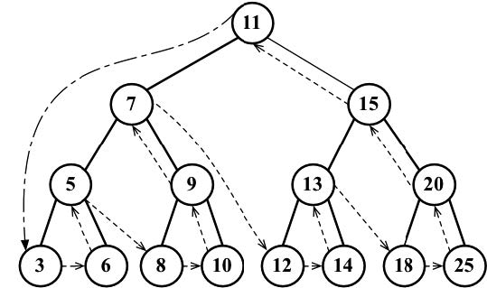
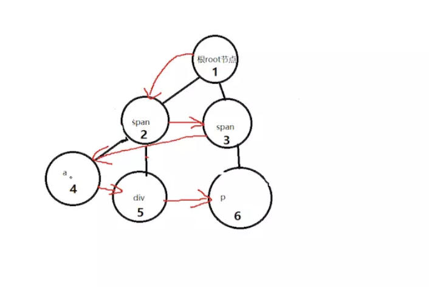

## 二叉树和二叉搜索树

> **二叉树**中的节点最多只能有两个子节点：一个是左侧子节点，另一个是右侧子节点。这些定
义有助于我们写出更高效的向/从树中插入、查找和删除节点的算法。二叉树在计算机科学中的
应用非常广泛。
**二叉搜索树（BST）是二叉树**的一种，但是它只允许你在左侧节点存储（比父节点）小的值，
在右侧节点存储（比父节点）大（或者等于）的值。上一节的图中就展现了一棵二叉搜索树。
### 几个概念
#### 深度优先遍历
##### 中序遍历

##### 先序遍历

##### 后序遍历

#### 广度优先遍历（层次遍历）


1. 第一步构建一个BinarySearchTree类
```
function BinarySearchTree(arr) {
    let root = null; // 根元素
    // 一个Node类来表示树中的每个节点
    let Node = function (key) {
        this.key = key;
        this.left = null;
        this.right = null;
    };
}
```
2. 第二步(实现一些方法)
- insert(key)：向树中插入一个新的键。

- inOrderTraverse：通过中序遍历方式遍历所有节点。
- preOrderTraverse：通过先序遍历方式遍历所有节点。
- postOrderTraverse：通过后序遍历方式遍历所有节点。
- min：返回树中最小的值/键。
- max：返回树中最大的值/键。
- search(key)：在树中查找一个键，如果节点存在，则返回true；如果不存在，则返回false。
- remove(key)：从树中移除某个键。
### insert
```
function BinarySearchTree(arr) {
    let root = null; // 根元素
    // 一个Node类来表示树中的每个节点
    let Node = function (key) {
        this.key = key;
        this.left = null;
        this.right = null;
    };
    // 向树中插入一个节点
    this.insert = function(key) {
        // 1.创建用来表示新节点的Node类实例
        var newNode = new Node(key);
        if (root == null) {
            root = newNode;
        } else {
            insertNode(root,newNode);
        }
    };
    // 一个私有的辅助函数,将节点加在非根节点的其他位置
    var insertNode = function(parentNode,newNode) {
        if (newNode.key < parentNode.key) {
            if (parentNode.left == null) {
                parentNode.left = newNode;
            } else {
                insertNode(parentNode.left,newNode)
            }
        } else { // 右侧节点存储（比父节点）大（或者等于）的值
            if (parentNode.right == null) {
                parentNode.right = newNode;
            } else {
                insertNode(parentNode.right,newNode)
            }
        }
    };
}
```
### inOrderTraverse和中序遍历
```
function BinarySearchTree(arr) {
    let root = null; // 根元素
    // 一个Node类来表示树中的每个节点
    let Node = function (key) {
        this.key = key;
        this.left = null;
        this.right = null;
    };
    // 向树中插入一个节点
    this.insert = function(key) {
        // 1.创建用来表示新节点的Node类实例
        var newNode = new Node(key);
        if (root == null) {
            root = newNode;
        } else {
            insertNode(root,newNode);
        }
    };
    // 一个私有的辅助函数,将节点加在非根节点的其他位置
    var insertNode = function(parentNode,newNode) {
        if (newNode.key < parentNode.key) {
            if (parentNode.left == null) {
                parentNode.left = newNode;
            } else {
                insertNode(parentNode.left,newNode)
            }
        } else { // 右侧节点存储（比父节点）大（或者等于）的值
            if (parentNode.right == null) {
                parentNode.right = newNode;
            } else {
                insertNode(parentNode.right,newNode)
            }
        }
    };
    // 中序遍历
    this.inOrderTraverse = function (callBack) {
        inOrderTraverseNode(root, callBack);
    };
    var inOrderTraverseNode = function(node,callBack) {
        if(!!node) {
            inOrderTraverseNode(node.left, callBack);
            callBack(node.key);
            inOrderTraverseNode(node.right, callBack);
        }
    }
}
function printNode(val) {
    console.log(val);
}
var tree  = new BinarySearchTree();
tree.insert(1);
tree.insert(2);
tree.insert(3);
tree.insert(6);
tree.insert(5);
tree.insert(3);
tree.insert(7);
tree.insert(8);
tree.insert(9);
tree.inOrderTraverse(printNode)
// 1 3 3....9
```
### 先序遍历
```
function BinarySearchTree(arr) {
    ...
    // 先序遍历
    this.preOrderTraverse = function (callBack) {
        preOrderTraverseNode(root, callBack);
    };
    var preOrderTraverseNode = function(node,callBack) {
        if(!!node) {
            callBack(node.key);
            preOrderTraverseNode(node.left, callBack);
            preOrderTraverseNode(node.right, callBack);
        }
    }
}
function printNode(val) {
    console.log(val);
}
...
```
### 后序遍历

```
function BinarySearchTree(arr) {
    ...
    // 后序遍历
    this.postOrderTraverse = function (callBack) {
        postOrderTraverseNode(root, callBack);
    };
    var postOrderTraverseNode = function(node,callBack) {
        if(!!node) {
            postOrderTraverseNode(node.left, callBack);
            postOrderTraverseNode(node.right, callBack);
            callBack(node.key);
        }
    }
    
}
function printNode(val) {
    console.log(val);
}
...
```
### 广度优先（层次遍历）
```
function BinarySearchTree(arr) {
    let root = null; // 根元素
    // 一个Node类来表示树中的每个节点
    let Node = function (key) {
        this.key = key;
        this.left = null;
        this.right = null;
    };
    // 向树中插入一个节点
    this.insert = function(key) {
        // 1.创建用来表示新节点的Node类实例
        var newNode = new Node(key);
        if (root == null) {
            root = newNode;
        } else {
            insertNode(root,newNode);
        }
    };
    // 一个私有的辅助函数,将节点加在非根节点的其他位置
    var insertNode = function(parentNode,newNode) {
        if (newNode.key < parentNode.key) {
            if (parentNode.left == null) {
                parentNode.left = newNode;
            } else {
                insertNode(parentNode.left,newNode)
            }
        } else { // 右侧节点存储（比父节点）大（或者等于）的值
            if (parentNode.right == null) {
                parentNode.right = newNode;
            } else {
                insertNode(parentNode.right,newNode)
            }
        }
    };
    // 中序遍历
    this.inOrderTraverse = function (callBack) {
        inOrderTraverseNode(root, callBack);
    };
    var inOrderTraverseNode = function(node,callBack) {
        if(!!node) {
            inOrderTraverseNode(node.left, callBack);
            callBack(node.key);
            inOrderTraverseNode(node.right, callBack);
        }
    }
    // 广度优先（层次遍历）
    this.wideTraversal = function(callBack) {
        wideTraversalNode(callBack)
    }
    var wideTraversalNode = function(callBack,stackNode = [root], count = 0){
        let node = stackNode[count]
        if (node) {
            callBack(node.key)
            if (node.left) {
                stackNode.push(node.left)
            }
            if (node.right) {
                stackNode.push(node.right)
            }
            count ++;
            wideTraversalNode(callBack,stackNode,count)
        }

    }
}

```
### 最小值和最大值
```
function BinarySearchTree(arr) {
    let root = null; // 根元素
    // 一个Node类来表示树中的每个节点
    let Node = function (key) {
        this.key = key;
        this.left = null;
        this.right = null;
    };
    // 向树中插入一个节点
    this.insert = function(key) {
        // 1.创建用来表示新节点的Node类实例
        var newNode = new Node(key);
        if (root == null) {
            root = newNode;
        } else {
            insertNode(root,newNode);
        }
    };
    // 一个私有的辅助函数,将节点加在非根节点的其他位置
    var insertNode = function(parentNode,newNode) {
        if (newNode.key < parentNode.key) {
            if (parentNode.left == null) {
                parentNode.left = newNode;
            } else {
                insertNode(parentNode.left,newNode)
            }
        } else { // 右侧节点存储（比父节点）大（或者等于）的值
            if (parentNode.right == null) {
                parentNode.right = newNode;
            } else {
                insertNode(parentNode.right,newNode)
            }
        }
    };
    // 中序遍历
    this.inOrderTraverse = function (callBack) {
        inOrderTraverseNode(root, callBack);
    };
    var inOrderTraverseNode = function(node,callBack) {
        if(!!node) {
            inOrderTraverseNode(node.left, callBack);
            callBack(node.key);
            inOrderTraverseNode(node.right, callBack);
        }
    }
    // 查找最小值
    this.min = function() {
        return minNode(root)
    }
    var minNode = function (node) {
        if (node) {
            while(node && node.left){
                node = node.left
            }
            return node.key
        }
        return null
    }
    // 查找最小值
    this.max = function() {
        return maxNode(root)
    }
    var maxNode = function (node) {
        if (node) {
            while(node && node.right){
                node = node.right
            }
            return node.key
        }
        return null
    }
}
function printNode(val) {
    console.log(val);
}
var tree  = new BinarySearchTree();
tree.insert(1);
tree.insert(2);
tree.insert(3);
tree.insert(6);
tree.insert(5);
tree.insert(3);
tree.insert(7);
tree.insert(8);
tree.insert(9);
tree.inOrderTraverse(printNode) //1 2 3 3...9
tree.min() // 1
tree.max() // 9
```
### 最难的删除值
```
function BinarySearchTree(arr) {
    let root = null; // 根元素
    // 一个Node类来表示树中的每个节点
    let Node = function (key) {
        this.key = key;
        this.left = null;
        this.right = null;
    };
    // 向树中插入一个节点
    this.insert = function(key) {
        // 1.创建用来表示新节点的Node类实例
        var newNode = new Node(key);
        if (root == null) {
            root = newNode;
        } else {
            insertNode(root,newNode);
        }
    };
    // 一个私有的辅助函数,将节点加在非根节点的其他位置
    var insertNode = function(parentNode,newNode) {
        if (newNode.key < parentNode.key) {
            if (parentNode.left == null) {
                parentNode.left = newNode;
            } else {
                insertNode(parentNode.left,newNode)
            }
        } else { // 右侧节点存储（比父节点）大（或者等于）的值
            if (parentNode.right == null) {
                parentNode.right = newNode;
            } else {
                insertNode(parentNode.right,newNode)
            }
        }
    };
    // 中序遍历
    this.inOrderTraverse = function (callBack) {
        inOrderTraverseNode(root, callBack);
    };
    var inOrderTraverseNode = function(node,callBack) {
        if(!!node) {
            inOrderTraverseNode(node.left, callBack);
            callBack(node.key);
            inOrderTraverseNode(node.right, callBack);
        }
    }
    // 查找最小值
    this.min = function() {
        return minNode(root)
    }
    var minNode = function (node) {
        if (node) {
            while(node && node.left){
                node = node.left
            }
            return node.key
        }
        return null
    }
    // 查找最小值
    this.max = function() {
        return maxNode(root)
    }
    var maxNode = function (node) {
        if (node) {
            while(node && node.right){
                node = node.right
            }
            return node.key
        }
        return null
    }
    // 广度优先（层次遍历）
    this.wideTraversal = function(callBack) {
        wideTraversalNode(callBack)
    }
    var wideTraversalNode = function(callBack,stackNode = [root], count = 0){
        let node = stackNode[count]
        if (node) {
            callBack(node.key)
            if (node.left) {
                stackNode.push(node.left)
            }
            if (node.right) {
                stackNode.push(node.right)
            }
            count ++;
            wideTraversalNode(callBack,stackNode,count)
        }
    };
    // 最难的：删除一个节点(关键是理解下面代码中所有返回node的作用)
    // 返回node的作用：当节点的值已经为null了，父节点指向它的指针也要接收到这个值(对应的父节点指针要赋予null值)，这也是我们要在函数中返回节点的值的原因。
    this.remove = function (key) {
        root = removeNode(root,key)
    };
    var removeNode = function(node, key) {
        if(node == null) {
            return null;
        }
        if(key < node.key){
            node.left = removeNode(node.left, key);
            return node;
        } else if (key > node.key) {
            node.right = removeNode(node.right, key);
            return node;
        } else { // 找到node
            // 第一种情况node是一个叶节点
            if (node.right == null && node.left == null) {
                node = null
                return node;
            } 
            // 第二种情况node只有一个叶节点
            if (node.left == null) {
                node = node.right
                return node
                
            } else if(node.right == null){
                node = node.left
                return node
            }
            // 第三种node有两个子节点
            var minNode = findMinNode(node)
            node.key = minNode.key
            node.right = removeNode(node.right, minNode.key);
            return node

        }
    };
    var findMinNode = function (node) {
        while(node.left && node.key !== null) {
            node = node.left;
        }
        return node
    }

}
function printNode(val) {
    console.log(val);
}
var tree  = new BinarySearchTree();
tree.insert(1);
tree.insert(2);
tree.insert(3);
tree.insert(6);
tree.insert(5);
tree.insert(3);
tree.insert(7);
tree.insert(8);
tree.insert(9);
tree.wideTraversal(printNode)
tree.remove(9)
tree.wideTraversal(printNode)
```