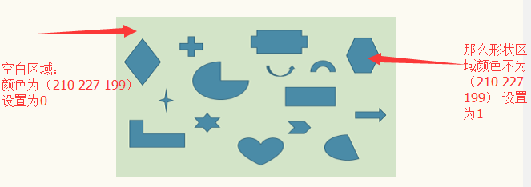

&emsp;[1. 程序求出物体的个数，以及每个不同物体的面积。](#h1)
&emsp;[2. canvas进阶之图片缩放、水印及放大镜](#h2)


<h1 id='h1'>1. 平面上有若干个不特定的形状，如下图所示。请写程序求出物体的个数，以及每个不同物体的面积？</h1>


### 分析
想要知道有多少个图形，想到的就是先获取图片中的每一个像素点然后判获取像素点的背景颜色（RGBA）。想要获得图片中的每一个像素点，那就可以联想到使用h5的canvas。
如下：

菜鸟教程中canvas的getimagedata方法

书写html标签。

```
<canvas id="canvas" height="200" width="350">对不你，你的浏览器不支持Canvas</canvas>
```

js获取canvas对象

```
let ctxt = canvas.getContext('2d');
```

js创建image对象

```
let img = new Image;
img.src = './image.png'; //图片路径
img.onload = function(){}  //加载成功后的执行函数，之后的代码就写在其中
```

创建存储图片像素点的二维数组

```
let coordinates = [];
for(let i=0; i<200; i++){
       coordinates[i] = [];
}
```


获取像素点，也就是使用getimagedata方法。

```
ctxt.drawImage(img, 0, 0);  //将图片画如canvas
let data = ctxt.getImageData(0, 0, 350, 200).data;//读取整张图片的像素。
```

将像素存入二维数组

```
let x=0,y=0;  //二维数组的行和列， x：列  y：行
for(let i =0,len = data.length; i<len;i+=4){
        let red = data[i],//红色色深
        green = data[i+1],//绿色色深
        blue = data[i+2],//蓝色色深
        alpha = data[i+3];//透明度
        //把每个像素点，以二位数组的形式展开
        if(`${red} ${green} ${blue}` === '210 227 199'){
            coordinates[y][x] = 0;
        }else{
            coordinates[y][x] = 1;
        }
        x++;
        if(x >= 350){
            x = 0;
            y++;
        }
}
```

目前代码如下：

```
(function(){
        let ctxt = canvas.getContext('2d');
        let img = new Image;
        let coordinates = [];
        let h = 200,
            w = 350;
        for(let i=0; i<200; i++){
            coordinates[i] = [];
        }
        img.src = './image.png'; //图片路径
        img.onload = function(){
            ctxt.drawImage(img, 0, 0);
            let data = ctxt.getImageData(0, 0, 350, 200).data;//读取整张图片的像素。
            let x=0,y=0;
            for(let i =0,len = data.length; i<len;i+=4){
                    let red = data[i],//红色色深
                    green = data[i+1],//绿色色深
                    blue = data[i+2],//蓝色色深
                    alpha = data[i+3];//透明度
                    //把每个像素点，以二位数组的形式展开
                    if(`${red} ${green} ${blue}` === '210 227 199'){
                        coordinates[y][x] = 0;
                    }else{
                        coordinates[y][x] = 1;
                    }
                    x++;
                    if(x >= 350){
                        x = 0;
                        y++;
                    }
                }
                console.log(coordinates);
        }
    })();
```

如图：




构成类似如下二维数组：

```
 0,0,0,0,0,0,0,0,0,0,0,0
 0,0,1,1,1,0,0,0,0,0,0,0
 0,1,1,1,1,0,0,0,0,0,0,0
 0,1,1,1,0,0,0,1,1,1,1,0
 0,0,0,0,0,0,1,1,1,0,0,0
 0,0,0,0,0,0,1,1,1,0,0,0
 0,0,0,0,0,0,0,0,0,0,0,0
```


那么我们就只需要知道二维数组中这种连续为1的块有多少个就知道了图片中形状有多少个，并且块中有多少个1，那么这个块的面积就是1的个数。

递归回溯算法

```
//计算连续的面积和个数
const linkSum = (i,j,num)=>{
        //走过的路就置0
      coordinates[i][j] = 0;
      num++;
      //向上
      if((i+1 < h) && coordinates[i+1][j] == 1){
        num = linkSum(i+1 , j , num);
      }
      //向下
      if((j+1 < w) && coordinates[i][j+1] == 1){
        num = linkSum(i , j+1 , num);
      }
      //向左
      if((i-1 >= 0) && coordinates[i-1][j] == 1){
        num = linkSum(i-1 , j , num);
      }
      //向右
    if((j-1 >= 0) && coordinates[i][j-1] == 1){
        num = linkSum(i , j-1 , num);
    }

    return num;
}
```

不熟悉的，直接百度就好，这里就不多说了，其实代码就反应了很多信息。

使用算法，统计并计算出结果。

```
const getCountAndArea = () =>{
    let sum = [];
    let count = 0;
    for(let i = 0; i < h; i++)  //遍历二维数组
    {
      for(let j = 0; j < w; j++)
      {
       //连续1的个数
       if(coordinates[i][j] == 1)
       {
        let buf = 0;  //连续1的个数
        buf = linkSum(i,j,buf);
        count++;  //形状的总数
        sum.push({
            index: count,   //第几个形状
            area: buf         //形状的面积
        });
       }
      }
    }
    return {
        count,
        sum
    };
}
```

最后的代码

```
(function(){
        let ctxt = canvas.getContext('2d');
        let img = new Image;
        let coordinates = [];
        let h = 200,
            w = 350;
        for(let i=0; i<200; i++){
            coordinates[i] = [];
        }
        img.src = './image.png'; //图片路径
        img.onload = function(){
            ctxt.drawImage(img, 0, 0);
            let data = ctxt.getImageData(0, 0, 350, 200).data;//读取整张图片的像素。
            let x=0,y=0;
            for(let i =0,len = data.length; i<len;i+=4){
                    let red = data[i],//红色色深
                    green = data[i+1],//绿色色深
                    blue = data[i+2],//蓝色色深
                    alpha = data[i+3];//透明度
                    //把每个像素点，以二位数组的形式展开
                    if(`${red} ${green} ${blue}` === '210 227 199'){
                        coordinates[y][x] = 0;
                    }else{
                        coordinates[y][x] = 1;
                    }
                    x++;
                    if(x >= 350){
                        x = 0;
                        y++;
                    }
                }
                // console.log(coordinates);
                let rst = getCountAndArea();
                // console.log(rst);
                console.log('个数： ' + rst.count);
                for(let i=0; i<rst.sum.length; i++){
                    console.log(`第${i+1}个面积为: ${rst.sum[i].area} px`);
                }
        }
    
        const getCountAndArea = () =>{
            let sum = [];
            let count = 0;
            for(let i = 0; i < h; i++)
            {
              for(let j = 0; j < w; j++)
              {
               //连续1的个数
               if(coordinates[i][j] == 1)
               {
                let buf = 0;
                buf = linkSum(i,j,buf);
                count++;
                sum.push({
                    index: count,
                    area: buf
                });
               }
              }
            }
            return {
                count,
                sum
            };
        }

        //计算连续的面积和个数
        const linkSum = (i,j,num)=>{
            //走过的路就置0
          coordinates[i][j] = 0;
          num++;
          //向上
          if((i+1 < h) && coordinates[i+1][j] == 1){
            num = linkSum(i+1 , j , num);
          }
          //向下
          if((j+1 < w) && coordinates[i][j+1] == 1){
            num = linkSum(i , j+1 , num);
          }
          //向左
          if((i-1 >= 0) && coordinates[i-1][j] == 1){
            num = linkSum(i-1 , j , num);
          }
          //向右
        if((j-1 >= 0) && coordinates[i][j-1] == 1){
            num = linkSum(i , j-1 , num);
        }

        return num;
        }
    })();
```

<h1 id='h2'>2. canvas进阶之图片缩放、水印及放大镜</h1>

#### 一、拖动滑竿实现图片缩放

要实现的效果：

效果一

HTML布局：

```
<canvas id="canvas" style="display:block;margin:0 auto;border:1px solid #aaa;">
您的浏览器尚不支持canvas
</canvas>

<input type="range" id="scale-range" min="0.5" max="3.0" step="0.01" value="1.0" style="display:block;margin:20px auto;width:800px"/>
```

```
<script>
    var canvas = document.getElementById("canvas")
    var context = canvas.getContext("2d")
    var slider = document.getElementById("scale-range")
    var image = new Image()

    window.onload = function(){

        canvas.width = 1152
        canvas.height = 768

        var scale = slider.value
        image.src = "img-lg.jpg"
        image.onload = function(){
            drawImageByScale( scale )

            // 鼠标移动，实时改变缩放的值
            slider.onmousemove = function(){
                scale = slider.value
                drawImageByScale( scale )
            }
        }
    }

    // 绘制裁切后的图片
    function drawImageByScale( scale ){

        var imageWidth = 1152 * scale
        var imageHeight = 768 * scale

        //context.drawImage( image , sx , sy , canvas.width , canvas.height , 0 , 0 , canvas.width , canvas.height ) 把裁切后的图片在canvas里绘制  前一部分是裁切图片，后一部分是把裁切后的图片在canvas里绘制
        x = canvas.width /2 - imageWidth / 2
        y = canvas.height / 2 - imageHeight / 2

        context.clearRect( 0 , 0 , canvas.width , canvas.height ) // 清除矩形
        context.drawImage( image , x , y , imageWidth , imageHeight ) // 把裁切后的图片在canvas内重新绘制
    }
</script>
```

#### 二、图片缩放+绘制水印
要实现的效果：

效果二

HTML布局：

```
<canvas id="canvas" style="display:block;margin:0 auto;border:1px solid #aaa;">
    您的浏览器尚不支持canvas
</canvas>
<input type="range" id="scale-range" min="0.5" max="3.0" step="0.01" value="1.0" style="display:block;margin:20px auto;width:800px"/>

<canvas id="watermark-canvas" style="display:none;margin:0 auto;border:1px solid #aaa;">
    您的浏览器尚不支持canvas
</canvas>
```

JS脚本：

```
<script>
    var canvas = document.getElementById("canvas")
    var context = canvas.getContext("2d")
    var slider = document.getElementById("scale-range")

    var watermarkCanvas = document.getElementById("watermark-canvas")
    var watermarkContext = watermarkCanvas.getContext("2d")

    window.onload = function(){

        canvas.width = 1152
        canvas.height = 768

        var image = new Image()
        var scale = 1.0
        image.src = "img-lg.jpg"
        image.onload = function(){
            drawImage( image , scale )

            slider.onmousemove = function(){  // 鼠标移动不断绘制  类似于window.resize()  touchMove drag
                scale = slider.value
                drawImage( image , scale )
            }
        }

        // 水印画布
        watermarkCanvas.width = 600
        watermarkCanvas.height = 100

        watermarkContext.font = "bold 50px Arial" // 设置字体
        watermarkContext.fillStyle = "rgba( 255 , 0 , 0 , 0.5 )"  // 填充rgba字体颜色
        watermarkContext.textBaseline = "middle"; // 文本对齐方式
        watermarkContext.fillText( "== 天涯客 ==" , 20 , 50 ) // 填充文本
    }

    // 绘制图片函数
    function drawImage( image , scale ){

        imageWidth = 1152 * scale
        imageHeight = 768 * scale
        x = canvas.width /2 - imageWidth / 2
        y = canvas.height / 2 - imageHeight / 2

        context.clearRect( 0 , 0 , canvas.width , canvas.height )
        context.drawImage( image , x , y , imageWidth , imageHeight )  // 绘制图片
        context.drawImage( watermarkCanvas , canvas.width - watermarkCanvas.width ,  // 绘制水印
                                              canvas.height - watermarkCanvas.height )
    }
</script>
```


#### 三、放大镜效果
要实现的效果：

效果三

HTML布局：

```
<canvas id="canvas" style="display:block;margin:0 auto;border:1px solid #aaa;">
    您的浏览器尚不支持canvas
</canvas>

<canvas id="offCanvas" style="display: none">
</canvas>
```
JS脚本：

```
<script>
    var canvas = document.getElementById("canvas")
    var context = canvas.getContext("2d")

    var offCanvas = document.getElementById("offCanvas")
    var offContext = offCanvas.getContext("2d")

    var image = new Image()
    var isMouseDown = false  // 鼠标是否按下的标识 
    var scale  

    window.onload = function(){

        canvas.width = 1152
        canvas.height = 768

        image.src = "img-lg.jpg"  
        image.onload = function(){
            offCanvas.width = image.width  // 原始图片的宽度 
            offCanvas.height = image.height // 原始图片的高度
            scale = offCanvas.width / canvas.width // 原始图片的宽度与canvas画布的宽度比

            context.drawImage( image , 0 , 0 , canvas.width , canvas.height ) // 绘制图片 设置宽高
            offContext.drawImage( image , 0 , 0 ) // 绘制图片 不设置宽 
        }
    }

    // 获取相对于canvas画布的x,y坐标
    function windowToCanvas( x , y ){
        var bbox = canvas.getBoundingClientRect()  // getBoundingClientRect()用来获取canvas这个矩形对象的属性 left,top, right, bottom, width, height
        return {x:x-bbox.left , y:y-bbox.top}
    }

    // 鼠标按下，进行放大绘制
    canvas.onmousedown = function(e){
        e.preventDefault()
        isMouseDown = true
        point = windowToCanvas( e.clientX , e.clientY )
        drawCanvasWithMagnifier( true , point )
    }

    // 鼠标抬起，停止放大绘制
    canvas.onmouseup = function(e){
        e.preventDefault()
        isMouseDown = false
        drawCanvasWithMagnifier( false )
    }

    // 鼠标离开，停止放大绘制
    canvas.onmouseout = function(e){
        e.preventDefault()
        isMouseDown = false
        drawCanvasWithMagnifier( false )
    }

    // 鼠标移动，实时的进行放大绘制
    canvas.onmousemove = function(e){
        e.preventDefault()
        if( isMouseDown == true ){
            point = windowToCanvas( e.clientX , e.clientY )
            drawCanvasWithMagnifier( true , point )
        }
    }

    // 用放大镜绘制
    function drawCanvasWithMagnifier( isShowMagnifier , point ){

        context.clearRect( 0 , 0 , canvas.width , canvas.height )
        context.drawImage( image , 0 , 0 , canvas.width , canvas.height )
        if( isShowMagnifier == true ){
            drawMagnifier( point )
        }
    }

    // 放大镜绘制函数
    function drawMagnifier( point ){

        var mr = 200  // 半径

        var imageLG_cx = point.x * scale  // 当前坐标点x放大scale倍
        var imageLG_cy = point.y * scale // 当前坐标点y放大scale倍

        var sx = imageLG_cx - mr  // 从sx坐标点，开始裁切x轴图片
        var sy = imageLG_cy - mr // 从sy坐标点，开始裁切y轴图片

        var dx = point.x - mr // 在canvas中绘制裁切后的图片，然后在x轴的dx坐标绘制
        var dy = point.y - mr // 在canvas中绘制裁切后的图片，然后在y轴的dy坐标绘制

        context.save()  // 保存以前的状态

        context.lineWidth = 10.0  // 描边宽度
        context.strokeStyle = "#069" // 描边颜色

        context.beginPath() // 开始路径
        context.arc( point.x , point.y , mr , 0 , Math.PI*2 , false )  // 绘制圆 arc(圆心坐标，半径，开始弧度，结束弧度，顺时针)
        context.stroke() // 描边
        context.clip() // 裁切圆形区域 
        context.drawImage( offCanvas , sx , sy , 2*mr , 2*mr , dx , dy , 2*mr , 2*mr ) // 在圆形区域内绘制放大后的区域图
        context.restore()  // 恢复到以前的状态
    }
</script>
```