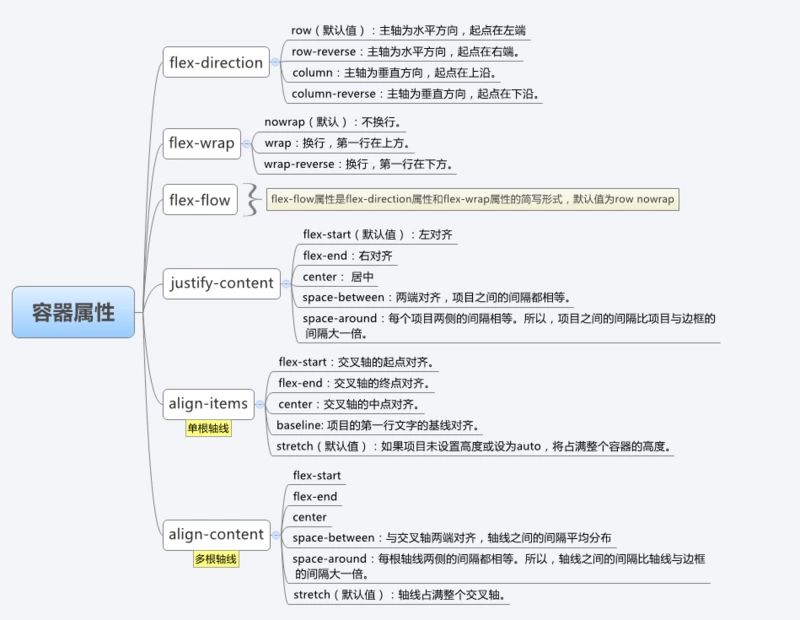
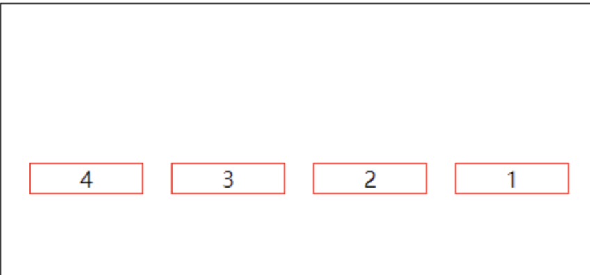
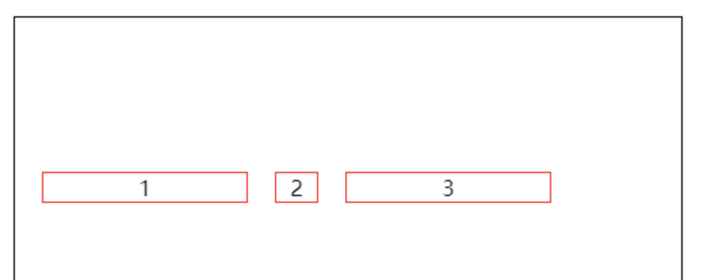
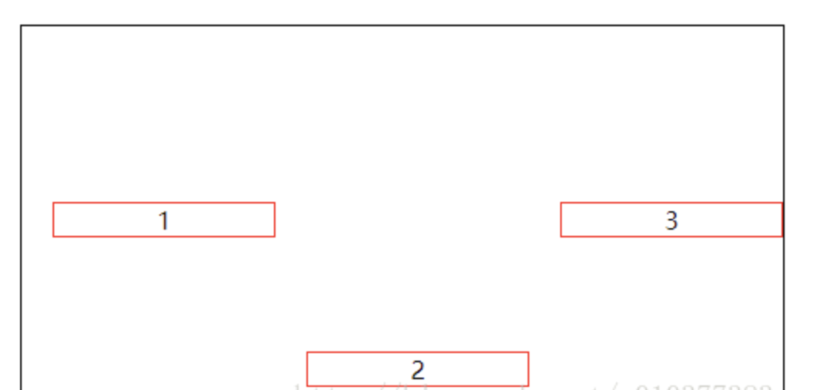

## 一、基本概念
- Flex 容器: 采用 Flex 布局的元素，称为 Flex 容器（flex container），简称"容器"。
- Flex 项目: 它的所有子元素自动成为容器成员，称为 Flex 项目（flex item），简称"项目"。


在 Flexbox 模型中，有三个核心概念：
– flex 项（注：也称 flex 子元素），需要布局的元素
– flex 容器，其包含 flex 项
– 排列方向（direction），这决定了 flex 项的布局方向
## 二、容器属性

### 2.1  flex-direction:
- row（默认值）：主轴为水平方向，起点在左端。
- row-reverse：主轴为水平方向，起点在右端。
- column：主轴为垂直方向，起点在上沿。
- column-reverse：主轴为垂直方向，起点在下沿
### 2.2   flex-wrap:
- nowrap（默认）：不换行。
- wrap：换行，第一行在上方。
- wrap-reverse：换行，第一行在下方。
 

### 2.3  justify-content:
- flex-start（默认值）：左对齐
- flex-end：右对齐
- center： 居中
- space-between：两端对齐，项目之间的间隔都相等。
- space-around：每个项目两侧的间隔相等。所以，项目之间的间隔比项目与边框的间隔大一倍。


### 2.4  align-items:
- flex-start：交叉轴的起点对齐。
- flex-end：交叉轴的终点对齐。
- center：交叉轴的中点对齐。
- baseline: 项目的第一行文字的基线对齐。
- stretch（默认值）：如果项目未设置高度或设为auto，将占满整个容器的高度。


### 2.5  align-content:
定义了多根轴线的对齐方式，如果项目只有一根轴线，那么该属性将不起作用

- flex-start：与交叉轴的起点对齐。
- flex-end：与交叉轴的终点对齐。
- center：与交叉轴的中点对齐。
- space-between：与交叉轴两端对齐，轴线之间的间隔平均分布。
- space-around：每根轴线两侧的间隔都相等。所以，轴线之间的间隔比轴线与边框的间隔大一倍。
- stretch（默认值）：轴线占满整个交叉轴。


## 结合 justify-content和align-items，看看在 flex-direction 两个不同属性值的作用下，轴心有什么不同：

##  三、项目属性

### 3.1 order属性
order属性定义项目的排列顺序。数值越小，排列越靠前，默认为0。
```
<style>
    div{
        display: flex;
        border: 1px solid #000;
        height: 250px;
        align-items: center;
    }
    p{
        border: 1px solid red;
        width: 80px;
        text-align: center;
        margin-left: 20px;
    }
    p:nth-child(1){
        order: 4;
    }
    p:nth-child(2){
        order: 3;
    }
    p:nth-child(4){
        order: -1; /** 设置为-1 **/
    }
</style>
<body>
<div>
    <p>1</p>
    <p>2</p>
    <p>3</p>
    <p>4</p>
</div>
</body>
</html>
```

### 3.2 flex-grow属性
> flex-grow属性定义项目的放大比例，默认为0，即如果存在剩余空间，也不放大。
例子

```
<style>
    div{
        display: flex;
        border: 1px solid #000;
        height: 250px;
        align-items: center;
    }
    p{
        border: 1px solid red;
        width: 80px;
        text-align: center;
        margin-left: 20px;
    }
    p:nth-child(1){
        flex-grow: 2;
    }
    p:nth-child(2){
        flex-grow: 1;
    }
    p:nth-child(3){
        flex-grow: 1;
        margin-right: 20px;
    }
</style>
<body>
<div>
    <p>1</p>
    <p>2</p>
    <p>3</p>
</div>
</body>
```

>如果所有项目的flex-grow属性都为1，则它们将等分剩余空间（如果有的话）。如果一个项目的flex-grow属性为2，其他项目都为1，则前者占据的剩余空间将比其他项多一倍。


### 3.3 flex-shrink属性
> flex-shrink属性定义了项目的缩小比例，默认为1，即如果空间不足，该项目将缩小。

例子
```
<style>
    div{
        display: flex;
        border: 1px solid #000;
        height: 250px;
        align-items: center;
    }
    p{
        border: 1px solid red;
        width: 150px;
        text-align: center;
        margin-left: 20px;
    }
    p:nth-child(1){
    }
    p:nth-child(2){
        flex-shrink: 0; /**设置为0**/
    }
    p:nth-child(3){
        margin-right: 20px;
    }
</style>
<body>
<div>
    <p>1</p>
    <p>2</p>
    <p>3</p>
</div>
</body>
```

> 如果所有项目的flex-shrink属性都为1，当空间不足时，都将等比例缩小。如果一个项目的flex-shrink属性为0，其他项目都为1，则空间不足时，前者不缩小。

### 3.4 Flex-basis属性
>flex-basis属性定义了在分配多余空间之前，项目占据的主轴空间（main size）。浏览器根据这个属性，计算主轴是否有多余空间。它的默认值为auto，即项目的本来大小。

例子
```
<style>
    div{
        display: flex;
        border: 1px solid #000;
        height: 250px;
        align-items: center;
    }
    p{
        border: 1px solid red;
        width: 150px;
        text-align: center;
        margin-left: 20px;
    }
    p:nth-child(2){
        flex-basis: 30px;
    }
</style>
<body>
<div>
    <p>1</p>
    <p>2</p>
    <p>3</p>
</div>
</body>
```

>它可以设为跟width或height属性一样的值（比如30px），则项目将占据固定空间。

### 3.5flex属性
> flex属性是flex-grow, flex-shrink 和 flex-basis的简写，默认值为0 1 auto。后两个属性可选。

```
p {
  flex: none | [ <'flex-grow'> <'flex-shrink'>? || <'flex-basis'> ]
}
```
该属性有两个快捷值：auto (1 1 auto) 和 none (0 0 auto)。

**建议优先使用这个属性，而不是单独写三个分离的属性，因为浏览器会推算相关值。**

## 3.6 align-self属性
> align-self属性允许单个项目有与其他项目不一样的对齐方式，可覆盖align-items属性。默认值为auto，表示继承父元素的align-items属性，如果没有父元素，则等同于stretch。

例子
```
<style>
    div{
        display: flex;
        border: 1px solid #000;
        height: 250px;
        align-items: center;
    }
    p{
        border: 1px solid red;
        width: 150px;
        text-align: center;
        margin-left: 20px;
    }
    p:nth-child(2){
        align-self: flex-end;
    }
</style>
<body>
<div>
    <p>1</p>
    <p>2</p>
    <p>3</p>
</div>
</body>
```


> 该属性可能取6个值，除了auto，其他都与align-items属性完全一致。 flex-start | flex-end | center | baseline | stretch;