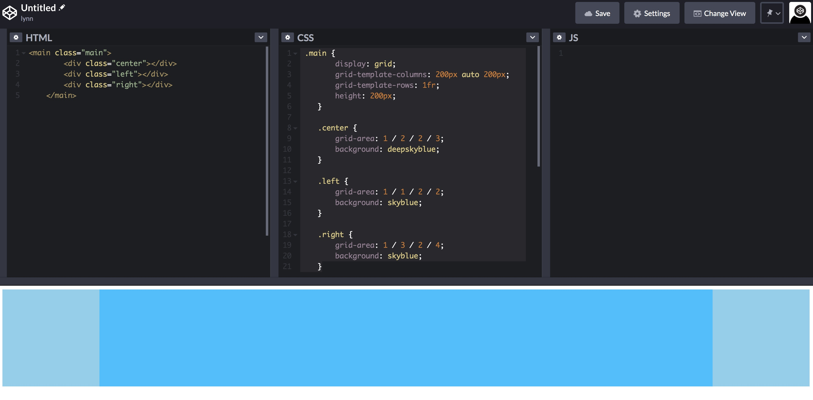

## 一.基本概念
[参考阮一峰](http://www.ruanyifeng.com/blog/2019/03/grid-layout-tutorial.html)
### 容器和项目
#### 容器属性
1. display 属性
    **display: grid指定一个容器采用网格布局。**
2. 
- grid-template-columns 属性，
- grid-template-rows 属性,
repeat(),auto-fill关键字,fr 关键字,minmax(),auto 关键字,网格线的名称
3.
- grid-row-gap 属性，
- grid-column-gap 属性，
- grid-gap 属性
4. grid-template-areas

5. grid-auto-flow

6. 
- justify-items 属性，
- align-items 属性，
- place-items 属性

7. 
- justify-content 属性，
- align-content 属性，
- place-content 属性

8. 
- grid-auto-columns 属性，
- grid-auto-rows 属性

9. 
- grid-template 属性，
- grid 属性

#### 项目属性
下面这些属性定义在项目上面。

1. 
- grid-column-start 属性，
- grid-column-end 属性，
- grid-row-start 属性，
- grid-row-end 属性

2. 
- grid-column 属性，
- grid-row 属性
**这两个属性之中，也可以使用span关键字，表示跨越多少个网格**

3. grid-area

4. 
- justify-self 属性，
- align-self 属性，
- place-self 属性

### 练习grid

> 1写一个左中右的满屏布局，左右固定220px,中间自适应并且要优先加载 ?

```
<main class="main">
    <div class="center"></div>
    <div class="left"></div>
    <div class="right"></div>
</main>
```
```
    .main {
        display: grid;
        grid-template-columns: 200px auto 200px; //auto 由浏览器自己决定长度。
        grid-template-rows: 1fr;
        height: 200px;
    }

    .center {
        grid-area: 1 / 2 / 2 / 3;
        background: deepskyblue;
    }

    .left {
        grid-area: 1 / 1 / 2 / 2;
        background: skyblue;
    }

    .right {
        grid-area: 1 / 3 / 2 / 4;
        background: skyblue;
    }

 ```

