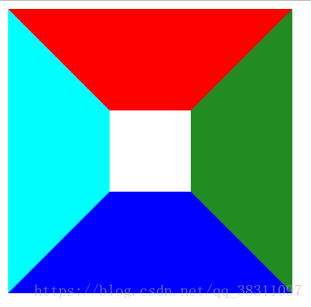
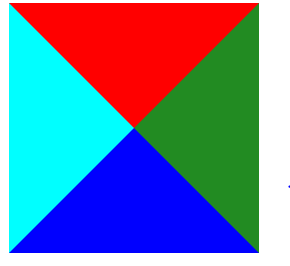
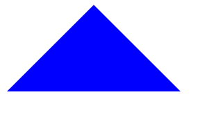

面试知识点 - css
===


## CSS
CSS 属于表示层，负责如何显示有关内容。

### CSS 学习推荐
* [《前端工程师手册》](https://leohxj.gitbooks.io/front-end-database/content/html-and-css-basic/index.html?tdsourcetag=s_pctim_aiomsg)
* [《CSS 权威指南》](https://baike.baidu.com/item/CSS%E6%9D%83%E5%A8%81%E6%8C%87%E5%8D%97/6229475?fr=aladdin)
* [《CSS 揭秘》](https://baike.baidu.com/item/CSS%E6%8F%AD%E7%A7%98)
* [《CSS 世界》](https://baike.baidu.com/item/CSS%E4%B8%96%E7%95%8C)
[CSS部分](#css)

&emsp;[1. css盒子模型，box-sizing属性的理解](#c1)

&emsp;[2. 清除浮动，什么时候需要清除浮动，清除浮动都有哪些方法](#c2)

&emsp;[3. 如何让一个不定宽高的盒子水平垂直居中](#c3)

&emsp;[4. px和em和rem的区别](#c4)

&emsp;[5. position的值有哪些](#c5)

&emsp;[6. display:none与visibility：hidden的区别](#c6)

&emsp;[7. CSS中link 和@import的区别](#c7)

&emsp;[8. 什么是响应式设计，响应式设计的基本原理是什么](#c8)

&emsp;[9. 为什么要初始化CSS样式](#c9)

&emsp;[10. CSS3有哪些新特性](#c10)

&emsp;[11. ::before 和 :after中双冒号和单冒号有什么区别？解释一下这2个伪元素的作用](#c11)

&emsp;[12. CSS优化、提高性能的方法有哪些](#c12)

&emsp;[13. 重绘和重排（回流）的理解](#c13)

&emsp;[14. flex布局css预处理器](#c14)

&emsp;[15. css预处理器](#c15)

&emsp;[16. css中可以让文字在垂直和水平方向上重叠的两个属性是什么？](#c16)

&emsp;[17.消除inline-block元素间隔](#c17)

&emsp;[18.绘制三角形](#c18)

&emsp;[19.选择器优先](#c19)

&emsp;[20.css伪类和伪元素](#c20)

&emsp;[21.脱离文档流的有哪些](#c21)

&emsp;[22.为何要清除浮动？如何清除？](#c22)

&emsp;[23.css哪些属性可以继承](#c23)

&emsp;[24.三栏布局（圣杯和双飞翼）和两栏布局](#c24)

&emsp;[25.:link、:hover、:active和:visited的区别？](#c25)

&emsp;[26.左中右的满屏布局，左右固定220px,中间自适应并且要优先加载](#c26)


### CSS

## <div id='c1'>1. css盒子模型，box-sizing属性的理解</div>
[IE盒模型和标准盒模型的区别](https://www.jianshu.com/p/cc2bc404269b)
css的盒模型由content(内容)、padding(内边距)、border(边框)、margin(外边距)组成。但盒子的大小由content+padding+border这几部分决定
先说重要的区别：
>两者的区别在于content的不同，IE盒模型的content包括border、padding
即IE的border,padding改变实际大小（width,height）不变。但是标准的会变


box-sizing是一个CSS3属性，与盒子模型有着密切联系。即决定元素的宽高如何计算，box-sizing有三个属性：
```css
box-sizing: content-box|border-box|inherit:
```
- content-box 使得元素的宽高即为内容区的宽高(默认模式)
- border-box: 计算方式content + padding + border = 本身元素大小，即缩小了content大小
- inherit 指定box-sizing属性的值，应该从父元素继承

## <div id='c2'>2. 清除浮动，什么时候需要清除浮动，清除浮动都有哪些方法</div>

浮动的元素是脱离文档标准流的，如果我们不清楚浮动，那么就会造成**父元素高度塌陷**，影响页面布局。

清除浮动的方式：
- 为父元素设置高度
- 为父元素添加`overflow:hidden`
- 伪元素
```css
.fix::after {
     content:"";
     display:block;
     clear:both;
}
```
使用伪元素的好处：不增加冗余的DOM节点，符合语义化

> overflow:hidden可以触发BFC机制。BFC：块级格式化上下文，创建了 BFC的元素就是一个独立的盒子，它规定了内部如何布局，并且与这个独立盒子里的布局不受外部影响，当然它也不会影响到外面的元素，**计算BFC的高度时，浮动元素也参与计算**


## <div id='c3'>3. 如何让一个不定宽高的盒子水平垂直居中</div>

> 定位的方式

```css
.father {
    position: relative;
}
.son {
    position: absolute;
    top: 0;
    right: 0;
    bottom: 0;
    left: 0;
    margin: auto;
}
```
> css3属性

```css
.father {
    position: relative;
}
.son {
    position: absolute;
    top: 50%;
    left: 50%;
    transform: translate(-50%, -50%);
}
```
> flex布局

```css
.father {
    display: flex;
    justify-content: center;
    align-items: center;
}
```

## <div id='c4'>4. px和em和rem的区别</div>

> `px`: 像素，相对长度单位。像素`px`是相对于显示器屏幕分辨率而言的

> `em`的值并不是固定的，会继承父级元素的字体大小，代表倍数

> `rem`的值并不是固定的，始终是基于根元素 `<html>` 的，也代表倍数

## <div id='c5'>5. position的值有哪些</div>

> static： 默认值。没有定位，元素出现在正常的流中

> relative（相对定位）：生成相对定位的元素,相对于其正常（原先本身）位置进行定位

> absolute（绝对定位）：生成绝对定位的元素，相对于static定位以外的第一个父元素进行定位

> fixed（固定定位）：生成绝对定位的元素，相对于浏览器窗口进行定位

## <div id='c6'>6. display:none与visibility：hidden的区别</div>

区别 | display:none | visibility：hidden的
---|---|---
是否占据空间 | 不占据任何空间，在文档渲染时，该元素如同不存在（但依然存在文档对象模型树中）| 该元素空间依旧存在
是否渲染 | 会触发reflow（回流），进行渲染 | 只会触发repaint（重绘），因为没有发现位置变化，不进行渲染
是否是继承属性 | 不是继承属性，元素及其子元素都会消失 | 是继承属性，若子元素使用了visibility:visible，则不继承，这个子孙元素又会显现出

## <div id='c7'>7. CSS中link 和@import的区别</div>

> link属于XHTML标签，@import完全是CSS提供的一种方式,只能加载CSS

> 加载顺序的差别，当一个页面被加载的时候，link引用的CSS会同时被加载，而@import引用的CSS 会等到页面全部被下载完再被加载

> 兼容性的差别。由于@import是CSS2.1提出的所以老的浏览器不支持，而link标签无此问题

> 当使用javascript控制dom去改变样式的时候，只能使用link标签，因为@import不是dom可以控制的

## <div id='c8'>8. 什么是响应式设计，响应式设计的基本原理是什么</div>

> 响应式网站设计是一个网站能够兼容多个终端，而不是为每一个终端做一个特定的版本。基本原理是通过媒体查询检测不同的设备屏幕尺寸做处理

## <div id='c9'>9. 为什么要初始化CSS样式</div>

> 因为浏览器的兼容问题，不同浏览器对有些标签的默认值是不同的，如果没对 CSS 初始化往往会出现浏览器之间的页面显示差异

> 初始化样式会对 SEO 有一定的影响

## <div id='c10'>10. CSS3有哪些新特性</div>

- 实现圆角`border-radius`，阴影`box-shadow`，边框图片`border-image`
- 对文字加特效`text-shadow`，强制文本换行`word-wrap`，线性渐变`linear-gradient`
- 实现旋转`transform:rotate(90deg)`,缩放`scale(0.85,0.90)`,`translate(0px,-30px)`定位,倾斜`skew(-9deg,0deg)`;
- 增加了更多的CSS选择器、多背景、`rgba()`
- 唯一引入的伪元素是`::selection`；
- 实现媒体查询`@media`，多栏布局`flex`
- 过渡`transition` 动画`animation`

1）边框：

border-radius：圆角边框，border-radius:25px;
box-shadow：边框阴影，box-shadow: 10px 10px 5px #888888;
border-image：边框图片，border-image:url(border.png) 30 30 round;
（2）背景：

background-size：规定背景图片的尺寸，background-size:63px 100px;
background-origin：规定背景图片的定位区域，背景图片可以放置于 content-box、padding-box 或 border-box 区域。background-origin:content-box;
CSS3 允许您为元素使用多个背景图像。background-image:url(bg_flower.gif),url(bg_flower_2.gif);
（3）文本效果：

text-shadow：向文本应用阴影，可以规定水平阴影、垂直阴影、模糊距离，以及阴影的颜色。text-shadow: 5px 5px 5px #FF0000;
word-wrap：允许文本进行换行。word-wrap:break-word;
（4）字体：CSS3 @font-face 规则可以自定义字体。

（5）2D 转换（transform）

translate()：元素从其当前位置移动，根据给定的 left（x 坐标） 和 top（y 坐标） 位置参数。 transform: translate(50px,100px);
rotate()：元素顺时针旋转给定的角度。允许负值，元素将逆时针旋转。transform: rotate(30deg);
scale()：元素的尺寸会增加或减少，根据给定的宽度（X 轴）和高度（Y 轴）参数。transform: scale(2,4);
skew()：元素翻转给定的角度，根据给定的水平线（X 轴）和垂直线（Y 轴）参数。transform: skew(30deg,20deg);
matrix()： 把所有 2D 转换方法组合在一起，需要六个参数，包含数学函数，允许您：旋转、缩放、移动以及倾斜元素。transform:matrix(0.866,0.5,-0.5,0.866,0,0);
（6）3D 转换

rotateX()：元素围绕其 X 轴以给定的度数进行旋转。transform: rotateX(120deg);
rotateY()：元素围绕其 Y 轴以给定的度数进行旋转。transform: rotateY(130deg);
（7）transition：过渡效果，使页面变化更平滑

transition-property ：执行动画对应的属性，例如 color，background 等，可以使用 all 来指定所有的属性。
transition-duration：过渡动画的一个持续时间。
transition-timing-function：在延续时间段，动画变化的速率，常见的有：ease | linear | ease-in | ease-out | ease-in-out | cubic-bezier 。
transition-delay：延迟多久后开始动画。
简写为：transition: [<transition-property> || <transition-duration> || <transition-timing-function> || <transition-delay>];

（8）animation：动画

使用CSS3 @keyframes 规则。

animation-name: 定义动画名称
animation-duration: 指定元素播放动画所持续的时间长
animation-timing-function:ease | linear | ease-in | ease-out | ease-in-out | cubic-bezier(<number>, <number>, <number>, <number>)： 指元素根据时间的推进来改变属性值的变换速率，说得简单点就是动画的播放方式。
animation-delay: 指定元素动画开始时间
animation-iteration-count:infinite | <number>：指定元素播放动画的循环次
animation-direction: normal | alternate： 指定元素动画播放的方向，其只有两个值，默认值为normal，如果设置为normal时，动画的每次循环都是向前播放；另一个值是alternate，他的作用是，动画播放在第偶数次向前播放，第奇数次向反方向播放。
animation-play-state:running | paused ：控制元素动画的播放状态。
简写为： animation:[<animation-name> || <animation-duration> || <animation-timing-function> || <animation-delay> || <animation-iteration-count> || <animation-direction>]

## <div id='c11'>11. ::before 和 :after中双冒号和单冒号有什么区别？解释一下这2个伪元素的作用</div>

> 单冒号(:)用于CSS3伪类，双冒号(::)用于CSS3伪元素。（伪元素由双冒号和伪元素名称组成）,双冒号是在当前规范中引入的，用于区分伪类和伪元素

## <div id='c12'>12. CSS优化、提高性能的方法有哪些</div>

- 移除空的css规则（Remove empty rules）
- 正确使用display的属性
- 不滥用浮动、web字体
- 不声明过多的font-size
- 不在选择符中使用ID标识符
- 遵守盒模型规则
- 尽量减少页面重排、重绘
- 抽象提取公共样式，减少代码量

## <div id='c13'>13. 重绘和重排（回流）的理解</div>
1. 重绘（repaint或redraw）：
重绘是指当 DOM 元素的属性发生变化 (如 color) 时, 浏览器会通知render 重新描绘相应的元素, 此过程称为重绘。
2. 重排：
重排是指某些元素变化涉及元素布局 (如width), 浏览器则抛弃原有属性, 重新计算，此过程称为重排。（重排一定会重绘，重绘不一定重排）
3. 回流（reflow）：
重排好的结果，传递给render以重新描绘页面元素, 此过程称为回流
[重绘和重排（回流）的理解](https://www.cnblogs.com/yxkNotes/p/12718693.html)

## <div id='c14'>14. flex布局</div>

[flex布局教程--阮一峰](http://www.ruanyifeng.com/blog/2015/07/flex-grammar.html)

## <div id='c15'>15. css预处理器</div>

提供了一种css的书写方式，常见的就是 [SAAS文档](http://sass.bootcss.com/docs/sass-reference/) 和 [LESS文档](https://less.bootcss.com/)

## <div id='c16'>16. css中可以让文字在垂直和水平方向上重叠的两个属性是什么？</div>
```
垂直方向：line-height
水平方向：letter-spacing
```
那么问题来了，关于letter-spacing的妙用知道有哪些么？
答案:可以用于消除inline-block元素间的换行符空格间隙问题
## <div id='c17'>17.消除inline-block元素间隔</div>
父元素 设置font-size：0 ；letter-spacing：-3px ，子元素重新设置font-size，letter-spacing: 0;

## <div id='c18'>18.绘制三角形</div>
首先先做一个测试深入理解一下盒子模型，主要体会一下height和border-width的用法：
```
  \#div1{
      height: 80px;
      border-style: solid;
      border-width: 100px 100px 100px 100px;
      border-color: red forestgreen blue cyan;
      width: 80px;
  }
```
```
\<body>
  ## <div id="div1">
      
  </div>
\</body>
```

最后结果为：

<br>


其中，红色的块儿代表是上边框宽度，右边的块儿代表右边框宽度，以此类推，发现几个边距的宽度而言，他们之间的分界恰好是这个正方形的对角线所在的直线，如果里面的小盒子宽高无穷小，那么这个图形将是一个由四块不同颜色三角形拼接而成的图形，因此可以利用这个性质进行绘制三角形。若height:0;width:0;得到下面的图形：
<br>


如果我们想要得到一个上三角，那么根据刚刚的原理，只要将上边框、左右边框设置为隐藏，即可实现一个上三角。
```
border-color: transparent transparent blue transparent;
```
但是有个问题，这里这个三角距离上面总是有100px的边距，是因为隐藏的边框依然占位，所以直接将上边框去掉就好了
</br>



所以实现三角形

- 第一步：新建一个div。
```
<div class="kailong"></div>
```
- 第二步：为盒子添加样式。
1.向上
```
.kailong{
	width:0;
    height:0;
	border-right:50px solid transparent;
	border-left:50px solid transparent;
	border-bottom:50px solid red;
}
```
2.向下
```
.kailong{
	width:0;
	height:0;
	border-right:50px solid transparent;
	border-left:50px solid transparent;
	border-top:50px solid red;
}
```

3.向左
```
.kailong{
    width:0;
    height:0;
    border-top:50px solid transparent;
    border-bottom:50px solid transparent;
    border-right:50px solid red;
}
```

4.向右
```
.kailong{
    width:0;
    height:0;
    border-top:50px solid transparent;
    border-bottom:50px solid transparent;
    border-left:50px solid red;
}
```
## <div id='c19'>19.选择器优先级</div>

!important > 内联样式 > ID选择器 > 类选择器 = 属性选择器 = 伪类选择器 > 元素选择器 = 关系选择器 = 伪元素选择器 > 通配符选择器

<h2 id='c20'>20.css伪类和伪元素</h2>

#### css伪类
css伪类本质上是为了弥补常规CSS选择器的不足，以便获取到更多信息
```
:link, :visited, :hover, :focus, :active, :first-child, :lang
- css3新增的伪类：
:last-child, :only-child, :first-of-type, :last-of-type, :only-of-type, :nth-child(n), :nth-last-child(n), :nth-of-type(n), :nth-last-of-type(n), :root, :empty, :target, :enabled, :disabled, :checked, :not(selector),
```
#### css伪元素
css伪元素本质上是创建了一个有内容的虚拟容器。
```
::first-letter, ::first-line, ::before, ::after
css3新增的伪元素
::selection
```
#### 总结
1. 伪类本质上是为了弥补常规CSS选择器的不足，以便获取到更多信息；
2. 伪元素本质上是创建了一个有内容的虚拟容器；
3. CSS3中伪类和伪元素的语法不同；
4. 可以同时使用多个伪类，而只能同时使用一个伪元素；
#### css伪类和伪元素的区别
- 为了避免大家混淆伪类和伪元素，css3中的标准规定伪类使用单冒号“:” ，伪元素使用双冒号“::”，但在此之前都使用的单冒号“:”，所以为了保证兼容伪元素两种使用方法都是可以的。
- 伪类可以叠加使用，而伪元素在一个选择器中只能出现一次，并且只能出现在末尾。
.box:first-child:hover { color: #000;}   //使用伪类
.box:first-letter { color: #000;}   //使用伪元素
.box:first-letter:hover { color: #000;}   //错误写法
- 伪类与类优先级相同，伪元素与标签优先级相同。顺便说一下优先级怎么判断，

一般是 !important > 行内样式> ID选择器 > 类选择器 > 标签 > 通配符 > 继承 > 浏览器默认属性。还有一个简单的计算方法，内联样式表的权值为 1000，ID 选择器的权值为 100，Class 类选择器的权值为 10，HTML 标签选择器的权值为 1，权值实际并不是按十进制计算的，用数字表示只是说明思想，我们可以把选择器中规则对应做加法，比较权值大小，权值越大优先级越高，如果权值相同前面的样式会被后面的覆盖。

<h2 id='c21'>21.脱离文档流的有哪些</h2>
- 浮动

- 绝对定位

- 固定定位

> 元素脱离文档流会导致父元素高度塌陷，要修复高度塌陷问题，可以将子元素与父元素放在同一个BFC中

<h2 id='c22'>22.为何要清除浮动？如何清除？</h2>
原因：
> 元素设置了float属性后，就会脱离文档流，当 包含框 的高度小于 浮动框 的时候，会出现高度塌陷。因此才需要清除浮动！

清除浮动方法：
1：给 包含框 添加 after伪元素清除浮动。代码：
```
.clearfix:after{
    display: block;
    content:'';
    clear: both;
    height:0;
}
```
2：使用BFC， 原理：让浮动块包含在同一个BFC中。

给 包含框 加一个overflow：hidden就可以了；代码：

```
.container{
    overflow: hidden;   
}

.container div{
    float: left;
}
```
3:  在 浮动元素 的最后面添加一个新元素，应用clear:both.
```
<div class="box">
  <div style="float:left;width:100px;height:100px;"></div>
  <div style="float:right;width:100px;height:100px;"></div>
  <div class="clearfix"></div>
</div>

<style>
.clearfix{
    clear:both;
}
</style>
```
这种方法不太好，使margin实效了，并且增加了一个无用的element

<h2 id='c23'>23.css哪些属性可以继承</h2>

字体相关：line-height, font-family, font-size, font-style, font-variant, font-weight, font
文本相关： letter-spacing, text-align, text-indent, text-transform, word-spacing
列表相关：list-style-image, list-style-position, list-style-type, list-style
颜色：color

<h2 id='c24'>24.三栏布局（圣杯和双飞翼）和两栏布局</h2>

### 一、两栏布局
左边固定长度，右边自适应

#### 1. 浮动布局 + BFC
```
<div class="contain">
  <div class="left">左</div>
  <div class="right">右</div>
</div>
.left{
  float:left;
  border:2px solid red;
  width:100px;
}
.right{
  border:2px solid black;
  display:flow-root
}
```
#### 2. 浮动布局 / 绝对定位 + 外边距
```
<div class="contain">
  <div class="left">左</div>
  <div class="right">右</div>
</div>
.left{
  float:left;/* position:absolute; */
  border:2px solid red;
  width:100px;
}
.right{
  border:2px solid black;
  margin-left:100px;
}
```
#### 3. 使用Flexbox
```
.contain{
  display:flex;
  flex-direction:row;
}
.left{
  border:2px solid red;
  width:100px;
}
.right{
  border:2px solid black;
  flex:1;  
}
```
### 二、三栏布局
两边固定长度，中间自适应

#### 1. 浮动布局 + BFC
```
<div class="contain">
  <div class="left">左</div>
  <div class="right">右</div>
  <div class="center">中</div>
</div>
.left{
  border:2px solid red;
  width:100px;
  float:left;
}
.center{
  border:2px solid black;
  display:flow-root;
}
.right{
  border:2px solid red;
  width:100px;
  float:right;
}
```
#### 2. 浮动布局 / 绝对定位 + 外边距
```
<div class="contain">
  <div class="left">左</div>
  <div class="right">右</div>
  <div class="center">中</div>
</div>
.left{
  border:2px solid red;
  width:100px;
  float:left;
}
.center{
  border:2px solid black;
  margin:0 100px
}
.right{
  border:2px solid red;
  width:100px;
  float:right;
}
```
#### 3. 使用Flexbox
```
<div class="contain">
  <div class="left">左</div>
  <div class="center">中</div>
  <div class="right">右</div>
</div>
.contain{
  display:flex;
}
.left{
  border:2px solid red;
  width:100px;
}
.center{
  border:2px solid black;
  flex:1
}
.right{
  border:2px solid red;
  width:100px;
}
```
#### 圣杯布局
```
<!DOCTYPE html>
<html lang="en">
  <head>
    <title></title>
    <meta charset="UTF-8" />
    <style>
      .container {
        padding: 0 100px 0 200px;
      }
      .left {
        width: 200px;
        background: red;
        /* 关键点：-100%表示向左移动他的父元素content的宽度，这一行不能容纳，于是就**移动到了上一行**，刚好middle的左边界与left的左边界重合*/
        margin-left: -100%; 
        left: -200px;
      }
      .right {
        width: 100px;
        background: blue;

        margin-left: -100px;
        right: -100px;
      }
      .main {
        background: yellow;
        width: 100%;
      }
      .left, .main, .right{
        float: left;
        min-height: 200px;
        position: relative;
      }

    </style>
  </head>
  <body>
    <div class="container">
      <div class="main">main</div>
      <div class="left">left</div>
      <div class="right">right</div>
    </div>
  </body>
</html>
```
#### 双飞翼布局
中间的 div 外层用另一个 div 包裹了一下，然后被包裹用 margin 来把自己挤到中间
```
<!DOCTYPE html>
<html>
<head>
    <meta charset="utf-8">
    <title>实现三栏水平布局之双飞翼布局</title>
    <style type="text/css">
    .left, .main, .right {
        float: left;
        min-height: 130px;
        text-align: center;
    }
    .left {
        margin-left: -100%;
        background: green;
        width: 200px;
    }
    .right {
        margin-left: -300px;
        background-color: red;
        width: 300px;
    }
    .main {
        background-color: blue;
        width: 100%;
    }
    .content{
      /* 关键点：用margin把div挤到中间正常展示*/
        margin: 0 300px 0 200px;
    }
    </style>
</head>
<body>
<div class="container"> 
　   <div class="main">
    　　 <div class="content">main</div> 
       </div>
　　<div class="left">left</div> 
　　<div class="right">right</div> 
</div>
</body>
</html>
```
#### 二者异同
> 圣杯布局与双飞翼布局实现的效果是一样的，即：
两边宽度不变，中间的部分会随浏览器窗口大小而改变。

##### 相同点
- middle中的三个div都用了浮动。
- 都利用负的margin-left把三个div放在一行。
- middle的宽度设置为100%。
（处理遮挡文字以上的部分都相同）
##### 不同点

- 圣杯布局为middle添加padding，将middle往中间缩，然后用position来处理两边的位置。
- 双飞翼布局是在middle里又加了一个inner，然后为inner添加padding。

<h2 id='c25'>25.:link、:hover、:active和:visited的区别？</h2>
>（小技巧：有一天我走在路上，捡到一个lv的包，我就很开心，笑haha。l在头，v在尾，ha依次在中间）

```
:link、:hover、:active和:visited的区别？
:link表示鼠标点击之前，也称为原始状态
:hover表示鼠标悬停状态
:active表示鼠标点击状态
:visited表示鼠标点击之后状态
```
<h2 id='c26'>26.左中右的满屏布局，左右固定220px,中间自适应并且要优先加载</h2>

> **order**
声明在flex item上，其值是数值，默认值是0，用来控制flex item在flex container中的显示顺序，数值越小越靠前。如果flex items有相同的order属性值，则按照他们在文档流中的顺序排列。
有一点需要注意，order属性只是改变了元素的显示顺序，他们在文档流中的位置没有发生任何改变，所以像div:nth-child(1)这种选择器依然是按照元素在文档流中的顺序

```
<main>
	<div class="center">center</div>
	<div class="left">left</div>
	<div class="right">right</div>
</main>

```

```
main {
	width: 100%;
	display: flex;
}


.left, .right {
	flex: 0 0 220px;
}

.center {
	flex: 1;
}

.left {
	order: -1;
}
```
