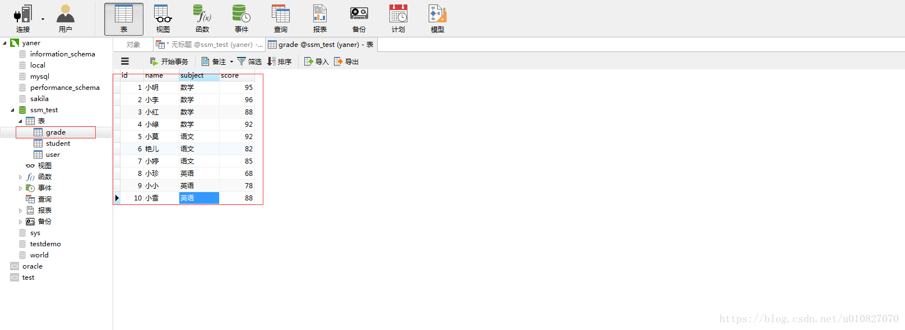
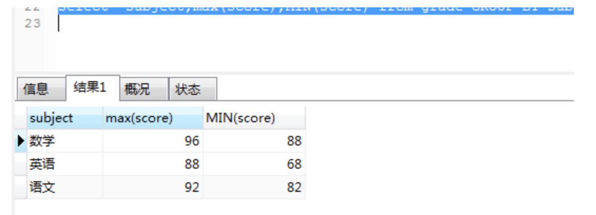
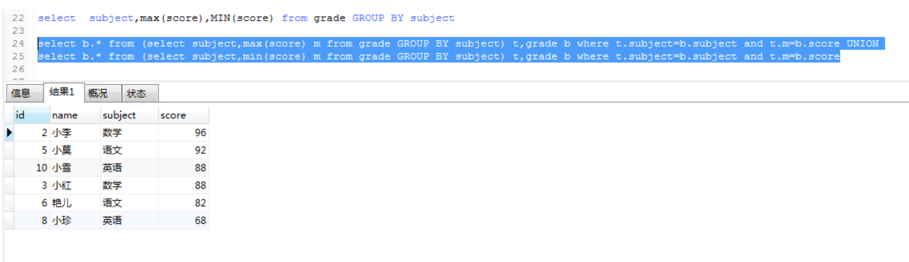

如图有这样一张成绩表：


>首先要理解group by 含义：“Group By”从字面意义上理解就是根据“By”指定的规则对数据进行分组，所谓的分组就是将一个“数据集”划分成若干个“小区域”，然后针对若干个“小区域”进行数据处理。

先来看这样一条sql语句：select  subject,max(score) from grade GROUP BY subject


这样正确的得出了每一科的最高分以及科目的名称。那是不是再在后面加个name就可以得出对应的学生的名字呢？我们可以试试：select  subject,max(score),name from grade GROUP BY subject


>一看有结果以为成功了，但是对比数据后发现是错的，学生姓名和分数没对应上。如果你认为是成功的是因为对group by理解的不够，我也不知道这样查询为什么能出来结果，我使用的mysql数据库，如果是oracle的话就会报错。

**注意：**因为在select指定的字段要么就要包含在Group By语句的后面，作为分组的依据；要么就要被包含在聚合函数中。

所以这样是错误的。

>group by语句中select指定的字段必须是“分组依据字段”，其他字段若想出现在select中则必须包含在聚合函数中，常见的聚合函数如下表：

函数|	作用	|支持性
-|-|-
sum(列名)|	求和|	 
max(列名)	|最大值	 ||
min(列名)	|最小值	 
avg(列名)	|平均值	 |
first(列名)	|第一条记录	|仅Access支持
last(列名)	|最后一条记录	|仅Access支持
count(列名)	|统计记录数	|注意和count(*)的区别

我们还是分析要求，通过要求来写sql语句。

这里提供几种方法：

>我们已经通过group by分组来获得每一科的最高分以及科目名称，把它作为第一句sql，，然后再查询一下score表，找到学科和分数都相同的记录:（子sql语句作为主sql语句的一部分）

注：a.* 表示a表中所有的字段，b.*表示b表中所有的字段
```
select b.* from (select subject,max(score) m from grade GROUP BY subject) t,grade b where t.subject=b.subject and t.m=b.score
```
结果如下：


对比发现数据是对的。


- 拓展问法：用一句SQL查出所有课程成绩最高和最低的学生及其分数。

首先，通过分组获得每个学科的最高分以及最低分：
```
select  subject,max(score),MIN(score) from grade GROUP BY subject
```
结果如下：


>那我们如何把最高分对应的学生名字和最低分对应的名字放入呢，而且要求的数据展示是最高分一行，最低分一行。所以这样行不通。

通过上面的第一个问题得出的思路：
```
select b.* from (select subject,max(score) m from grade GROUP BY subject) t,grade b where t.subject=b.subject and t.m=b.score
```

>这样既然能得到每个学科的最高分，学生名字，学科名，那同样把max（score）改成min（score）不就可以获得最低分，学生名字，学科名字了吗？现在重点是如何把两条sql语句查询出来的结果整合到一起。

```
select b.* from (select subject,min(score) m from grade GROUP BY subject) t,grade b where t.subject=b.subject and t.m=b.score
```

> 此时想到了sql的关键字 : **UNION**的定义


> UNION 操作符用于**合并两个或多个 SELECT 语句的结果集**。

**请注意**，UNION 内部的 SELECT 语句必须拥有相同数量的列。列也必须拥有相似的数据类型。同时，每条 SELECT 语句中的列的顺序必须相同。**注释：默认地，UNION 操作符选取不同的值。如果允许重复的值，请使用 UNION ALL。另外，UNION 结果集中的列名总是等于 UNION 中第一个 SELECT 语句中的列名。**

所以得出的sql是这样的：
```
select b.* from (select subject,max(score) m from grade GROUP BY subject) t,grade b where t.subject=b.subject and t.m=b.score UNION
select b.* from (select subject,min(score) m from grade GROUP BY subject) t,grade b where t.subject=b.subject and t.m=b.score
```
得出的结果是：


这样就ok了。如果还想添加一些东西。例如添加一列说明这个分数是最低分或者最高分。
```
select b.*,"最高分" from (select subject,max(score) m from grade GROUP BY subject) t,grade b where t.subject=b.subject and t.m=b.score 
UNION
select b.*,"最低分" from (select subject,min(score) m from grade GROUP BY subject) t,grade b where t.subject=b.subject and t.m=b.score
```


原文链接：https://blog.csdn.net/u010827070/article/details/79712303