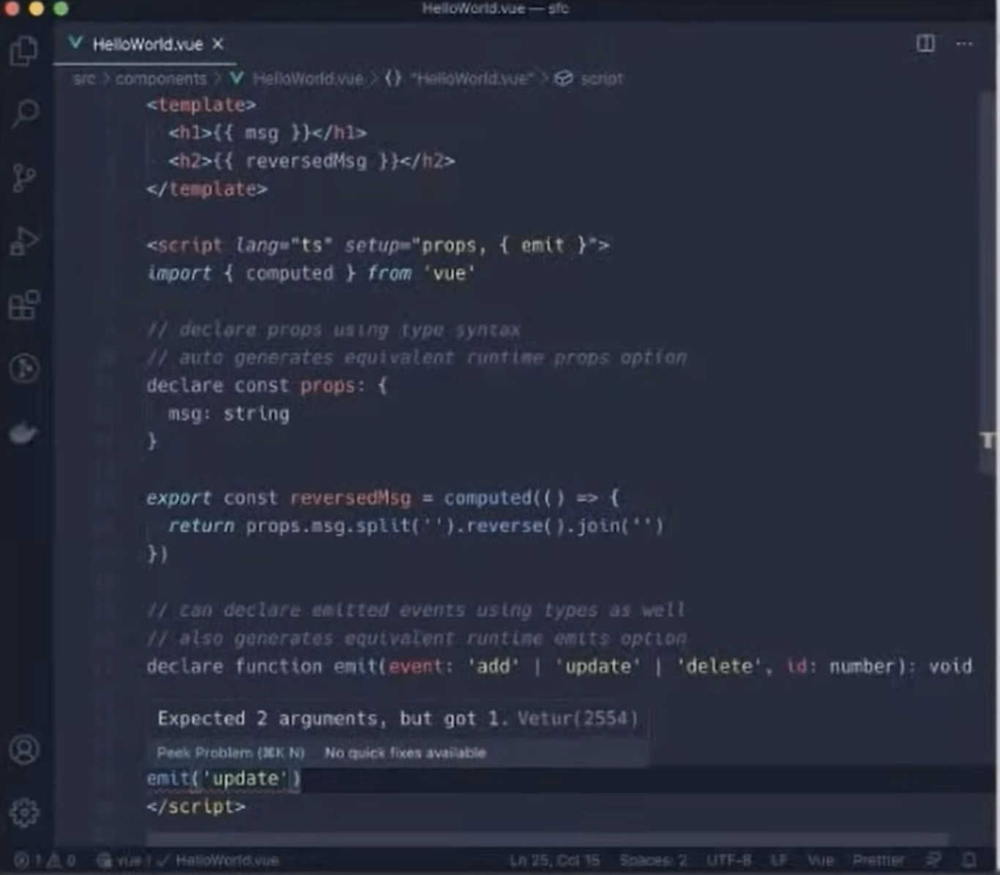

vue3.0为何弃用Object.defineProperty而选择Proxy
===

首先这两种都是基于数据劫持实现的双向绑定

## 什么是数据劫持?
> 当访问或者设置对象的属性的时候，触发相应的函数，并且返回或者设置属性的值。vue通过Object.defineProperty来劫持对象属性的getter和setter操作，当数据发生变化时发出通知。如下代码，实现了一个Observer

```
const data= {
    name: 'xiaoming',
    sex: '男'
}
// 遍历对象,对其属性值进行劫持
Object.keys(data).forEach(key => {
  let val = data[key]
  Object.defineProperty(data, key, {
    enumerable: true, // 该属性可被枚举
    configurable: true, // 该属性可以被删除以及属性描述符可以被改变
    get () {
      console.log(`属性值${data}当前值为${val}`)
      return val
    },
    set (newValue) {
      console.log(`监听到属性值${data}由${val}变为${newValue}`)
      val = newValue
    }
  })
});
 
data.name // 属性值name当前值为xiaoming
data.name = 'huahua' // 监听到属性值name由xiaoming变为huahua
data.sex // 属性值sex当前值为男
data.sex = '女' // 监听到属性值sex由男变为女
```
## 数据劫持的优势
1. 不需要进行显示调用，vue的双向绑定原理就是通过数据劫持+发布订阅来实现的，比如angular的脏检查需要通过显示调用markForCheck，react则需要通过setState来进行显示调用

2. 通过属性的劫持可以精准获得变化的内容，这部分不需要额外的diff操作，减少性能消耗

## vue实现双向绑定
1. 实现一个监听器Observer，用来劫持并监听所有属性，如果有变动的，就通知订阅者。这里需要注意，递归的时候由于属性的值可能也是一个对象，在递归处理对象属性值的时候 ，递归循环引用对象很容易出现递归爆栈问题，在vue中已经通过定义ob对象记录已经被设置过setter和getter方法的对象，避免了此问题，但如果需要扩展对象，必须手动给新属性设置setter和getter方法，这就是为什么不在data中预先声明好的属性无法进行双向绑定，需要通过this.$set()来设置

```
this.$set(this.data.key, value) !注意，这是1.0的写法

this.$set(this.data,”key”,value) ！这个是2.0的写法

```
2. 实现一个订阅者Watcher，作为连接Observer和Compile的桥梁，可以收到属性的变化通知并执行相应的函数，从而更新视图。

3. 实现一个解析器Compile，可以扫描和解析每个节点的相关指令，并根据初始化模板数据以及初始化相应的订阅器。

## Object.defineProperty缺陷
>将上文中我们的示例代码 属性值改为数组，数组也算是一种特殊的对象，下标其实就是对象的属性，理论上是可以通过Object.defineProperty来处理的，那尤大大为什么没有采用这种方式呢，猜测源于数组的使用场景，数组的主要操作场景是遍历，如果每一个元素都挂载set和get方法，会产生巨大性能消耗，而且数组下标变化频繁，操作方法居多，一旦数组长度发生变化，在无法自动检测的状态下，手动更新会是一个相当繁琐的工作

## 那vue中是如何实现对数组的劫持呢
>肯定不能直接篡改Array.prototype 对象，因为会影响所有的数组实例，尤大大通过原型继承得到一个新的原型对象，在此基础上，劫持了7种常用的数组操作进行了重写，分别是push() 、pop() 、shift()、 unshift() 、splice() 、sort()、 reverse()，Vue.set()对于数组的处理其实就是调用了splice方法

## Proxy的优势
Proxy 用于修改某些操作的默认行为，等同于在语言层面做出修改，所以属于一种“元编程”（meta programming），即对编程语言进行编程。Proxy 可以理解成，在目标对象之前架设一层“拦截”，外界对该对象的访问，都必须先通过这层拦截，因此提供了一种机制，可以对外界的访问进行过滤和改写，可以这样认为,Proxy是Object.defineProperty的全方位加强版
```
1.Proxy可以直接监听对象而非属性，并返回一个新对象

2.Proxy可以直接监听数组的变化
```

## 用法



## Composition API如何替换Vue Mixins?

### mixin缺点：
1. 命名冲突
```
const mixin = {
  data: () => ({
    myProp: null
  })
}

export default {
  mixins: [mixin],
  data: () => ({
    // 同名!
    myProp: null
  })
}
```

### 快速入门Composition API
Composition API的主要思想是，我们将它们定义为从新的 setup 函数返回的JavaScript变量，而不是将组件的功能（例如state、method、computed等）定义为对象属性。

以这个经典的Vue 2组件为例，它定义了一个“计数器”功能：
```
//Counter.vue
export default {
  data: () => ({
    count: 0
  }),
  methods: {
    increment() {
      this.count++;
    }
  },
  computed: {
    double () {
      return this.count * 2;
    }
  }
}
```
下面是使用Composition API定义的完全相同的组件。

```
// Counter.vue
import { ref, computed } from "vue";

export default {
  setup() {
    const count = ref(0);
    const double = computed(() => count * 2)
    function increment() {
      count.value++;
    }
    return {
      count,
      double,
      increment
    }
  }
}
```
首先会注意到，我们导入了 ref 函数，该函数允许我们定义一个响应式变量，其作用与 data 变量几乎相同。计算属性的情况与此相同。

increment 方法不是被动的，所以它可以被声明为一个普通的JavaScript函数。注意，我们需要更改子属性 count 的 value 才能更改响应式变量。这是因为使用 ref 创建的响应式变量必须是对象，以便在传递时保持其响应式。

定义完这些功能后，我们将从 setup 函数中将其返回。上面两个组件之间的功能没有区别，我们所做的只是使用替代API。

### Composition API优点
#### 1. 代码提取
Composition API的第一个明显优点是提取逻辑很容易。

让我们使用Composition API重构上面定义的组件，以使我们定义的功能位于JavaScript模块 useCounter 中（在特性描述前面加上“use”是一种Composition API命名约定。）。

```
//useCounter.js
import { ref, computed } from "vue";

export default function () {
  const count = ref(0);
  const double = computed(() => count * 2)
  function increment() {
    count.value++;
  }
  return {
    count,
    double,
    increment
  }
}
```

#### 2. 代码重用
要在组件中使用该函数，我们只需将模块导入组件文件并调用它（注意导入是一个函数）。这将返回我们定义的变量，随后我们可以从 setup 函数中返回它们。

```
// MyComponent.js
import useCounter from "./useCounter.js";

export default {
  setup() {
    const { count, double, increment } = useCounter();
    return {
      count,
      double,
      increment
    }
  }
}
```
乍一看，这似乎有点冗长而毫无意义，但让我们来看看这种模式如何克服了前面讨论的mixins问题。

#### 3. 命名冲突解决了
我们之前已经了解了mixin如何使用与消费者组件中的名称相同的属性，或者甚至更隐蔽地使用了消费者组件使用的其他mixin中的属性。

这不是Composition API的问题，因为我们需要显式命名任何状态或从合成函数返回的方法。

export default {
  setup () {
    const { someVar1, someMethod1 } = useCompFunction1();
    const { someVar2, someMethod2 } = useCompFunction2();
    return {
      someVar1,
      someMethod1,
      someVar2,
      someMethod2
    }
  }
}
命名冲突的解决方式与其他任何JavaScript变量相同。

#### 4.隐式依赖...解决了！
前面还看到mixin如何使用在消费组件上定义的 data 属性，这可能会使代码变得脆弱，并且很难进行推理。

合成函数(Composition Function)还可以调用消费组件中定义的局部变量。不过，不同之处在于，现在必须将此变量显式传递给合成函数。

```
import useCompFunction from "./useCompFunction";

export default {
  setup () {
    // 某个局部值的合成函数需要用到
    const myLocalVal = ref(0);

    // 它必须作为参数显式地传递
    const { ... } = useCompFunction(myLocalVal);
  }
}
```