<h1>目录</h1>

&emsp;[1. 说一下Vue的双向绑定数据的原理](#k1)

&emsp;[2. 解释单向数据流和双向数据绑定](#k2)

&emsp;[3. Vue如何去除url中的 #](#k3)

&emsp;[4. 对 MVC、MVVM的理解](#k4)

&emsp;[5. 介绍虚拟DOM](#k5)

&emsp;[6. vue生命周期的理解](#k6)

&emsp;[7. 组件通信](#k7)

&emsp;[8. 路由实现](#k8)

&emsp;[9. v-if 和 v-show 区别](#k9)

&emsp;[10. $route和$router的区别](#k10)

&emsp;[11. NextTick 是做什么的](#k11)

&emsp;[12. Vue 组件 data 为什么必须是函数](#k12)

&emsp;[13. 计算属性computed 和事件 methods 有什么区别](#k13)

&emsp;[14. 对比 jQuery ，Vue 有什么优缺点](#k14)

&emsp;[15. Vue 中怎么自定义指令](#k15)

&emsp;[16. Vue 中怎么自定义过滤器](#k16)

&emsp;[17. 对 keep-alive 的了解](#k17)

&emsp;[18. Vue 中 key 的作用](#k18)

&emsp;[19. 你觉得 Vue 的核心是什么](#k19)

&emsp;[20. vue 等单页面应用的优缺点](#k20)

&emsp;[21. vue-router 使用params与query传参有什么区别](#k21)

&emsp;[22. 详解vue的diff算法](#k22)

&emsp;[23. Vue数组监视](#k23)

&emsp;[24. provide/inject原理](#k24)

&emsp;[25. vue指令以及原理](#k25)

&emsp;[26. vue插件](#k26)

&emsp;[27. vue里extend、mixins、extends的区别](#k27)

&emsp;[28. Vue中的$attrs和$listener](#k28)

&emsp;[29. Vue中的slots深层传递, slot-scope, v-slot](#k29)

&emsp;[30. vue2和vue3的响应式核心原理](#k30)

&emsp;[31. Vue的v-model的实现原理以及常用指令和修饰符](#k31)

&emsp;[32. Vue.extend、Vue.component与new Vue](#k32)

&emsp;[33. Vue export default中的name属性有哪些作用](#k33)

&emsp;[34. v-bind="$props](#k34)


<h2 id='k1'>1. 说一下Vue的双向绑定数据的原理</h2>

> Vue2.0数据双向绑定原理:Vue 数据双向绑定主要是指：数据变化更新视图，视图变化更新数据。其中，View变化更新Data，可以通过事件监听的方式来实现，所以 Vue数据双向绑定的工作主要是如何根据Data变化更新View。简述： 当你把一个普通的 JavaScript 对象传入 Vue 实例作为 data 选项，Vue 将遍历此对象所有的 property，并使用 Object.defineProperty 把这些 property 全部转为 getter/setter。这些 getter/setter 对用户来说是不可见的，但是在内部它们让 Vue 能够追踪依赖，在 property 被访问和修改时通知变更。每个组件实例都对应一个 watcher 实例，它会在组件渲染的过程中把“接触”过的数据 property 记录为依赖。之后当依赖项的 setter 触发时，会通知 watcher，从而使它关联的组件重新渲染。深入理解： 

- 监听器 Observer：对数据对象进行遍历，包括子属性对象的属性，利用 Object.defineProperty() 对属性都加上 setter 和 getter。这样的话，给这个对象的某个值赋值，就会触发 setter，那么就能监听到了数据变化。

- 解析器 Compile：解析 Vue 模板指令，将模板中的变量都替换成数据，然后初始化渲染页面视图，并将每个指令对应的节点绑定更新函数，添加监听数据的订阅者，一旦数据有变动，收到通知，调用更新函数进行数据更新。

- 订阅者 Watcher：Watcher 订阅者是 Observer 和 Compile 之间通信的桥梁 ，主要的任务是订阅 Observer 中的属性值变化的消息，当收到属性值变化的消息时，触发解析器 Compile 中对应的更新函数。每个组件实例都有相应的 watcher 实例对象，它会在组件渲染的过程中把属性记录为依赖，之后当依赖项的 setter 被调用时，会通知 watcher 重新计算，从而致使它关联的组件得以更新——这是一个典型的观察者模式订阅器 

- Dep：订阅器采用 发布-订阅 设计模式，用来收集订阅者 Watcher，对监听器 Observer 和 订阅者 Watcher 进行统一管理。

<h2 id='k2'>2. 解释单向数据流和双向数据绑定</h2>

> 单向数据流： 顾名思义，数据流是单向的。数据流动方向可以跟踪，流动单一，追查问题的时候可以更快捷。缺点就是写起来不太方便。要使UI发生变更就必须创建各种 `action` 来维护对应的 `state`

> 双向数据绑定：数据之间是相通的，将数据变更的操作隐藏在框架内部。优点是在表单交互较多的场景下，会简化大量业务无关的代码。缺点就是无法追踪局部状态的变化，增加了出错时 `debug` 的难度

<h2 id='k3'>3. Vue 如何去除url中的 #</h2>

`vue-router` 默认使用 `hash` 模式，所以在路由加载的时候，项目中的 `url` 会自带 `#`。如果不想使用 `#`， 可以使用 `vue-router` 的另一种模式 `history`

```js
new Router({
  mode: 'history',
  routes: [ ]
})
```

> 需要注意的是，当我们启用 `history` 模式的时候，由于我们的项目是一个单页面应用，所以在路由跳转的时候，就会出现访问不到静态资源而出现 `404` 的情况，这时候就需要服务端增加一个覆盖所有情况的候选资源：如果 `URL` 匹配不到任何静态资源，则应该返回同一个 `index.html` 页面

<h2 id='k4'>4. 对 MVC、MVVM的理解</h2>

> MVC


特点：
1. `View` 传送指令到 `Controller`
2. `Controller` 完成业务逻辑后，要求 `Model` 改变状态
3. `Model` 将新的数据发送到 `View`，用户得到反馈

**所有通信都是单向的**

> MVVM


特点：
1. 各部分之间的通信，都是双向的
2. 采用双向绑定：`View` 的变动，自动反映在 `ViewModel`，反之亦然

具体请移步 [这里](http://www.ruanyifeng.com/blog/2015/02/mvcmvp_mvvm.html)

<h2 id='k5'>5. 介绍虚拟DOM</h2>

[参考这里](https://www.jianshu.com/p/616999666920)

<h2 id='k6'>6. vue生命周期的理解</h2>

> vue实例有一个完整的生命周期，生命周期也就是指一个实例从开始创建到销毁的这个过程

- `beforeCreated()` 在实例创建之间执行，data,method 还没有初始化
- `created()` 在实例创建、数据加载后，能初始化数据，data,method 初始化，能使用，能调用
- `beforeMount()` 虚拟`dom`已创建完成，在数据渲染前最后一次更改数据
- `mounted()` 页面、数据渲染完成，真实`dom`挂载完成
- `beforeUpadate()` 重新渲染之前触发
- `updated()` 数据已经更改完成，`dom` 也重新 `render` 完成,更改数据会陷入死循环
- `beforeDestory()` 和 `destoryed()` 前者是销毁前执行（实例仍然完全可用），后者则是销毁后执行

<h2 id='k7'>7. 组件通信</h2>

> 父组件向子组件通信

子组件通过 props 属性，绑定父组件数据，实现双方通信

> 子组件向父组件通信

将父组件的事件在子组件中通过 `$emit` 触发

> 非父子组件、兄弟组件之间的数据传递

```js
/*新建一个Vue实例作为中央事件总嫌*/
let event = new Vue();

/*监听事件*/
event.$on('eventName', (val) => {
    //......do something
});

/*触发事件*/
event.$emit('eventName', 'this is a message.')
```

> Vuex 数据管理

<h2 id='k8'>8. vue-router 路由实现</h2>

> 路由就是用来跟后端服务器进行交互的一种方式，通过不同的路径，来请求不同的资源，请求不同的页面是路由的其中一种功能

参考 [这里](https://zhuanlan.zhihu.com/p/37730038)

<h2 id='k9'>9. v-if 和 v-show 区别</h2>

> 使用了 `v-if` 的时候，如果值为 `false` ，那么页面将不会有这个 `html` 标签生成。

> `v-show` 则是不管值为 `true` 还是 `false` ，`html` 元素都会存在，只是 `CSS` 中的 `display` 显示或隐藏

<h2 id='k10'>10. $route和$router的区别</h2>

> `$router` 为 `VueRouter` 实例，想要导航到不同 `URL`，则使用 `$router.push` 方法

> `$route` 为当前 `router` 跳转对象里面可以获取 `name` 、 `path` 、 `query` 、 `params` 等

<h2 id='k11'>11. NextTick 是做什么的</h2>

> `$nextTick` 是在下次 `DOM` 更新循环结束之后执行延迟回调，在修改数据之后使用 `$nextTick`，则可以在回调中获取更新后的 `DOM`

> 简单来说，Vue 在修改数据后，视图不会立刻更新，而是等同一事件循环中的所有数据变化完成之后，再统一进行视图更新。在下次 DOM 更新循环结束之后执行延迟回调。在修改数据之后立即使用这个方法，获取更新后的 DOM。所以就衍生出了这个获取更新后的DOM的Vue方法。所以放在Vue.nextTick()回调函数中的执行的应该是会对DOM进行操作的 js代码；

```
<template>
  <div class="hello">
    <h3 id="h">{{testMsg}}</h3>
  </div>
</template>
 
<script>
export default {
  name: 'HelloWorld',
  data () {
    return {
      testMsg:"原始值",
    }
  },
  methods:{
    changeTxt:function(){
      let that=this;
      that.testMsg="修改后的文本值";  //vue数据改变，改变dom结构
      let domTxt=document.getElementById('h').innerText;  //后续js对dom的操作
      console.log(domTxt);  //输出可以看到vue数据修改后DOM并没有立即更新，后续的dom都不是最新的
      if(domTxt==="原始值"){
        console.log("文本data被修改后dom内容没立即更新");
      }else {
        console.log("文本data被修改后dom内容被马上更新了");
      }
    },
 
  }
}
</script>
```

> 正确的用法是：vue改变dom元素结构后使用vue.$nextTick()方法来实现dom数据更新后延迟执行后续代码

```
   changeTxt:function(){
      let that=this;
      that.testMsg="修改后的文本值";  //修改dom结构
       
      that.$nextTick(function(){  //使用vue.$nextTick()方法可以dom数据更新后延迟执行
        let domTxt=document.getElementById('h').innerText; 
        console.log(domTxt);  //输出可以看到vue数据修改后并没有DOM没有立即更新，
        if(domTxt==="原始值"){
          console.log("文本data被修改后dom内容没立即更新");
        }else {
          console.log("文本data被修改后dom内容被马上更新了");
        }
      });
    },
```
### 原理

> Vue是异步执行dom更新的，一旦观察到数据变化，Vue就会开启一个队列，然后把在同一个事件循环 (event loop) 当中观察到数据变化的 watcher 推送进这个队列。如果这个watcher被触发多次，只会被推送到队列一次。这种缓冲行为可以有效的去掉重复数据造成的不必要的计算和DOm操作。而在下一个事件循环时，Vue会清空队列，并进行必要的DOM更新。
当你设置 vm.someData = 'new value'，DOM 并不会马上更新，下一个事件循环开始时执行更新时才会进行必要的DOM更新。如果此时你想要根据更新的 DOM 状态去做某些事情，就会出现问题。为了在数据变化之后等待 Vue 完成更新 DOM ，可以在数据变化之后立即使用 Vue.nextTick(callback) 。这样回调函数在 DOM 更新完成后就会调用。


## [源码分析](https://blog.csdn.net/shuoxi666/article/details/108139431)

```
其实就是判断使用Promise，MutationObserver，setTimeout的优先级。系统中会优先用Promise，在Promise不存在的情况下使用MutationObserver，这两个方法都会在microtask中执行，会比setTimeout更早执行，所以优先使用。
如果上述两种方法都不支持的环境则会使用setTimeout，在task尾部推入这个函数，等待调用执行。

nextTick的源码其实就是将传进来的函数依次放入数组中，然后找到最优的异步方法依次执行数组中的方法，vue进行DOM更新内部也是调用nextTick来做异步队列控制。而当我们自己调用nextTick的时候，它就在更新DOM的那个microtask后追加了我们自己的回调函数，从而确保我们的代码在DOM更新后执行，这就是为什么nextTick()方法可以获取最新的DOM。
```

具体可参考官方文档 [深入响应式原理](https://cn.vuejs.org/v2/guide/reactivity.html)

<h2 id='k12'>12. Vue 组件 data 为什么必须是函数</h2>

> 因为js本身的特性带来的，如果 `data` 是一个对象，那么由于对象本身属于引用类型，当我们修改其中的一个属性时，会影响到所有Vue实例的数据。如果将 `data` 作为一个函数返回一个对象，那么每一个实例的 `data` 属性都是独立的，不会相互影响了

<h2 id='k13'>13. 计算属性computed 和事件 methods 有什么区别</h2>

我们可以将同一函数定义为一个 `method` 或者一个计算属性。对于最终的结果，两种方式是相同的

不同点：

> computed: 计算属性是基于它们的依赖进行缓存的,只有在它的相关依赖发生改变时才会重新求值

> 对于 `method` ，只要发生重新渲染，`method` 调用总会执行该函数

<h2 id='k14'>14. 对比 jQuery ，Vue 有什么不同</h2>

> jQuery 专注视图层，通过操作 DOM 去实现页面的一些逻辑渲染； Vue 专注于数据层，通过数据的双向绑定，最终表现在 DOM 层面，减少了 DOM 操作

> Vue 使用了组件化思想，使得项目子集职责清晰，提高了开发效率，方便重复利用，便于协同开发

<h2 id='k15'>15. Vue 中怎么自定义指令</h2>

> 全局注册

```js
// 注册一个全局自定义指令 `v-focus`
Vue.directive('focus', {
  // 当被绑定的元素插入到 DOM 中时……
  inserted: function (el) {
    // 聚焦元素
    el.focus()
  }
})
```

> 局部注册

```js
directives: {
  focus: {
    // 指令的定义
    inserted: function (el) {
      el.focus()
    }
  }
}
```

参考 [官方文档-自定义指令](https://cn.vuejs.org/v2/guide/custom-directive.html)

<h2 id='k16'>16. Vue 中怎么自定义过滤器</h2>

> 可以用全局方法 `Vue.filter()` 注册一个自定义过滤器，它接收两个参数：过滤器 `ID` 和过滤器函数。过滤器函数以值为参数，返回转换后的值

```js
Vue.filter('reverse', function (value) {
  return value.split('').reverse().join('')
})
```

```html
<!-- 'abc' => 'cba' -->
<span v-text="message | reverse"></span>
```

过滤器也同样接受全局注册和局部注册

<h2 id='k17'>17. 对 keep-alive 的了解</h2>

> `keep-alive` 是 `Vue` 内置的一个组件，可以使被包含的组件保留状态，或避免重新渲染

```html
<keep-alive>
  <component>
    <!-- 该组件将被缓存！ -->
  </component>
</keep-alive>
```

> 可以使用API提供的props，实现组件的动态缓存

具体参考 [官方API](https://cn.vuejs.org/v2/api/#keep-alive)

### 使用
```
<!-- 基本 -->
<keep-alive>
  <component :is="view"></component>
</keep-alive>
```
\<keep-alive> 包裹动态组件时，会缓存不活动的组件实例，而不是销毁它们。和 \<transition> 相似，\<keep-alive> 是一个抽象组件：它自身不会渲染一个 DOM 元素，也不会出现在父组件链中。

当组件在 \<keep-alive> 内被切换，它的 activated 和 deactivated 这两个生命周期钩子函数将会被对应执行。

### 原理
```
/* keep-alive组件 */
export default {
  name: 'keep-alive',
  /* 抽象组件 */
  abstract: true,

  props: {
    include: patternTypes,
    exclude: patternTypes
  },

  created () {
    /* 缓存对象 */
    this.cache = Object.create(null)
  },

  /* destroyed钩子中销毁所有cache中的组件实例 */
  destroyed () {
    for (const key in this.cache) {
      pruneCacheEntry(this.cache[key])
    }
  },

  watch: {
    /* 监视include以及exclude，在被修改的时候对cache进行修正 */
    include (val: string | RegExp) {
      pruneCache(this.cache, this._vnode, name => matches(val, name))
    },
    exclude (val: string | RegExp) {
      pruneCache(this.cache, this._vnode, name => !matches(val, name))
    }
  },

  render () {
    /* 得到slot插槽中的第一个组件 */
    const vnode: VNode = getFirstComponentChild(this.$slots.default)

    const componentOptions: ?VNodeComponentOptions = vnode && vnode.componentOptions
    if (componentOptions) {
      // check pattern
      /* 获取组件名称，优先获取组件的name字段，否则是组件的tag */
      const name: ?string = getComponentName(componentOptions)
      /* name不在inlcude中或者在exlude中则直接返回vnode（没有取缓存） */
      if (name && (
        (this.include && !matches(this.include, name)) ||
        (this.exclude && matches(this.exclude, name))
      )) {
        return vnode
      }
      const key: ?string = vnode.key == null
        // same constructor may get registered as different local components
        // so cid alone is not enough (#3269)
        ? componentOptions.Ctor.cid + (componentOptions.tag ? `::${componentOptions.tag}` : '')
        : vnode.key
      /* 如果已经做过缓存了则直接从缓存中获取组件实例给vnode，还未缓存过则进行缓存 */
      if (this.cache[key]) {
        vnode.componentInstance = this.cache[key].componentInstance
        // 2.5.0 新增这段逻辑，使用 LRU 策略 make current key freshest
        remove(keys, key);
        keys.push(key);
      }
      // 不命中缓存,把 vnode 设置进缓存
      else {
        this.cache[key] = vnode;
        // 2.5.0 新增这段逻辑，LRU 策略的移除。
        keys.push(key);
        // 如果配置了 max 并且缓存的长度超过了 this.max，还要从缓存中删除第一个
        if (this.max && keys.length > parseInt(this.max)) {
            pruneCacheEntry(cache, keys[0], keys, this._vnode);
        }
        
      }
      /* keepAlive标记位 */
      vnode.data.keepAlive = true
    }
    return vnode
  }
}
```

- 获取 keep-alive 包裹着的第一个子组件对象及其组件名
- 根据设定的 include/exclude（如果有）进行条件匹配，决定是否缓存。不匹配，直接返回组件实例
- 根据组件 ID 和 tag 生成缓存 Key，并在缓存对象中查找是否已缓存过该组件实例。如果存在,直接取出缓存值并更新该 key 在 this.keys 中的位置(更新 key 的位置是实现 LRU 置换策略的关键)
- 在 this.cache 对象中存储该组件实例并保存 key 值,之后检查缓存的实例数量是否超过 max 的设置值，超过则根据 LRU 置换策略删除最近最久未使用的实例（即是下标为 0 的那个 key）
最后组件实例的 keepAlive 属性设置为 true，这个在渲染和执行被包裹组件的钩子函数会用到，
### LRU 策略
- 最近最久未使用算法。

- 每次从内存中找出最久的未使用数据用于置换新的数据。

<h2 id='k18'>18. Vue 中 key 的作用</h2>

> `key` 的特殊属性主要用在 `Vue` 的虚拟 `DOM` 算法，在新旧 `nodes` 对比时辨识 `VNodes`。如果不使用 `key`，`Vue` 会使用一种最大限度减少动态元素并且尽可能的尝试修复/再利用相同类型元素的算法。使用 `key`，它会基于 `key` 的变化重新排列元素顺序，并且会移除 `key` 不存在的元素。

> 有相同父元素的子元素必须有独特的 `key`。重复的 `key` 会造成渲染错误

具体参考 [官方API](https://cn.vuejs.org/v2/api/#key)

<h2 id='k19'>19. Vue 的核心是什么</h2>

> 数据驱动 组件系统

<h2 id='k20'>20. vue 等单页面应用的优缺点</h2>

> 优点：

- 良好的交互体验
- 良好的前后端工作分离模式
- 减轻服务器压力

> 缺点：

- SEO难度较高
- 前进、后退管理
- 初次加载耗时多

<h2 id='k21'>21. vue-router 使用params与query传参有什么区别</h2>

`vue-router` 可以通过 `params` 与 `query` 进行传参

```js
// 传递
this.$router.push({path: './xxx', params: {xx:xxx}})
this.$router.push({path: './xxx', query: {xx:xxx}})

// 接收
this.$route.params

this.$route.query
```

- `params` 是路由的一部分,必须要有。`query` 是拼接在 `url` 后面的参数，没有也没关系
- `params` 不设置的时候，刷新页面或者返回参数会丢，`query` 则不会有这个问题
<h2 id='k22'>22. 详解vue的diff算法</h2>
[详解vue的diff算法](https://www.cnblogs.com/wind-lanyan/p/9061684.html)

<h2 id='k23'>23. Vue数组监视</h2>

> vue并不是不能利用Object.defineProperty实现对数组的监听，而是故意不去实现

> Vue数组监视的只有 push()、pop()、shift()、unshift()、splice()、sort()、reverse() 7 种方法。我们可以遍历一下：

```
var arrayProto = Array.prototype
var arrayMethods = Object.create(arrayProto)
 
;[
  'push',
  'pop',
  'shift',
  'unshift',
  'splice',
  'sort',
  'reverse'
].forEach(function(item){
	Object.defineProperty(arrayMethods,item,{
	    value:function mutator(){
            //缓存原生方法，之后调用
            console.log('array被访问');
	    	var original = arrayProto[item]	
	    	var args = Array.from(arguments)
		original.apply(this,args)
            // console.log(this);
	    },
	})
})
```

<h2 id='k24'>24. provide/inject原理</h2>

> 父孙组件之间怎么传递数据呢？VUE提供了provide/inject 来实现此功能。

使用详解
```
provide：Object | () => Object
inject：Array<string> | { [key: string]: string | Symbol | Object }
```
完整的用法
```
// 父级组件提供 'foo'
var Provider = {
	data () {
		return  {
			x: 'test'
		}
	}
	// 可以直接使用对象，对象包含需要提供的key：“value”
	provide: {
	    foo: 'bar'
	},
    // 可是设置provide 为一个函数，函数返回一个provide属性，this指向vue实例，所以可以调用组件data里的值得
    provide () {
	   return {
	        a: this.x
	   }
   },
	  // ...
}

// 子组件注入 'foo'
var Child = {
  // inject可以是一个数组，数组里包含需要注入的key的字面量
  inject: ['foo'],
  // inject 可以是一个对象
  inject: {
  	foo: 'foo'
  },
  // inject 可以设置默认值，所以可以inject的指可以在provide里不存在
  inject: {
	foo: {default: 'default value'}
  },
  // default 值也可是一个有返回值的函数
  inject: {
	foo: {default: () => {return [1,2,3]}}
  },
  // 完整的带默认值的写法, a 是provide中提供的key的字面量
  inject: {
	foo: {
		from: 'a',
		default: 'default value'
   }
  },
  created () {
    console.log(this.foo) // => "bar"
  }
  // ...
}
```
### provide/inject实现响应式数据更新

将一个函数赋值给provide的一个值，这个函数返回父组件的动态数据，然后在子孙组件里面调用这个函数。
实际上这个函数存储了父组件实例的引用，所以每次子组件都能获取到最新的数据。代码长下面的样子：
Parent组件：
```
<template>
    <div class="parent-container">
      Parent组件
      <br/>
      <button type="button" @click="changeName">改变name</button>
      <br/>
      Parent组件中 name的值: {{name}}
      <Child  v-bind="{name: 'k3vvvv'}" />
    </div>
</template>
<script>
import Child from './Child'
export default {
  name: 'Parent',
  data () {
    return {
      name: 'Kevin'
    }
  },
  methods: {
    changeName (val) {
      this.name = 'New Kevin'
    }
  },
  provide () {
    return {
      nameFromParent: this.name,
      getReaciveNameFromParent: () => this.name
    }
  },
  // provide: {
  // nameFromParent: this.name,
  // getReaciveNameFromParent: () => this.name
  // },
  components: {
    Child
  }
}
</script>
```
Child组件
```
<template>
  <div class="child-container">
    Child组件
    <br/>
    <GrandSon />
  </div>
</template>
<script>
import GrandSon from './GrandSon'
export default {
  components: {
    GrandSon
  }
}
</script>
```

GrandSon组件：

```
<template>
  <div class="grandson-container">
    Grandson组件
    <br/>
    {{nameFromParent}}
    <br/>
    {{reactiveNameFromParent}}
  </div>
</template>
<script>
export default {
  inject: ['nameFromParent', 'getReaciveNameFromParent'],
  computed: {
    reactiveNameFromParent () {
      return this.getReaciveNameFromParent()
    }
  },
  watch: {
    'reactiveNameFromParent': function (val) {
      console.log('来自Parent组件的name值发生了变化', val)
    }
  },
  mounted () {
    console.log(this.nameFromParent, 'nameFromParent')
  }
}
</script>
```


<h2 id='k25'>25. vue指令以及原理</h2>
参考(http://book.93lin.cn/UseInJob/vue自定义指令相关.html)

<h2 id='k26'>26. vue插件以及原理</h2>
参考(http://book.93lin.cn/UseInJob/vue插件.html)

<h2 id='k27'>27. vue里extend、mixins、extends的区别</h2>

### 1.extend
Vue.extend使用基础 Vue 构造器，创建一个“子类”。参数是一个包含组件选项的对象。
```
// Vue.extend
// 创建构造器
var Profile = Vue.extend({
  template: '<p>{{firstName}} {{lastName}} aka {{alias}}</p>',
  data: function () {
    return {
      firstName: 'Walter',
      lastName: 'White',
      alias: 'Heisenberg'
    }
  }
})
// 创建 Profile 实例，并挂载到一个元素上。
new Profile().$mount('#mount-point')
```
### 2.mixins
> mixins 选项接受一个混入对象的数组。这些混入实例对象可以像正常的实例对象一样包含选项，他们将在 Vue.extend() 里最终选择使用相同的选项合并逻辑合并。举例：如果你的混入包含一个钩子而创建组件本身也有一个，两个函数将被调用。
Mixin 钩子按照传入顺序依次调用，并在调用组件自身的钩子之前被调用。
```
// mixins示例
var mixin = {
  created: function () { console.log(1) }
}
var vm = new Vue({
  created: function () { console.log(2) },
  mixins: [mixin]
})
// => 1
// => 2
```
mixins要点

- data混入组件数据优先
- 钩子函数将混合为一个数组，混入对象的钩子将在组件自身钩子之前调用
- 值为对象的选项，例如 methods, components 和 directives，将被混合为同一个对象。两个对象键名冲突时，取组件对象的键值对。
- 以上合并策略可以通过Vue.config.optionMergeStrategies修改
### 3.extends
> 允许声明扩展另一个组件(可以是一个简单的选项对象或构造函数)，而无需使用 Vue.extend。这主要是为了便于扩展单文件组件。这和 mixins 类似。

extends示例
```

var CompA = { ... }
 
// 在没有调用 `Vue.extend` 时候继承 CompA
var CompB = {
  extends: CompA,
  ...
}
```
### 4.总结：
- extend用于创建vue实例
- mixins可以混入多个mixin，extends只能继承一个
- mixins类似于面向切面的编程（AOP），extends类似于面向对象的编程
- 优先级Vue.extend>extends>mixins


<h2 id='k28'>28. Vue中的$attrs和$listener</h2>

```
// father组件
<template>
  <div id="father">
    <child :temp="tempdata" @tempFn="fatherFn" prop='$attrs不会传递child组件中定义的props
     值'>
    </child>
  </div>
</template>
<script>
import Child from './child'
export default {
   component: { Child },
  data() {
    tempdata: 'i am father'
  },
  methods: {
    fatherFn: function() {
      console.log('father function!');
    }
  }
}
</script>

// child组件
<template>
  <div id="child">
    <son v-bind="$attrs" v-on="$listener"></son>
  </div>
</template>
<script>
import Son from './son'
export default {
  component: {Son},
  props: { 'prop' },
  data() {
    return {}
  },
  mounted() {
    // 结果显示为$attrs.temp，不包含prop
    console.log(this.$attrs)
    this.$emit('tempFn')
  },
  methods: {}
}
</script>

// son组件
<template>
  <div id="son">
    {{ $attrs.temp }}
  </div>
</template>
<script>
export default {
  props: {},
  data() {
    return {}
  },
  mounted() {
    this.$emit('tempFn')
  },
  methods: {}
}
</script>
```


综上，可知：

>$listeners包含了父作用域中的 (不含 .native 修饰器的) v-on 事件监听器，它可以通过 v-on=”$listeners” 传入内部组件。

>$attrs包含了父作用域中非props 特性绑定的属性 (class 和 style 除外)。当一个组件没有声明任何 props 时，这里会包含所有父作用域的绑定 (class 和 style 除外)，并且可以通过 v-bind=”$attrs” 传入内部组件。

新增理解

其实$attrs，$listeners，$props都是一样的，我们可以通过当前组件实例访问到，具体包含如下：

$attrs：当前组件的属性，通俗的讲也就是在组件标签定义的一系列属性，如input的value，placeholder等，但是不包括在当前组件里面定义的props属性

$listeners：当前组件监听的事件，通俗的讲也就是在使用组件的时候在标签中定义的事件，如@input，以及一些自定义事件@tempFn等

$props：当前组件从父组件那里接收的参数，通俗的讲和$attr差不多，但是只包括在当前组件中定义了的props属性

通俗的讲$attrs+$props = 在使用组件时定义的所有属性，不包括事件

那么在当前组件中使用v-bind="$attrs"，v-bind="$props"，v-on="$listeners"也就是把之前父组件那里给它的属性再全部传到它的子组件。


<h2 id='k29'>29. Vue中的slots深层传递</h2>

>  现在假设有A，B，C三个组件，层级关系为A>B>C(爷爷，父亲，儿子)

C:

```
<div>
    C组件
    <div>
      <slot name="pane" :data="我是C">我是c组件(儿子)---外部没传递，我才显示</slot>
    </div>
</div>
```

B:

```
<div>
    B组件---这是一个中间传递的slot
    <C>
	    <div slot="pane" slot-scope="{data}">
	      <slot name="pane" :data="data"></slot>
	    </div>
    </C>
</div>
```

A:

```
<div>
    A组件
    <B>
    <div slot="pane" slot-scope="{data}">
      {{data}}注意，我要传到C了
    </div>
    </B>
</div>
```

### slot-scope是作用域插槽。

就是父组件中不能直接用自组件中定义的data数据。而slot-scope的出现就是解决了这样的问题。如下代码
父组件

```
<template lang="">
  <div>
    <h3>这是父组件</h3>
    <son>
      <template slot="myslot" slot-scope="scope">
        <ul>
          <li v-for="item in scope.data">{{item}}</li>
        </ul>
      </template>
    </son>
  </div> 
</template>
```

```
子组件
<template>
  <div>
    <h4>这是子组件</h4>
    <input type="text" placeholder="请输入">
    <slot name="myslot" :data='list'></slot>
  </div>
</template>
 
<script>
  export default {
    name:'Son',
    data(){
      return{
        list:[
          {name:"Tom",age:15},
          {name:"Jim",age:25},
          {name:"Tony",age:13}
        ]
      }
    }
  }
</script>
```
### v-slot
使用v-slot处理具名插槽
> 在向具名插槽提供内容的时候，可以在一个<template>元素上使用v-slot指令，并以v-slot的参数的形式提供其名称：

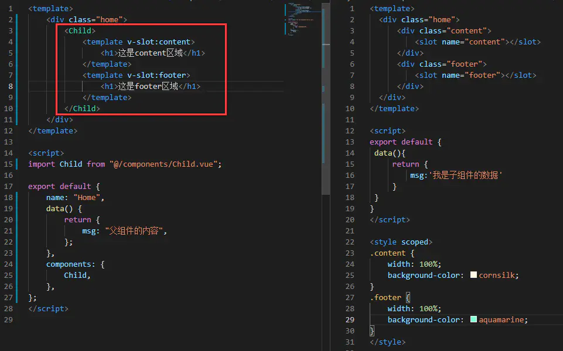

执行结果

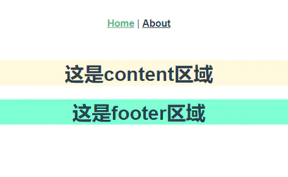

        很显然，v-slot处理具名插槽，现在<template>元素中的所有内容都会将传入相应的插槽，任何没有被包裹在带有v-slot的<template>中的内容都会被视为默认插槽的内容。

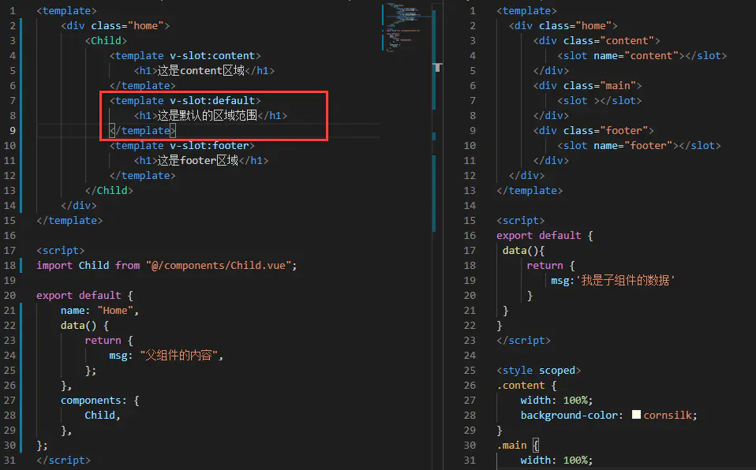

执行结果

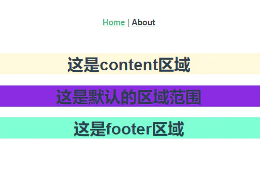

**注意：v-slot只能添加在<template>上**


3、使用v-slot处理作用域
        绑定在 <slot> 元素上的attribute被称为插槽prop，现在在父级作用域中，可以使用带值得v-slot来定义提供的prop的名字。

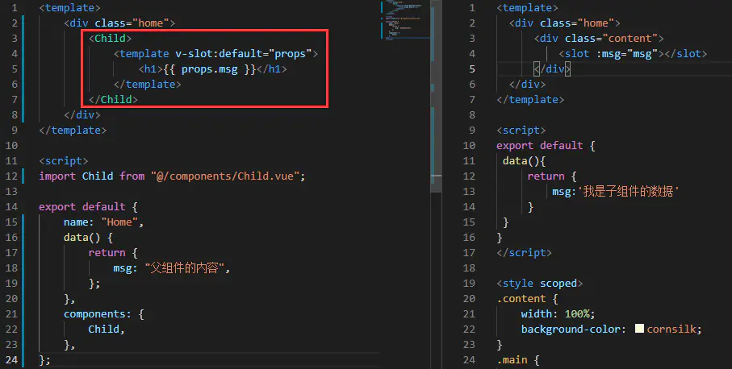
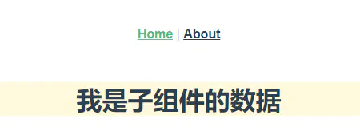

        v-slot插槽指令处理作用域插槽功能。


4、作用域插槽的特殊处理
        在上述情况下，当被提供的内容只有默认插槽时，组件的标签才可以被当作插槽的模板来使用，这样我们就可以把v-slot直接用在组件上。

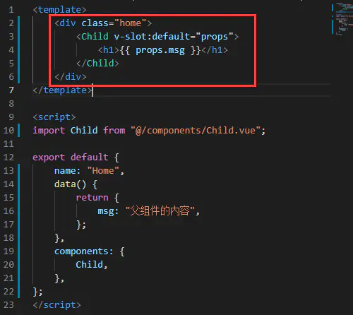

        同时，也可以这样的简写形式去简化代码。
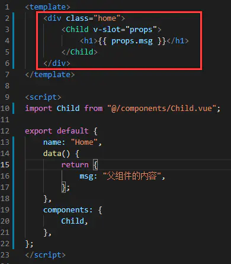

        这样的写法也可以，就像假定没有指明的内容对应默认插槽一样，不带参数的v-slot被假定对应默认插槽。但是这样简写不太建议使用，因为如果默认的插槽只有一个还好，一旦有多个，就不能这样使用。


5、动态插槽
        动态插槽是2.6新增的，动态指令参数可以用在v-slot上，来定义动态的插槽。

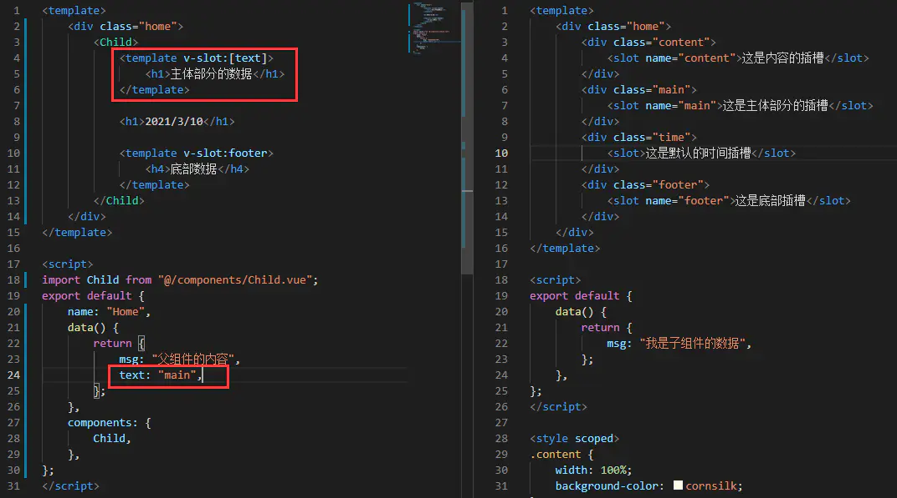

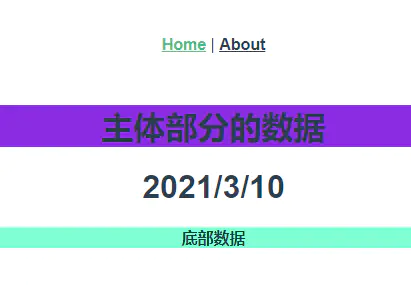

        此时template 标签上的v-solt指令参数是一个中括号, 中括号里的值将是一个变量,为当前父组件的数据


6、具名插槽的缩写
        具名插槽的缩写也是2.6.0新增的，跟v-on和v-bind一样，v-slot也有缩写，即把参数之前的所有内容(v-slot：)替换为字符 # 。例如 v-slot：header可以被重写为 #header：

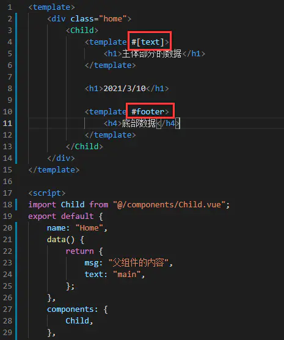

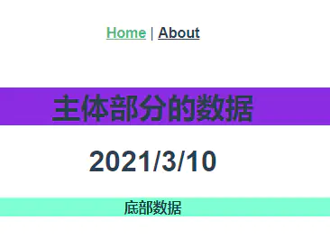


<h2 id='k30'>30. vue2和vue3的响应式核心原理</h2>

```
<body>
    <div>
        <input type="text" id="input">
        <span id="text"></span>
    </div>
    <script>
    var obj = {};
    Object.defineProperty(obj, 'prop', {
        get: function () {
            return val;
        },
        set: function (newVal) {
            val = newVal;
            document.getElementById('text').innerHTML = val;
        }
    });
    document.addEventListener('keyup', function (e) {
        obj.prop = e.target.value;
    });
</script>
</body>

```

```
<body>
    <div>
        <input type="text" id="input">
        <span id="text"></span>
    </div>
</body>
<script>
    var obj = {};
    var obj1 = new Proxy(obj, {
        get: function (target, key, receive) {
            return target[key];
        },
        set: function (target, key, newVal, receive) {
            target[key] = newVal;
            document.getElementById('text').innerHTML = target[key];
        }
    })
    document.addEventListener('keyup', function (e) {
        obj1[0] = e.target.value;
    });
</script>
```
<h2 id='k31'>31. Vue的v-model的实现原理以及常用指令和修饰符</h2>
v-model的实现原理：

```
v-model="msg"等同于 
 <input type="text" :value="msg" @input="msg = $event.target.value" />
运行之后发现和 v-model 的效果一样也实现了双向的数据绑定。
v-model其实是个语法糖，它实际上是做了两步动作：
1、绑定数据value
2、触发输入事件input
一句话概括就是，绑定数据并且监听数据改变
```
Vue的常用指令：

```
v-text、v-html、v-pre、v-once、v-show、v-if、v-else、v-else-if、v-for、v-on、v-bind、v-model
```

Vue的修饰符：

```
.trim   自动过滤用户输入的首尾空格
.number   自动将用户的输入值转化为数值类型
.lazy    默认情况下，v-model同步输入框的值和数据。可以通过这个修饰符，转变为在change事件再同步。
.stop 阻止事件继续传播
.prevent 事件不再重载页面
.once 事件将只会触发一次
.passive 告诉浏览器你不想阻止事件的默认行为
```
<h2 id='k32'>32. Vue.extend、Vue.component与new Vue</h2>

关系：vue构造->vue组件->vue实例
> Vue有几种创建组件实例的方式，还有几种挂在组件的方式。因为刚刚开始学习Vue,很容易混淆，所以这里对Vue.extend()、VueComponent()、new Vue()、new xxx()、{}、$mount()、$el、template和render、createElement()做一个总结。

vue构造、vue组件和vue实例 是不同的概念。
首先在了解上述的方法前，要先了解这几个概念。
### 1.vue构造
vue构造相当于一个对象，不能成为一个Vue组件，其中可以通过Vue.extend()来构造，也可以直接通过对象来构造。其中Vue。extend()在Vue官网上有解释。Vue.extend()

Vue 构造器，创建一个“子类”。参数是一个包含组件选项的对象。

```
// 创建构造器
var Profile = Vue.extend({
  template: '<p>{{firstName}} {{lastName}} aka {{alias}}</p>',
  data: function () {
    return {
      firstName: 'Walter',
      lastName: 'White',
      alias: 'Heisenberg'
    }
  }
})
```

这样，就是一个Vue的构造器。其中也可以不实用这个方法，而直接定义对象。

```
{
	  template: '<p>{{firstName}} {{lastName}} aka {{alias}}</p>',
	  data: function () {
	    return {
	      firstName: 'Walter',
	      lastName: 'White',
	      alias: 'Heisenberg'
	    }
	  }
}
```
> 但是这两种方法构造的变量都不是一个Vue组件，想要创建一个Vue组件，需要使用刚刚的构造器来注册，使之成为一个组件。

### 2.vue组件
Vue组件分为全局组件和局部组件。
> 其中全局组件使用Vue.component(‘组件名’，Vue构造器)的方式来创建。
Vue构造器可以为以上两种方式。

// 构造器1
Vue.component("icom",Vue.extend({
		template:"<h1>这是组件的内容</h1>"
}))

// 构造器2
Vue.component("icom",{
		template:"<h1>这是组件的内容</h1>"
})
// 构造器3第三方模板引入
    Vue.component('templecomponent', function(resolve, reject) {
        $.get("./../xtemplate/com.html").then(function(res) {
            resolve({
                template: res,
                props: ["b"],
                data: function() {
                    return {
                        a: "a"
                    }
                }
            })
        });
    });
> 而局部组件，就是在组件实例的内部使用components：构造器 | 组件 来创建。
可以作用到vue实例或者某个组件中的components属性中并在内部使用apple组件。

```
// 作用到vue实例
new Vue({
  el: '#app',
  components: {
    'component-a': ComponentA,
    'component-b': ComponentB
  }
})

// 作用到某个组件中
var ComponentA = { /* ... */ }
var ComponentB = {
  components: {
    'component-a': ComponentA
  },
  // ...
}
```

> 其中的new Vue()就是创建组件实例的一种方式，说完了Vue组件，接下来就说说组件实例。

### 3.vue实例
> 当要在页面展示时，需要用到组件实例，需要将要展示的组件实例和容器绑定起来。
创建组件实例有两个方法：1. 通过new Vue()； 2.通过new 构造器()。
挂载到容器上也有两个方法：1. 通过$el；2. 通过$mount

```
1. 通过new Vue()
// $el挂载在#app上
new Vue({
  el: '#app',
  data: obj
})

// $mount挂载在app上
const app = new Vue({
  data: obj
})
app.$mount('#app');

// 这样app就可以使用Vue的全局注册的组件，以及组件实例的components中的组件。
new Vue({
  el: '#app',
  components: {
    'component-a': ComponentA,
    'component-b': ComponentB
  }
})
```

2.通过new 构造器()
之前在讲构造器的地方说了有两个方法可以创建构造器，而构造器其实就是一个对象（类），可以通过new来直接创建实例。

```
var Comp = Vue.extend({
  props: ['msg'],
  template: '<div>{{ msg }}</div>'
})

// el挂载，如果构造器有需要的props，则在new中通过propsData传入
var vm = new Comp({
  el:'#app',
  propsData: {
    msg: 'hello'
  }
})

// $mount挂载
new Comp().$mount('#app');
```


> 最后想说，组件的渲染方式也有两种，普通的就是通过字符串模板，即HTML，在通过component。
还可以通过渲染函数——render。
```
// 加载主页面
// new Vue
function initApp(){
	const app = new Vue({
		router,
		store,
		render : (h:CreateElement): Vnode => h(App);
	})
	app.$mount('#app');
}

//Vue.component
Vue.component('anchored-heading', {
  render: function (createElement) {
    return createElement(
      'h' + this.level,   // 标签名称
      this.$slots.default // 子节点数组
    )
  },
}

```

render中的参数是createElement 。createElement 参数
它到底会返回什么呢？其实不是一个实际的 DOM 元素。它更准确的名字可能是 createNodeDescription，因为它所包含的信息会告诉 Vue 页面上需要渲染什么样的节点，包括及其子节点的描述信息。我们把这样的节点描述为“虚拟节点 (virtual node)”，也常简写它为“VNode”。“虚拟 DOM”是我们对由 Vue 组件树建立起来的整个 VNode 树的称呼。

<h2 id='k33'>33. Vue export default中的name属性有哪些作用</h2>

### 1. vue中的name属性作用
1.递归组件运用（指组件自身调用自身组件）
```
 <article>
    <div class="item" v-for="(item,index) in list" :key="index">
      <div class="item-title">
        <span class="item-title-ticket"></span>
        {{item.title}}</div>
        <div v-if="item.children" class="item-children">
        <detail-list :list="item.children"></detail-list> //递归调用
      </div>
    </div>
  </article>
</template>
<script>
export default {
  name: "DetailList",  /*指组件自身调用自身组件*/
  props: {
    list: Array
  },
  data() {
    return {};
  }
};
</script>
```
 
### 2、配合keep-alive对组件缓存做限制（include/exclude="name"）
我们知道 keep-alive的 include和exclude 允许有条件的对组件进行缓存,其中include和exclude所匹配的就是组件的name值。
example:
```
// 组件 a
export default {
  name: 'a',
  data () {
    return {}
  }
}
```

```
<keep-alive include="a">
  <component>
    <!-- name 为 a 的组件将被缓存！ -->
  </component>
</keep-alive>
<keep-alive exclude="a">
  <component>
    <!-- 除了 name 为 a 的组件都将被缓存！ -->
  </component>
</keep-alive>
```

### 3、在dev-tools中使用
在开发中我们经常需要对代码进行调试，在dev-tools中组件是以组件name进行显示的，这样更有语义化，方便我们快速定位到我们需要审查的位置，结构更清晰明了

<h2 id='k34'>34: v-bind="$props"</h2>

v-bind="$props": 可以将父组件的所有props下发给它的子组件,子组件需要在其props:{} 中定义要接受的props。