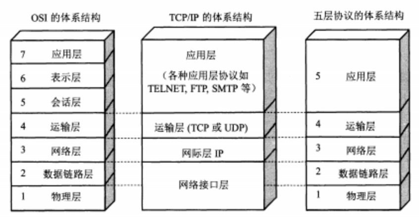
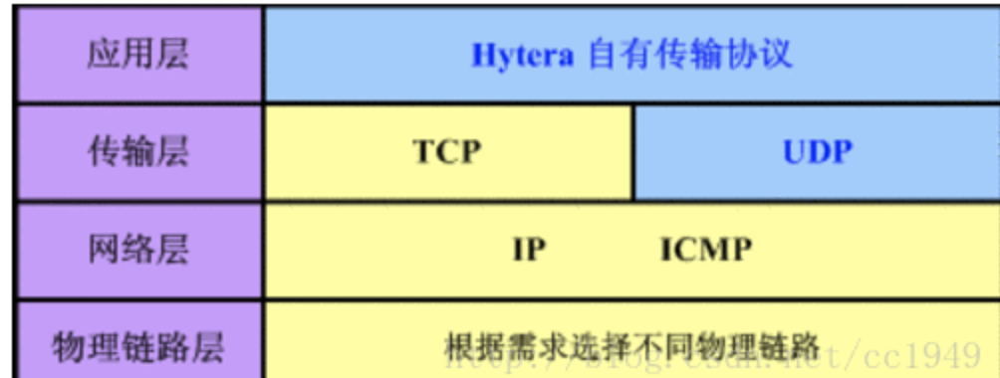
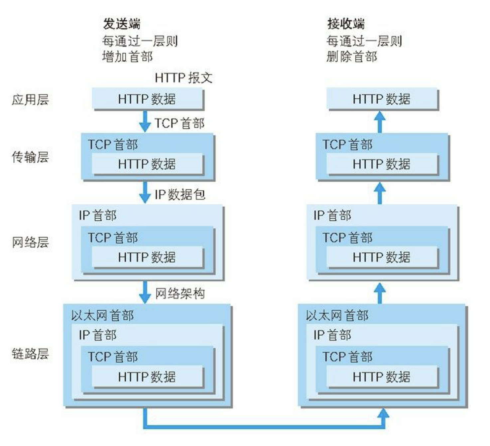

OSI七层模型-tcpIP四层模型 - 五层模型
===

源自http://www.colasoft.com.cn/download/protocols_map.php
## OSI七层模型
> OSI（Open System Interconnection，开放系统互连）七层网络模型称为开放式系统互联参考模型 ，是一个逻辑上的定义，一个规范，它把网络从逻辑上分为了7层。每一层都有相关、相对应的物理设备，比如路由器，交换机。OSI 七层模型是一种框架性的设计方法 ，建立七层模型的主要目的是为解决异种网络互连时所遇到的兼容性问题，其最主要的功能使就是帮助不同类型的主机实现数据传输。它的最大优点是将服务、接口和协议这三个概念明确地区分开来，通过七个层次化的结构模型使不同的系统不同的网络之间实现可靠的通讯。如下图：

## 五层模型

5层只是OSI和TCP/IP的综合，是业界产生出来的非官方协议模型，但是很多具体的应用。实际应用还是TCP/IP的四层结构。为了方便可以把下两层称为网络接口层。五层体系结构包括：应用层、运输层、网络层、数据链路层和物理层。 

## tcp/IP四层模型
4层是指TCP/IP四层模型，主要包括：应用层、传输层、网络层和数据链路层。

## 4层协议和对应的标准7层协议的关系如下图：

## 数据包

从上往下，每经过一层，协议就会在包头上面做点手脚，加点东西，传送到接收端，再层层解套出来，如下示意图：

## 应用层
- HTTP 超文本传输协议
- FTP 文件传输协议
- SMTP 简单邮件传输协议
- TELNET TCP/IP终端仿真协议
- POP3 邮局协议第三版
- Finger 用户信息协议
- NNTP 网络新闻传输协议
- IMAP4 因特网信息访问协议第四版
- LPR UNIX 远程打印协议
- Rwho UNIX 远程 Who协议
- Rexec UNIX远程执行协议
- Login UNIX 远程登陆协议
- RSH UNIX 远程Shell协议
- NTF HP网络文件传输协议
- RDA HP 远程数据库访问协议
- VT 虚拟终端仿真协议
- RFA HP 远程文件访问协议
- RPC Remote Process Comm.
- S-HTTP 安全超文本传输协议
- GDP网关发现协议
- X-Window
- CMOT 基于TCP/IP的CMIP协议
- SOCKS 安全套接字协议
- FANP流属性通知协议
- SLP服务定位协议
- MSN微软网络服务
- Radius 远程用户拨号认证服务协议
- DNS 域名系统
- NFS网络文件系统协议
- NIS SUN 网络信息系统协议
- R-STAT SUN远程状态协议
- NSM SUN 网络状态监测协议
- PMAP SUN 端口映射协议
- Mount
- LPR UNIX远程打印协议
- 常用UDP协议的应用层服务
- BOOTP引导协议
- DHCP动态主机配套协议
- NTP网络时间协议
- TFTP简单文件传输协议
- 
- SNMP简单网络管理协议
## 表示层
- DECnet NSP
- LPP 轻量级表示协议
- NBSSN NetBIOS会话服务协议
- XDP外部数据表示协议
- IPX
## 会话层
- SSL 安全套接字层协议
- TLS传输层安全协议
- DAP目录访问协议
- LDAP轻量级目录访问协议
- RPC远程过程调用协议
- VINES NETRPC
- VFRP
- NeTBIOS
- IPX
- 
## 传输层
- XOT 基于tcp之上的X协议
- Van Jacobson 压缩TCP协议
- ISO-DE ISO 开发环境-------->NetBISO
- TALI 传输适配层接口协议
- DSI、NetBIOS、IP NeTBIOS、ISO-TP SSP、SMB、MSRPC
- UDP用户数据报协议
- RUDP可靠的用户数据报协议
- Mobile IP 移动IP协议
## 网络层
- IP/IPv6 互联网协议/互联网协议第六版
- ICMPv6互联网控制信息协议第六版
- ICMP互联网控制信息协议
- IGMP 互联网组管理协议
- SLIP 串行线路IP协议
- 安全协议
- AH 认证头协议
- ESP 安装封装有效载荷协议
- 路由协议
- EGP 外部网关协议
- OSPF 开放最短路径优先协议
- IGRP 内部网关路由协议
- NHRP 下一跳解析协议
- IE-IRGP 增强内部网关路由选择协议
- RIPng for IPv6 IPv6路由信息协议
- GGP 网关到网关协议
- VRRP 虚拟路由器冗余协议
- PGM 实际通用组播协议
- RSVP 资源预留协议
- PIM-DM 密集模式独立组播协议
- DVMRP 距离矢量组播路由协议
- RIP2 路由信息协议第二版
- PIM-SM 稀疏模式独立组播协议
- MOSPF 组播开放最短路径优先协议
## 数据链路层
- MPLS 多协议标签交换协议
- XTP 压缩传输协议
- DCAP 数据转换客户访问协议
- SLE 串行连接封装协议
- IPinIP IP套IP封装协议
- 隧道协议
- PPTP点对点隧道协议
- L2F第二层转发协议
- L2TP 第二层隧道协议
- ATMP接入隧道管理协议
- Cisco 协议
- CDP 思科发现协议
- CGMP 思科组管理协议
- 地址解析协议
- ARP地址解析协议
- RAR逆向地址解析协议
## 物理层
- IEEE 802.2
- Ethernet v.2
- Internetwork