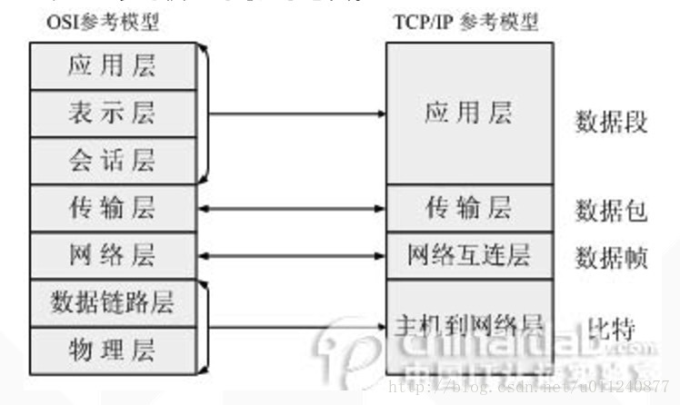

## IP：
网络层协议；（高速公路）

## TCP和UDP：
传输层协议；（卡车:主要解决数据如何在网络中传输）

## HTTP：
应用层协议；（货物: 如何包装数据）。HTTP(超文本传输协议)是利用TCP在两台电脑(通常是Web服务器和客户端)之间传输信息的协议。客户端使用Web浏览器发起HTTP请求给Web服务器，Web服务器发送被请求的信息给客户端。

## SOCKET：
套接字，TCP/IP网络的API。(港口码头/车站)Socket是应用层与TCP/IP协议族通信的中间软件抽象层，它是一组接口。socket是在应用层和传输层之间的一个抽象层，它把TCP/IP层复杂的操作抽象为几个简单的接口供应用层调用已实现进程在网络中通信。

## TCP/IP：
代表传输控制协议/网际协议，指的是一系列协议，TCP/IP 模型在 OSI 模型的基础上进行了简化，变成了四层，从下到上分别为：网络接口层、网络层、传输层、应用层。与 OSI 体系结构对比如下：

## 什么是TCP
TCP(Transmission Control Protocol传输控制协议）是一种面向连接的，可靠的，基于字节流的传输通信协议。

1、tcp(Transmission Control Protocol传输控制协议)

2、传输层协议

3、原因：应用层需要可靠的连接，但是IP层没有这样的流机制

4、面向连接，即在客户端和服务器之间发送数据之间，必须先建立连接

5、位于应用层和IP层之间

6、连接需要建立三次握手、四次挥手断开连接

7、传输数据时可靠的

### TCP连接建立——使用三次握手建立连接
1、客户端发送请求【寻址请求】

2、服务器端收到报文请求，向客户端发回确认报文【确认请求】

3、客户端收到服务端的报文进行回应。【连接请求】

三次握手完成，TCP客户端和服务端成功地建立连接，可以传输数据。

### TCP终止一个连接——四次握手

1、数据验证请求码

2、传输结束标记

3、确认结束标记

4、连接断开标记

## UDP(User Datagram Protocol用户数据报协议)

1、UDP(User Datagram Protocol用户数据报协议)

2、传输层协议

3、无连接的数据报协议

4、不能提供数据报分组，组装和不能对数据报进行排序

5、主要用于不要求分组顺序到达的传输中，分组传输顺序的检查和排序有应用层完成。

6、提供面向事务的简单不可靠传递服务。

7、UDP协议使用端口分别运行在同一台设备上的多个应用程序

8、功能：为了在给定的主句上能识别多个目的的地址，同时允许多个应用程序在同一台主句上工作并能够独立地进行数据包的发送和接受，设计用户数据报协议UDP

## TCP、UDP两者的区别

1、TCP是面向连接的（在客户端和服务器之间传输数据之前要先建立连接），UDP是无连接的（发送数据之前不需要先建立连接）

2、TCP提供可靠的服务（通过TCP传输的数据。无差错，不丢失，不重复，且按序到达）；UDP提供面向事务的简单的不可靠的传输。

3、UDP具有较好的实时性，工作效率比TCP高，适用于对高速传输和实时性比较高的通讯或广播通信。随着网速的提高，UDP使用越来越多。

4、每一条TCP连接只能是点到点的，UDP支持一对一，一对多和多对多的交互通信。

5、TCP对系统资源要去比较多，UDP对系统资源要求比较少

6、UDP程序结构更加简单

7、TCP是流模式，UDP是数据报模式

- 1、字节流是通过二进制进行传输，比如0101010001之类的。
- 2、用户数据传输分为两种协议：udp、tcp。
- 3、UDP协议不建立连接直接传输，每次最大数据64k，打包形式。
- 4、TCP协议是经过三次握手协议(先连接)，安全，数据大小不限，传输速度慢。

Websocket
Websocket协议解决了服务器与客户端全双工通信的问题。

注:什么是单工、半双工、全工通信？
信息只能单向传送为单工；
信息能双向传送但不能同时双向传送称为半双工；
信息能够同时双向传送则称为全双工。

## websocket协议解析
wensocket协议包含两部分:一部分是“握手”，一部分是“数据传输”。

### WebSocket和Socket区别
可以把WebSocket想象成HTTP(应用层)，HTTP和Socket什么关系，WebSocket和Socket就是什么关系。

HTTP 协议有一个缺陷：通信只能由客户端发起，做不到服务器主动向客户端推送信息。

WebSocket 协议在2008年诞生，2011年成为国际标准。所有浏览器都已经支持了。
它的最大特点就是，服务器可以主动向客户端推送信息，客户端也可以主动向服务器发送信息，是真正的双向平等对话，属于服务器推送技术的一种。
