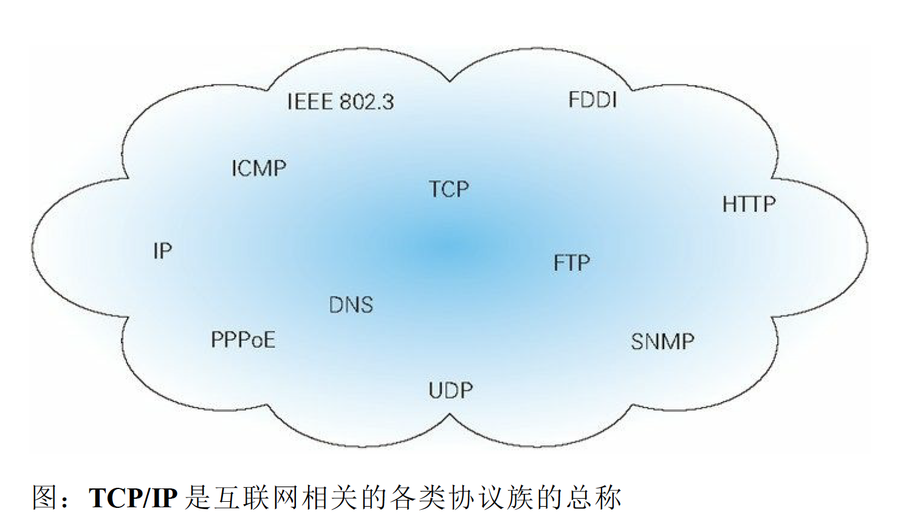

## 基础部分
### 什么是http?
> Web 使用一种名为 HTTP（HyperText Transfer Protocol，超文本传输协
议 1）的协议作为规范，完成从客户端到服务器端等一系列运作流
程。

简单理解就是：一种协议，作为web客户端到服务端通信的规范。

### 发展历史
> 版本0.9, 1.0, 1.1, 2.0

### HTTP作为TCP/IP 协议族的子集

### 网络模型到底是七层，五层，还是四层？
当前存在三种划分网络模型的方式；
- OSI七层模型
- TCP/IP四层模型
- 五层模型
### OSI七层模型

#### 什么是TCP/IP？

> 把与互联网相关联的协议集合起来总称为 TCP/IP。也有说法
认为，TCP/IP 是指 TCP 和 IP 这两种协议。还有一种说法认为，TCP/
IP 是在 IP 协议的通信过程中，使用到的协议族的统称。

#### TCP/IP 的分层管理
##### 为什么要分层？
> 如果互联网只由一个协议统
筹，某个地方需要改变设计时，就必须把所有部分整体替换掉。而分
层之后只需把变动的层替换掉即可。把各层之间的接口部分规划好之
后，每个层次内部的设计就能够自由改动了。
##### 怎么分？
TCP/IP 协议族按层次分别分
为以下 4 层：
- 应用层 
- 传输层 
- 网络层 
- 数据链路层。

###### 应用层
各种应用程序的协议。
> DNS解析成IP并发送http请求

###### 传输层