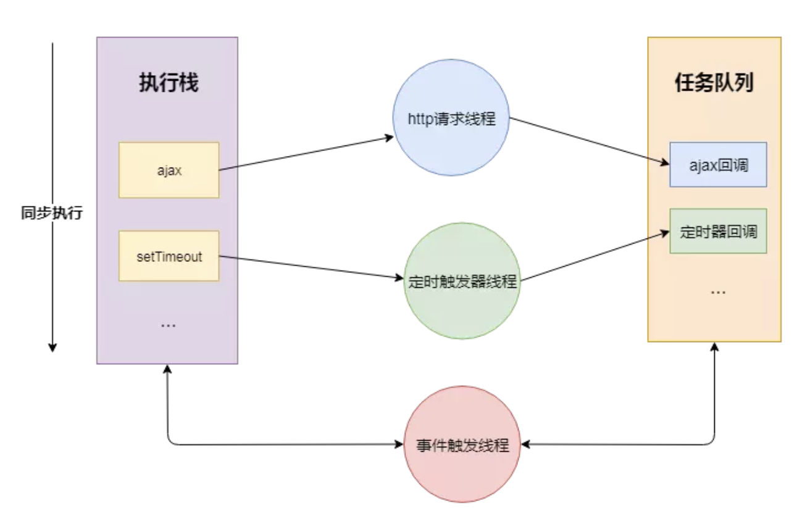
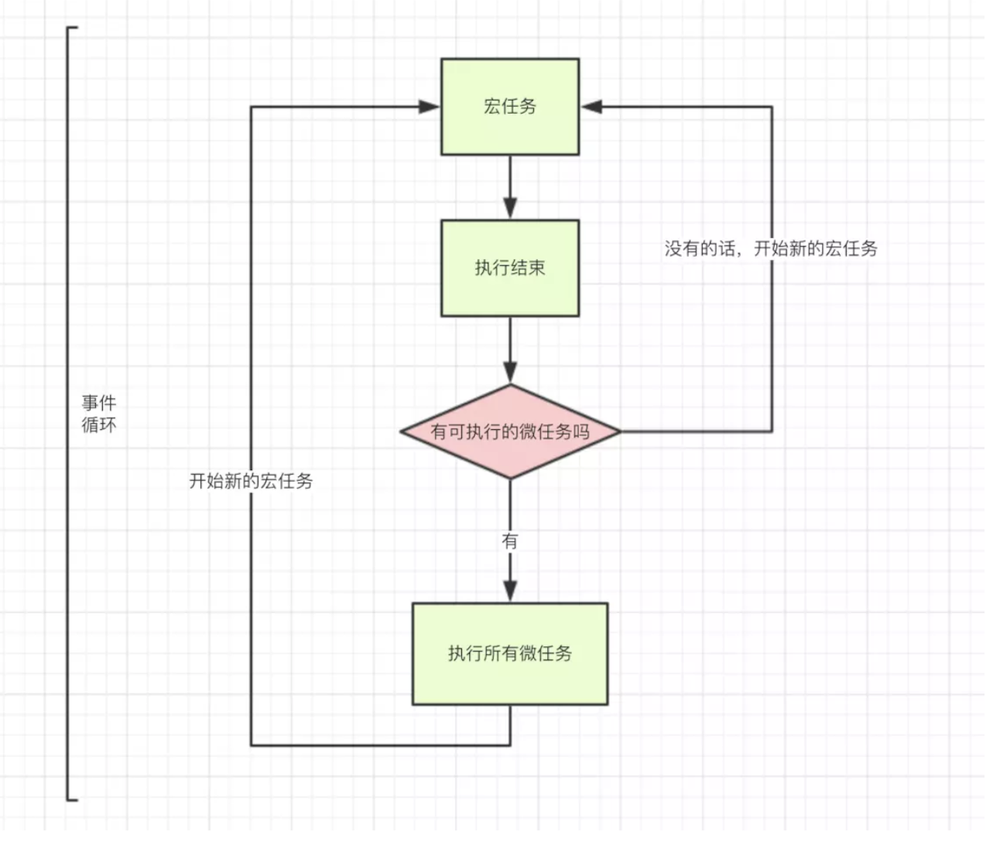

浏览器多进程到JS单线程，JS运行机制
===
## 大纲
- 区分进程和线程
- 浏览器是多进程的
    - 浏览器都包含哪些进程？
    - 浏览器多进程的优势
    - 重点是浏览器内核（渲染进程）
    - Browser进程和浏览器内核（Renderer进程）的通信过程
- 梳理浏览器内核中线程之间的关系
    - GUI渲染线程与JS引擎线程互斥
    - JS阻塞页面加载
    - WebWorker，JS的多线程？
    - WebWorker与SharedWorker
- 简单梳理下浏览器渲染流程
    - load事件与DOMContentLoaded事件的先后
    - css加载是否会阻塞dom树渲染？
    - 普通图层和复合图层

## 区分进程和线程

> 通俗的话：如果把cpu看作一个工厂，那**进程**好比工厂的车间，代表cpu能处理的单个任务，任意时刻cpu总是运行一个进程，其他进程都要停止，**线程**就好比车间的工人.每个线程都共享着内存空间。
> 官方的话：进程是cpu资源分配的最小单位（是能拥有资源和独立运行的最小单位）
线程是cpu调度的最小单位（线程是建立在进程的基础上的一次程序运行单位，一个进程中可以有多个线程）
**根本区别：**
进程是操作系统资源分配的基本单位，而线程是任务调度和执行的基本单位。
- 在开销方面：每个进程都有独立的代码和数据空间（程序上下文），程序之间的切换会有较大的开销；线程可以看做轻量级的进程，同一类线程共享代码和数据空间，每个线程都有自己独立的运行栈和程序计数器（PC），线程之间切换的开销小。
- 所处环境：在操作系统中能同时运行多个进程（程序）；而在同一个进程（程序）中有多个线程同时执行（通过CPU调度，在每个时间片中只有一个线程执行）。
- 内存分配方面：系统在运行的时候会为每个进程分配不同的内存空间；而对线程而言，除了CPU外，系统不会为线程分配内存（线程所使用的资源来自其所属进程的资源），线程组之间只能共享资源。
- 包含关系：没有线程的进程可以看做是单线程的，如果一个进程内有多个线程，则执行过程不是一条线的，而是多条线（线程）共同完成的；线程是进程的一部分，所以线程也被称为轻权进程或者轻量级进程。
## 浏览器是多进程的
- 浏览器是多进程的
- 浏览器之所以能够运行，是因为系统给它的进程分配了资源（cpu、内存）
- 简单点理解，每打开一个Tab页，就相当于创建了一个独立的浏览器进程。
**注意：**在这里浏览器应该也有自己的优化机制，有时候打开多个tab页后，可以在Chrome任务管理器中看到，有些进程被合并了

### 浏览器都包含哪些进程？
- Browser进程：浏览器的主进程（负责协调、主控），只有一个。作用有负责浏览器界面显示，与用户交互。如前进，后退等负责各个页面的管理，创建和销毁其他进程将Renderer进程得到的内存中的Bitmap，绘制到用户界面上网络资源的管理，下载等
- 第三方插件进程：每种类型的插件对应一个进程，仅当使用该插件时才创建
- GPU进程：最多一个，用于3D绘制等
- 浏览器渲染进程（浏览器内核）（Renderer进程，内部是多线程的）：默认每个Tab页面一个进程，互不影响。主要作用为页面渲染，脚本执行，事件处理等强化记忆：在浏览器中打开一个网页相当于新起了一个进程（进程内有自己的多线程）

### 浏览器多进程的优势
相比于单进程浏览器，多进程有如下优点：
>避免单个page crash影响整个浏览器
避免第三方插件crash影响整个浏览器
多进程充分利用多核优势
方便使用沙盒模型隔离插件等进程，提高浏览器稳定性
简单点理解：如果浏览器是单进程，那么某个Tab页崩溃了，就影响了整个浏览器，体验有多差；同理如果是单进程，插件崩溃了也会影响整个浏览器；而且多进程还有其它的诸多优势。

### 重点是浏览器内核（渲染进程）
重点来了，我们可以看到，上面提到了这么多的进程，那么，对于普通的前端操作来说，最终要的是什么呢？答案是**渲染进程**
>可以这样理解，页面的渲染，JS的执行，事件的循环，都在这个进程内进行。接下来重点分析这个进程
请牢记，浏览器的渲染进程是多线程的（这点如果不理解，请回头看进程和线程的区分）
终于到了线程这个概念了?，好亲切。那么接下来看看它都包含了哪些线程（列举一些主要常驻线程）：

1. **GUI渲染线程**
负责渲染浏览器界面，解析HTML，CSS，构建DOM树和RenderObject树，布局和绘制等。
当界面需要重绘（Repaint）或由于某种操作引发回流(reflow)时，该线程就会执行
注意，GUI渲染线程与JS引擎线程是互斥的，当JS引擎执行时GUI线程会被挂起（相当于被冻结了），GUI更新会被保存在一个队列中等到JS引擎空闲时立即被执行。
2. **JS引擎线程**
也称为JS内核，负责处理Javascript脚本程序。（例如V8引擎）
JS引擎线程负责解析Javascript脚本，运行代码。
JS引擎一直等待着任务队列中任务的到来，然后加以处理，一个Tab页（renderer进程）中无论什么时候都只有一个JS线程在运行JS程序
同样注意，GUI渲染线程与JS引擎线程是互斥的，所以如果JS执行的时间过长，这样就会造成页面的渲染不连贯，导致页面渲染加载阻塞。
3. **事件触发线程**
归属于浏览器而不是JS引擎，用来控制事件循环（可以理解，JS引擎自己都忙不过来，需要浏览器另开线程协助）
当JS引擎执行代码块如setTimeOut时（也可来自浏览器内核的其他线程,如鼠标点击、AJAX异步请求等），会将对应任务添加到事件线程中
当对应的事件符合触发条件被触发时，该线程会把事件添加到待处理队列的队尾，等待JS引擎的处理
注意，由于JS的单线程关系，所以这些待处理队列中的事件都得排队等待JS引擎处理（当JS引擎空闲时才会去执行）
4. **定时触发器线程**
传说中的setInterval与setTimeout所在线程
浏览器定时计数器并不是由JavaScript引擎计数的,（因为JavaScript引擎是单线程的, 如果处于阻塞线程状态就会影响记计时的准确）
因此通过单独线程来计时并触发定时（计时完毕后，添加到事件队列中，等待JS引擎空闲后执行）
注意，W3C在HTML标准中规定，规定要求setTimeout中低于4ms的时间间隔算为4ms。
5.**异步http请求线程**
**
在XMLHttpRequest在连接后是通过浏览器新开一个线程请求
将检测到状态变更时，如果设置有回调函数，异步线程就产生状态变更事件，将这个回调再放入事件队列中。再由JavaScript引擎执行。
看到这里，如果觉得累了，可以先休息下，这些概念需要被消化，毕竟后续将提到的事件循环机制就是基于事件触发线程的，所以如果仅仅是看某个碎片化知识，
可能会有一种似懂非懂的感觉。要完成的梳理一遍才能快速沉淀，不易遗忘。放张图巩固下吧：
<div></div>

### Browser进程和浏览器内核（Renderer进程）的通信过程
再谈谈浏览器的Browser进程（控制进程）是如何和内核通信的，
这点也理解后，就可以将这部分的知识串联起来，从头到尾有一个完整的概念。
> 打开一个浏览器，就可以看到：任务管理器中出现了两个进程（一个是主控进程，一个则是打开Tab页的渲染进程），
然后在这前提下，看下整个的过程：(简化了很多)
- Browser进程收到用户请求，首先需要获取页面内容（譬如通过网络下载资源），随后将该任务通过RendererHost接口传递给Render进程
- Renderer进程的Renderer接口收到消息，简单解释后，交给渲染线程，然后开始渲染

    - 渲染线程接收请求，加载网页并渲染网页，这其中可能需要Browser进程获取资源和需要GPU进程来帮助渲染
    - 当然可能会有JS线程操作DOM（这样可能会造成回流并重绘）
    - 最后Render进程将结果传递给Browser进程
- Browser进程接收到结果并将结果绘制出来
### 浏览器内核中线程之间的关系
#### GUI渲染线程与JS引擎线程互斥
>由于JavaScript是可操纵DOM的，如果在修改这些元素属性同时渲染界面（即JS线程和UI线程同时运行），那么渲染线程前后获得的元素数据就可能不一致了。

>因此为了防止渲染出现不可预期的结果，浏览器设置GUI渲染线程与JS引擎为互斥的关系，当JS引擎执行时GUI线程会被挂起，
GUI更新则会被保存在一个队列中等到JS引擎线程空闲时立即被执行。

#### JS阻塞页面加载
> 从上述的互斥关系，可以推导出，JS如果执行时间过长就会阻塞页面。
譬如，假设JS引擎正在进行巨量的计算，此时就算GUI有更新，也会被保存到队列中，等待JS引擎空闲后执行。
然后，由于巨量计算，所以JS引擎很可能很久很久后才能空闲，自然会感觉到巨卡无比。
所以，要尽量避免JS执行时间过长，这样就会造成页面的渲染不连贯，导致页面渲染加载阻塞的感觉。

#### WebWorker，JS的多线程？
前文中有提到JS引擎是单线程的，而且JS执行时间过长会阻塞页面，那么JS就真的对cpu密集型计算无能为力么？
所以，后来HTML5中支持了Web Worker。
MDN的官方解释是：

>Web Worker为Web内容在后台线程中运行脚本提供了一种简单的方法。线程可以执行任务而不干扰用户界面
一个worker是使用一个构造函数创建的一个对象(e.g. Worker()) 运行一个命名的JavaScript文件 
这个文件包含将在工作线程中运行的代码; workers 运行在另一个全局上下文中,不同于当前的window
因此，使用 window快捷方式获取当前全局的范围 (而不是self) 在一个 Worker 内将返回错误
这样理解下：
- 创建Worker时，JS引擎向浏览器申请开一个子线程（子线程是浏览器开的，完全受主线程控制，而且不能操作DOM）
- JS引擎线程与worker线程间通过特定的方式通信（postMessage API，需要通过序列化对象来与线程交互特定的数据）
所以，如果有非常耗时的工作，请单独开一个Worker线程，这样里面不管如何翻天覆地都不会影响JS引擎主线程，
只待计算出结果后，将结果通信给主线程即可，perfect!
而且注意下，JS引擎是单线程的，这一点的本质仍然未改变，Worker可以理解是浏览器给JS引擎开的外挂，专门用来解决那些大量计算问题。
其它，关于Worker的详解就不是本文的范畴了，因此不再赘述。
#### WebWorker与SharedWorker
既然都到了这里，就再提一下SharedWorker（避免后续将这两个概念搞混）
WebWorker只属于某个页面，不会和其他页面的Render进程（浏览器内核进程）共享
所以Chrome在Render进程中（每一个Tab页就是一个render进程）创建一个新的线程来运行Worker中的JavaScript程序。
SharedWorker是浏览器所有页面共享的，不能采用与Worker同样的方式实现，因为它不隶属于某个Render进程，可以为多个Render进程共享使用
所以Chrome浏览器为SharedWorker单独创建一个进程来运行JavaScript程序，在浏览器中每个相同的JavaScript只存在一个SharedWorker进程，不管它被创建多少次。
看到这里，应该就很容易明白了，本质上就是进程和线程的区别。SharedWorker由独立的进程管理，WebWorker只是属于render进程下的一个线程

## 简单梳理下浏览器渲染流程
本来是直接计划开始谈JS运行机制的，但想了想，既然上述都一直在谈浏览器，直接跳到JS可能再突兀，因此，中间再补充下浏览器的渲染流程（简单版本）
为了简化理解，前期工作直接省略成：（要展开的或完全可以写另一篇超长文）
- 浏览器输入url，浏览器主进程接管，开一个下载线程，
然后进行 http请求（略去DNS查询，IP寻址等等操作），然后等待响应，获取内容，
随后将内容通过RendererHost接口转交给Renderer进程

- 浏览器渲染流程开始
浏览器器内核拿到内容后，渲染大概可以划分成以下几个步骤：

- 解析html建立dom树
- 解析css构建render树（将CSS代码解析成树形的数据结构，然后结合DOM合并成render树）
- 布局render树（Layout/reflow），负责各元素尺寸、位置的计算
- 绘制render树（paint），绘制页面像素信息
- 浏览器会将各层的信息发送给GPU，GPU会将各层合成（composite），显示在屏幕上。
所有详细步骤都已经略去，渲染完毕后就是load事件了，之后就是自己的JS逻辑处理了

既然略去了一些详细的步骤，那么就提一些可能需要注意的细节吧。
这里重绘参考来源中的一张图：（参考来源第一篇）
参考：
#### load事件与DOMContentLoaded事件的先后
上面提到，渲染完毕后会触发load事件，那么你能分清楚load事件与DOMContentLoaded事件的先后么？

很简单，知道它们的定义就可以了：
- 当 DOMContentLoaded 事件触发时，仅当DOM加载完成，不包括样式表，图片。
(譬如如果有async加载的脚本就不一定完成)
- 当 onload 事件触发时，页面上所有的DOM，样式表，脚本，图片都已经加载完成了。
（渲染完毕了）
所以，顺序是：DOMContentLoaded -> load

#### css加载是否会阻塞dom树渲染？
这里说的是头部引入css的情况
首先，我们都知道：css是由单独的下载线程异步下载的。
然后再说下几个现象：
css加载**不会**阻塞DOM树解析（异步加载时DOM照常构建）
但会阻塞render树渲染（渲染时需等css加载完毕，因为render树需要css信息）
这可能也是浏览器的一种优化机制。
>因为你加载css的时候，可能会修改下面DOM节点的样式，
如果css加载不阻塞render树渲染的话，那么当css加载完之后，
render树可能又得重新重绘或者回流了，这就造成了一些没有必要的损耗。
所以干脆就先把DOM树的结构先解析完，把可以做的工作做完，然后等你css加载完之后，
在根据最终的样式来渲染render树，这种做法性能方面确实会比较好一点。

#### 普通图层和复合图层
渲染步骤中就提到了composite概念。

可以简单的这样理解，浏览器渲染的图层一般包含两大类：普通图层以及复合图层

首先，普通文档流内可以理解为一个复合图层（这里称为默认复合层，里面不管添加多少元素，其实都是在同一个复合图层中）

其次，absolute布局（fixed也一样），虽然可以脱离普通文档流，但它仍然属于默认复合层。

然后，可以通过硬件加速的方式，声明一个新的复合图层，它会单独分配资源
（当然也会脱离普通文档流，这样一来，不管这个复合图层中怎么变化，也不会影响默认复合层里的回流重绘）

可以简单理解下：GPU中，各个复合图层是单独绘制的，所以互不影响，这也是为什么某些场景硬件加速效果一级棒

可以Chrome源码调试 -> More Tools -> Rendering -> Layer borders中看到，黄色的就是复合图层信息
##### 如何变成复合图层（硬件加速）

将该元素变成一个复合图层，就是传说中的硬件加速技术

最常用的方式：translate3d、translateZ
opacity属性/过渡动画（需要动画执行的过程中才会创建合成层，动画没有开始或结束后元素还会回到之前的状态）
will-chang属性（这个比较偏僻），一般配合opacity与translate使用（而且经测试，除了上述可以引发硬件加速的属性外，其它属性并不会变成复合层），
作用是提前告诉浏览器要变化，这样浏览器会开始做一些优化工作（这个最好用完后就释放）\<video>\<iframe>\<canvas>\<webgl>等元素
其它，譬如以前的flash插件

##### absolute和硬件加速的区别

可以看到，absolute虽然可以脱离普通文档流，但是无法脱离默认复合层。
所以，就算absolute中信息改变时不会改变普通文档流中render树，
但是，浏览器最终绘制时，是整个复合层绘制的，所以absolute中信息的改变，仍然会影响整个复合层的绘制。
（浏览器会重绘它，如果复合层中内容多，absolute带来的绘制信息变化过大，资源消耗是非常严重的）

而硬件加速直接就是在另一个复合层了（另起炉灶），所以它的信息改变不会影响默认复合层
（当然了，内部肯定会影响属于自己的复合层），仅仅是引发最后的合成（输出视图）

##### 复合图层的作用？

一般一个元素开启硬件加速后会变成复合图层，可以独立于普通文档流中，改动后可以避免整个页面重绘，提升性能

但是尽量不要大量使用复合图层，否则由于资源消耗过度，页面反而会变的更卡

##### 硬件加速时请使用index

使用硬件加速时，尽可能的使用index，防止浏览器默认给后续的元素创建复合层渲染

具体的原理时这样的：
**webkit CSS3中，如果这个元素添加了硬件加速，并且index层级比较低，
那么在这个元素的后面其它元素（层级比这个元素高的，或者相同的，并且releative或absolute属性相同的），
会默认变为复合层渲染，如果处理不当会极大的影响性能**

简单点理解，其实可以认为是一个隐式合成的概念：如果a是一个复合图层，而且b在a上面，那么b也会被隐式转为一个复合图层，这点需要特别注意


## 从Event Loop谈JS的运行机制
### 事件循环机制：

- 上面讲了JS引擎线程会维护一个执行栈，执行栈中的所有任务从顶向下同步执行并出栈；
- 但当遇到一些需要异步执行的任务，如ajax、setTimeout等时，会立即返回函数，然后将异步操作交给浏览器内核中的其他模块处理（如timer、network、DOM Binding模块），接着主线程继续往下执行 栈中的任务。
- 当上面说的异步操作完成后如ajax接受完响应、setTimeout到达指定延时；这些任务 即回调函数会被放入到任务队列中。一般不同的异步任务的回调函数会放入不同的任务队列之中。（分为宏任务和微任务；优先执行微任务队列）
- 只有当执行栈为空时，执行引擎才会去看任务队列有无可执行的任务；如果有，就取一个放入到执行栈中执行。执行完后，执行栈为空，便又去检查任务队列。 不断地循环重复上述过程的机制，就是“事件循环(event loop)机制”。

> 此时，已经是属于浏览器页面初次渲染完毕后的事情，JS引擎的一些运行机制分析。
这里不谈可执行上下文，VO，scop chain等概念相关会总结


在知道JS引擎是单线程后再理解一个概念：

- JS分为同步任务和异步任务
- 同步任务都在主线程上执行，形成一个**执行栈**
- 主线程之外，事件触发线程管理着一个**任务队列**，只要异步任务有了**运行结果**，就在任务队列之中放置一个**事件**。
- 一旦执行栈中的所有同步任务执行完毕（此时JS引擎空闲），系统就会读取任务队列，将可运行的异步任务添加到可执行栈中，开始执行。

<div></div>

>看到这里，应该就可以理解了：为什么有时候setTimeout推入的事件不能准时执行？因为可能在它推入到事件列表时，主线程还不空闲，正在执行其它代码，
所以自然有误差。
### 事件循环机制进一步补充
<div></div>
总结：
- JS引擎线程只执行执行栈中的事件
- 执行栈中的代码执行完毕，就会读取事件队列中的事件
- 事件队列中的回调事件，是由各自线程插入到事件队列中的
- 如此循环

#### 单独说说定时器
上述事件循环机制的核心是：JS引擎线程和事件触发线程
>但事件上，里面还有一些隐藏细节，譬如调用setTimeout后，是如何等待特定时间后才添加到事件队列中的？
是JS引擎检测的么？当然不是了。它是由定时器线程控制（因为JS引擎自己都忙不过来，根本无暇分身）
为什么要单独的定时器线程？因为JavaScript引擎是单线程的, 如果处于阻塞线程状态就会影响记计时的准确，因此很有必要单独开一个线程用来计时。
什么时候会用到定时器线程？当使用setTimeout或setInterval时，它需要定时器线程计时，计时完成后就会将特定的事件推入事件队列中。

譬如:
```
setTimeout(function(){
    console.log('hello!');
}, 1000);

这段代码的作用是当1000毫秒计时完毕后（由定时器线程计时），将回调函数推入事件队列中，等待主线程执行

setTimeout(function(){
    console.log('hello!');
}, 0);

console.log('begin');
这段代码的效果是最快的时间内将回调函数推入事件队列中，等待主线程执行
```
注意：

执行结果是：先begin后hello!
虽然代码的本意是0毫秒后就推入事件队列，但是W3C在HTML标准中规定，规定要求setTimeout中低于4ms的时间间隔算为4ms。
(不过也有一说是不同浏览器有不同的最小时间设定)

就算不等待4ms，就算假设0毫秒就推入事件队列，也会先执行begin（因为只有可执行栈内空了后才会主动读取事件队列）
##### setTimeout而不是setInterval
用setTimeout模拟定期计时和直接用setInterval是有区别的。
因为每次setTimeout计时到后就会去执行，然后执行一段时间后才会继续setTimeout，中间就多了误差
（误差多少与代码执行时间有关）
而setInterval则是每次都精确的隔一段时间推入一个事件
（但是，事件的实际执行时间不一定就准确，还有可能是这个事件还没执行完毕，下一个事件就来了）

而且setInterval有一些比较**致命的问题**就是：

>累计效应（上面提到的），如果setInterval代码在（setInterval）再次添加到队列之前还没有完成执行，
就会导致定时器代码连续运行好几次，而之间没有间隔。
就算正常间隔执行，多个setInterval的代码执行时间可能会比预期小（因为代码执行需要一定时间）

>而且把浏览器最小化显示等操作时，setInterval并不是不执行程序，
它会把setInterval的回调函数放在队列中，等浏览器窗口再次打开时，一瞬间全部执行时

>所以，鉴于这么多但问题，目前一般认为的最佳方案是：用setTimeout模拟setInterval，或者特殊场合直接用requestAnimationFrame
**补充**：JS高程中有提到，JS引擎会对setInterval进行优化，如果当前事件队列中有setInterval的回调，不会重复添加。不过，仍然是有很多问题。。。


## 事件循环进阶：js 宏任务和微任务
[可以看看这篇](https://yq.aliyun.com/articles/607031)
简单概括：


>宏任务（macrotask ）和微任务（microtask ）

>macrotask 和 microtask 表示异步任务的两种分类。


>在挂起任务时，JS 引擎会将所有任务按照类别分到这两个队列中，首先在 macrotask 的队列（这个队列也被叫做 task queue）中取出第一个任务，执行完毕后取出 microtask 队列中的所有任务顺序执行；之后再取 macrotask 任务，周而复始，直至两个队列的任务都取完。

**微任务和宏任务的区别**:

- 微任务进入主线程执行是一队一队的, 而宏任务进入主线程是一个一个的。
- 微任务是在主线程空闲时批量执行, 宏任务是在事件循环下一轮的最开始执行

<div></div>

**宏任务和微任务之间的关系**

<div></div>
console.log(1)
    setTimeout(function() {
        console.log(2)
    })
    
    Promise.resolve()
        .then(function() {
            console.log(3)
        })
    
    console.log(4)
    
   // 打印结果: 1 4 3 2
整个的执行过程:

    stack(执行栈)、Micro(微任务)、Macro（宏任务）

    1.初始状态： stack:[], Micro: [], Macro: [script]。执行栈为空, 微任务为空, 宏任务队列中有一个整体的 script代码 
    
    2. 主线程开始执行, 遇到console.log(1), 首先会打印 1 
    
    3. 继续向下执行,遇到 setTimeout异步任务,就将其加入到Macro(宏任务)队列中。等待执行 
    
    4. 继续向下执行, 遇到 Promise.resolve也是一个异步任务,单它是微任务,将其加入 Micro(微任务)队列中,等待着行 
    
    5. 解析console.log(4), 并且打印4。 当主线程执行完打印的结果依次是 1 和 4。
    
    6. 这时候主线程就会问 任务(异步)队列,有没有微任务要执行,将所有的 Micro(微任务)加入执行栈执行, 打印结果 3
    
    7. 微任务执行完了, 就开始下一轮事件循环, 将第一个 Macro(宏任务)压入执行栈执行, 再次打印 2。  

再看个例子
```
setTimeout(() => {
    //执行后 回调一个宏事件
    console.log('内层宏事件3')
}, 0)
console.log('外层宏事件1');

new Promise((resolve) => {
    console.log('外层宏事件2');
    resolve()
}).then(() => {
    console.log('微事件1');
}).then(()=>{
    console.log('微事件2')
})
```
我们看看打印结果
外层宏事件1
外层宏事件2
微事件1
微事件2
内层宏事件3
> > 宏任务先于微任务执行。宏任务包括整体代码script，setTimeout，setInterval；微任务有Promise，process.nextTick。上面的例子就是整体代码script，所以先执行

- 首先浏览器执行js进入第一个宏任务script进入主线程, 遇到 setTimeout  分发到宏任务Event Queue中

- 遇到 console.log() 直接执行 输出 外层宏事件1

- 遇到 Promise， new Promise 直接执行 输出 外层宏事件2

- 执行then 被分发到微任务Event Queue中

- 第一轮宏任务执行结束，开始执行微任务 打印 '微事件1' '微事件2'

- 第一轮微任务执行完毕，执行第二轮宏事件，打印setTimeout里面内容'内层宏事件3'


#### 宏任务
 
\#|浏览器|Node
-|-
script|√|√
setTimeout|√|√
setInterval|√|√
setImmediate|x|√
requestAnimationFrame|√|	x

#### 微任务
\#	|浏览器	|Node
-|-
process.nextTick|	x	|√
MutationObserver|	√|	x
Promise.then catch finally	|√	|√

这个例子看懂基本js执行机制就理解了

```
//主线程直接执行
console.log('1');
//丢到宏事件队列中
setTimeout(function() {
    console.log('2');
    process.nextTick(function() {
        console.log('3');
    })
    new Promise(function(resolve) {
        console.log('4');
        resolve();
    }).then(function() {
        console.log('5')
    })
})
//微事件1
process.nextTick(function() {
    console.log('6');
})
//主线程直接执行
<!-- 所有会进入的异步都是指的事件回调中的那部分代码
也就是说new Promise在实例化的过程中所执行的代码都是同步进行的，而then中注册的回调才是异步执行的。 -->
new Promise(function(resolve) {
    console.log('7');
    resolve();
}).then(function() {
    //微事件2
    console.log('8')
})
//丢到宏事件队列中
setTimeout(function() {
    console.log('9');
    process.nextTick(function() {
        console.log('10');
    })
    new Promise(function(resolve) {
        console.log('11');
        resolve();
    }).then(function() {
        console.log('12')
    })
})
```
- 首先浏览器执行js进入第一个宏任务进入主线程, 直接打印console.log('1')

- 遇到 setTimeout  分发到宏任务Event Queue中

- 遇到 process.nextTick 丢到微任务Event Queue中

- 遇到 Promise， new Promise 直接执行 输出 console.log('7');

- 执行then 被分发到微任务Event Queue中

- 第一轮宏任务执行结束，开始执行微任务 打印 6,8

- 第一轮微任务执行完毕，执行第二轮宏事件，执行setTimeout

- 先执行主线程宏任务，然后主线程就会问 任务(异步)队列,有没有微任务要执行，再执行微任务，打印'2,4,3,5'

- 在执行第二个setTimeout,同理打印 ‘9,11,10,12’

- 整段代码，共进行了三次事件循环，完整的输出为1，7，6，8，2，4，3，5，9，11，10，12。

>以上是在浏览器环境下执行的数据，只作为宏任务和微任务的分析，我在node环境下测试打印出来的顺序为：1，7，6，8，2，4，9，11，3，10，5，12。node环境执行结果和浏览器执行结果不一致的原因是：浏览器的Event loop是在HTML5中定义的规范，而node中则由libuv库实现。libuv库流程大体分为6个阶段：timers，I/O callbacks，idle、prepare，poll，check，close callbacks，和浏览器的microtask，macrotask那一套有区别。


## 参考：
[从浏览器多进程到JS单线程，JS运行机制最全面的一次梳理](https://segmentfault.com/a/1190000012925872#articleHeader17)

[深入解析浏览器的幕后工作原理](https://www.cnblogs.com/lhb25/p/how-browsers-work.html)

[js 宏任务和微任务](https://www.cnblogs.com/wangziye/p/9566454.html)
