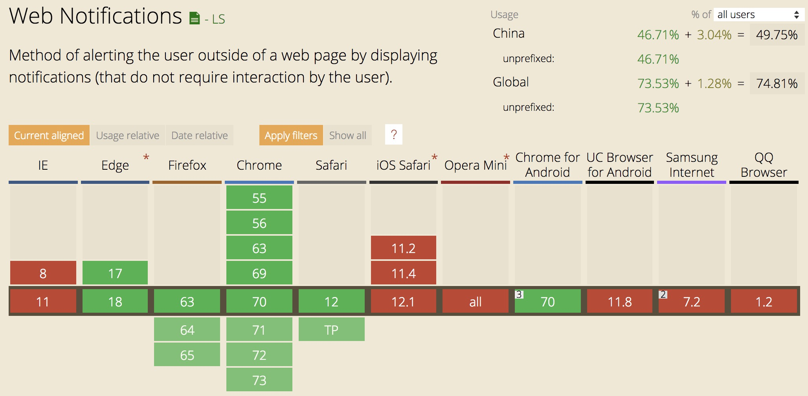

### Notification 浏览器的消息推送
Notification 对象，存在于window上，可以生成一个通知对象以推送推送浏览器消息通知。

> 这玩意兼容性不咋地，实不实用看场景。对外用户的应用，自然是鸡肋功能，因为你无法知道用户使用的是哪家哪版本的浏览器；对内部系统的帮助则是很大，内部员工使用的浏览器是可控的，为了实现更大的工作效率，该功能可用于比如站内消息、跟踪事务状态变化等的通知，并且，这玩意只要不关闭通知所在的网页，即使浏览器活动标签不是这个网页，依然可以弹出通知，这样就可以在做其他工作的同时及时收到需要的消息了。

实现效果如图(在Windows系统下，是在桌面右下侧图标栏上方弹出)：


对的，就是这个。但是你听我解释..我真的没有下过这个单...

 

进入正文。

Notification 是个构造函数，它上面有三个静态成员：maxActions、permission、requestPermission。

    1. maxActions，这个属性值为2，表示支持的最大的actions数量(actions见下文)。

    2. permission，这个属性有三个值："granted"、"denied"、"default"，default 和 denied 效果一样，表示用户不允许该网站显示通知，granted表示用户允许该网站显示通知。

    3. requestPermission，通过调用这个方法，浏览器会弹出框来让用户确认是否允许消息通知，该方法传入一个回调函数作为参数，用户授权结果作为回调函数的参数给到开发者；该方法返回一个Promise。

代码如下：

```
// 打开chrome浏览器，打开www.baidu.com，打开控制台，然后...
Notification.requestPermission(res =>{ console.log(res); });
/*
 * 返回值
 * Promise {<pending>}
 *   __proto__: Promise
 *   [[PromiseStatus]]: "resolved"
 *   [[PromiseValue]]: "granted"
 *
 * 输出值: granted 因为我点击了允许。
 */

Notification.permission
// 输出: "granted"
```
Notification 构造函数需要2个参数：title，options。

1. title 是消息的标题

2. options 消息的配置信息，含有值：

 - 2.1. body，通知消息的内容，只有Windows系统下Firefox可以显示多行数据，其余环境下只显示单行。

 - 2.2. icon，通知的图标图片地址。

 - 2.3. lang，消息通知的语言，值参考ISO 2 letter language codes

 - 2.4. dir，文字排列方向，三个值：auto、ltr、rtl。只有Windows系统下Firefox浏览器支持...

 - 2.5. image，当没有足够的空间显示通知本身时，用于表示通知的图像的URL。只有Windows系统下Chrome支持...

 - 2.6. tag，在构造函数的选项参数中指定的通知ID(如果有的话)，暂未研究出怎么使用，也没找到详细的使用文档...

 - 2.7. data，返回克隆后的消息格式，暂未研究出怎么使用，也没找到详细的使用文档...

 - 2.8. actions，用户操作行为的数组，暂未研究出怎么使用，也没找到详细的使用文档...

 - 2.9. badge，当没有足够的空间显示通知本身时，用于表示通知的图像的URL。然而测试过支持的浏览器，也没有一个对于这个属性做出反应...

 - 2.10. vibrate，指定具有振动功能的设备发出振动模式，然而在iphone手机上下载了几个浏览器，都未成功弹出通知，所以该值结果还是未知...

 - 2.11. requireInteraction，表示是否需要用户手动关闭通知，默认false，然而即使设置为true，通知也有系统来控制，并不会一直处于活动状态...

 - 2.12. 还有几个还在试验阶段的配置...

综上所述，通过浏览器测试后(Firefox含Mac和Windows、Chrome含Mac和Windows、Safari)，通用的有效配置仅有3个：title，body，icon。

使用代码如下：

```
function createNotify(title,options) {

    var PERMISSON_GRANTED = 'granted';
    var PERMISSON_DENIED = 'denied';
    var PERMISSON_DEFAULT = 'default';

    if (Notification.permission === PERMISSON_GRANTED) {
        notify(title,options);
    } else {
        Notification.requestPermission(function (res) {
            if (res === PERMISSON_GRANTED) {
                notify(title,options);
            }
        });
    }

    function notify($title,$options) {
        var notification = new Notification($title, $options);
    }
}

createNotify('测试通知',{body:'啊啊啊啊啊啊啊啊啊啊啊啊'});
```
Notification 实例上有一些事件：onclick、onerror、onclose(文档表示是要删除的方法)、onshow(文档表示是要删除的方法)；一个方法：close；属性：timestamp消息的时间戳。

代码如下：

```
function createNotify(title,options) {
    var PERMISSON_GRANTED = 'granted';
    var PERMISSON_DENIED = 'denied';
    var PERMISSON_DEFAULT = 'default';
    if (Notification.permission === PERMISSON_GRANTED) {
        notify(title,options);
    } else {
        Notification.requestPermission(function (res) {
            if (res === PERMISSON_GRANTED) {
                notify(title,options);
            }
        });
    }

    function notify($title,$options) {
        var notification = new Notification($title, $options);
        console.log(notification);
        notification.onshow = function(event){ console.log('show : ',event); }
        notification.onclose = function(event){ console.log('close : ',event); }
        notification.onclick = function(event){ 
            console.log('click : ',event);
            notification.close();
        }
    }
}

createNotify('测试通知',{body:'啊啊啊啊啊啊啊啊啊啊啊啊'});

/* 依次打印
 * show:   Event Object(事件对象)，事件的type为"show"
 * click:  Event Object(事件对象)，事件的type为"click"。点击消息后消息被关闭，跳到close事件。
 * close:  Event Object(事件对象)，事件的type为"close"
*/
```
最后，它的兼容性是这样的...


最后，本地测试这玩意需要起个服务来访问(可以用java或者nodejs随便起个简单的)，直接打开html是无效的，估摸着是浏览器处理通知地址的时候所需依赖导致。

就这么多，将就着用。