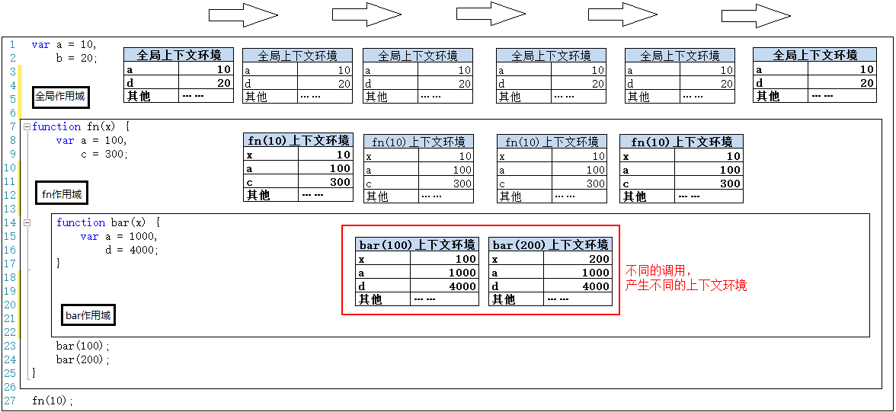
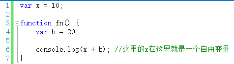
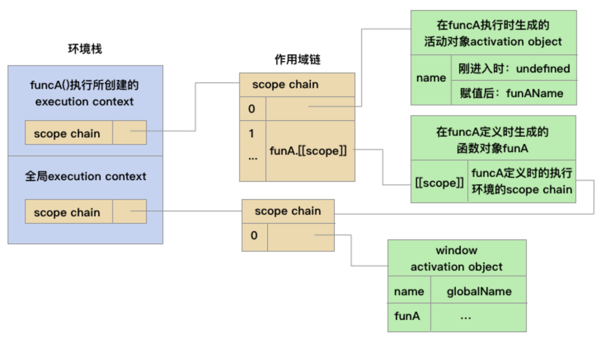

2.2作用域与作用域链
===

https://github.com/mqyqingfeng/Blog/issues/3
#### 1.作用域？

> 变量a的作用域是什么？一会儿又问：函数a的作用域是什么？变量和函数的作用域分别是啥玩意？
我们先来看看“作用域”是什么意思，“作用域”拆开来就是“作用”和“域”
```
作用：访问、操作、调用……
域：区域、范围、空间……
```
**作用域**: 就是变量和函数的可访问范围，或者说变量或函数起作用的区域。

1.javascript函数的作用域：
> 函数内的区域，就是这个函数的作用域，变量和函数在这个区域都可以访问操作。最外层函数外的区域叫全局作用域，函数内的区域叫局部作用域。

2.javascript变量的作用域：
> 在源代码中变量所在的区域，就是这个变量的作用域，变量在这个区域内可以被访问操作。在全局作用域上定义的变量叫全局变量，在函数内定义的变量叫局部变量。

简单地理解，JS源代码被函数{ }划分成一块一块的区域，这些区域换个身份就是某函数或某变量的作用域，变量的作用域和函数的作用域在源代码中有可能指的是同一块区域。

1. javascript除了全局作用域之外，只有函数可以创建的作用域。
2. 作用域最大的用处就是隔离变量，不同作用域下同名变量不会有冲突。
3. 作用域在函数定义时就已经确定了。而不是在函数调用时确定。
**一张图总结作用域**：



>作用域只是一个“地盘”，一个抽象的概念，其中没有变量。要通过作用域对应的执行上下文环境来获取变量的值。同一个作用域下，不同的调用会产生不同的执行上下文环境，继而产生不同的变量的值。所以，作用域中变量的值是在执行过程中产生的确定的，而作用域却是在函数创建时就确定了。
所以，如果要查找一个作用域下某个变量的值，就需要找到这个作用域对应的执行上下文环境，再在其中寻找变量的值。

> **词法作用域**是  作用域的一种工作模型”，作用域有两种工作模型，在JavaScript中的词法作用域是比较主流的一种，另一种动态作用域（比较少的语言在用）。词法作用域是在你写代码时将变量和块作用域写在哪里来决定，也就是词法作用域是静态的作用域，在你书写代码时就确定了。

#### 2.作用域链
作用域链（Scope Chain）是javascript内部中一种变量、函数查找机制，它决定了变量和函数的作用范围，即作用域链
作用域链：[[scope]]中所存储的执行期上下文对象的集合，这个集合呈链式结构，也可理解为是一个对象列表，所以我们称之为作用域链。
**定义**
> 当访问一个变量时，解释器会首先在当前作用域查找标示符，如果没有找到，就去父作用域找，直到找到该变量的标示符或者不在父作用域中，这就是作用域链。

**产生过程**
- 函数在创建的时候同时也会创建一个包含全局变量对象的作用域链，别急，这时候这个链子上只有一个全局变量对象。
- 下一步，调用函数（不然创建函数干嘛~），此时会有相应的函数执行环境产生，理所当然地会产生一个该执行环境的变量对象（因为每个执行环境都有一个变量对象），那么它就会被当做活动对象被推入作用域链的前端。到这里，一个完整的作用域链产生了，它包含两个变量对象：本地活动对象和全局变量对象。
每个函数在执行时都会有一个执行环境，而每个执行环境中都有相应的变量对象，其实作用域链正是由这些变量对象连接得到。在搜索变量时，会沿着作用域链自下而上进行搜索，如果该变量存在于活动对象中则停止搜索，否则继续向上搜索，直至找到该变量。

**原理**
> 作用域链的形成原理，通过1999年的ECMAScript-262-3th第三版来说明作用域链的形成原理，将会介绍执行环境，变量对象和活动对象，arguments对象，作用域链等几个概念。2009年发布了ECMAScript-262-5th第五版，不同的是取消了变量对象和活动对象等概念，引入了词法环境（Lexical Environments）、环境记录（EnviromentRecord）等新的概念，所以两个版本的概念不要混淆了。

### 几个概念

### 自由变量

在A作用域中使用的变量x，却没有在A作用域中声明（即在其他作用域中声明的），对于A作用域来说，x就是一个自由变量,如下图：



注：自由变量跨作用域取值时，曾经强调过：要去创建这个函数的作用域取值，而不是“父作用域”

[[scope]]：每个JavaScript函数都是一个对象，对象中有些属性我们可以访问，也有些不可以访问，这些属性仅供JavaScript引擎存取，[[scope]]就是其中的一个,内部属性[[scope]]**指向当前的作用域对象**，。
[[scope]]指的就是我们所说的作用域，其中存储了运行期上下文的集合。

运行期上下文指的是：当函数执行时，创建一个称为执行期上下文的内部对象。一个执行期上下文定义了一个函数执行时的环境，函数每次执行时对应的执行上下文都是独一无二的，所以多次调用一个函数会导致创建多个执行上下文，当函数执行完毕，它所产生的执行上下文会被销毁。也就是在预编译过程的时候所产生的（上一篇文章上所说的AO）。


函数被定义的时候，就已经再[[scope]]上创建了一个GO对象（在[[scope]]上存储了一个Global Object对象，在[[scope]]的第一位），接着函数被执行的时候又在[[scope]]上创建了一个AO对象，此时AO对象会被放在[[scope]]作用域链的顶端，GO对象排在函数自身的AO对象的后面；此时AO对象的变量会覆盖同名的GO对象的变量。函数执行过程中，查找变量的时候是从作用域链的最顶端（第一个对象）开始往后查找，就是说先从自身的AO对象查找，如果没有找到的话再沿着作用域链去GO（未必是GO对象，当函数内还嵌套了其它函数的话，[[scope]]上至少存在3个对象，反正就是会继续往下一个对象查找）对象查找；如果在整个作用域链上都找不到想要的属性的话，会抛出一个引用错误异常（ReferenceError）。

```
 var name = 'globalName';
 function funcA() {
      //当funcA()被调用时，刚进入funcA的执行环境，其作用域链最前端的funA activation object里有name属性，值为undefined。
      console.log(name);
      var name = 'funAName';
      console.log(name);
      console.log(age);
 }

 funcA();
 ```
1. 执行环境：函数被调用时会创建一个执行环境和执行环境相应的作用域链
对于每个执行环境，都有三个重要属性
- 变量对象(Variable object，VO)
- 作用域链(Scope chain)
- this
2. 函数对象
​ 在一个函数定义的时候， 会创建一个这个函数对象的[[scope]]属性（内部属性,只有JS引擎可以访问, 但FireFox的几个引擎（SpiderMonkey和Rhino）提供了私有属性__parent__来访问它)，并将这个[[scope]]属性指向定义它的作用域链上。 在这里的问题中，因为funcA定义在全局环境, 所以此时的[[scope]]只是指向全局活动对象window active object。
3. 变量对象：每个执行环境都有一个表示变量的对象即变量对象，全局环境的变量对象一直存在，而像函数那样的局部环境的变量对象只会在执行的过程中存在
4. 活动对象：在一个函数对象被调用的时候，会创建一个活动对象，首先将该函数的每个形参和实参，都添加为该活动对象的属性和值；将该函数体内显示声明的变量和函数，也添加为该活动的的属性（在刚进入该函数执行环境时，未赋值，所以值为undefined，这个是JS的提前声明机制）。
​ 然后将这个活动对象做为该函数执行环境的作用域链的最前端，并将这个函数对象的[[scope]]属性里作用域链接入到该函数执行环境作用域链的后端。


> 在作用域 链中，外部函数的活动对象始终处于第二位，外部函数的外部函数的活动对象处于第三位，......直至作
为作用域链终点的全局执行环境。
  在函数执行过程中，为读取和写入变量的值，就需要在作用域链中查找变量。来看下面的例子。

 ```
  var name = 'globalName';
  function funcA() {
       //当funcA()被调用时，刚进入funcA的执行环境，其作用域链最前端的funA activation object里有name属性，值为undefined。
       console.log(name);
       var name = 'funAName';
       console.log(name);
       console.log(age);
  }

  funcA();
  ```
  

### 延长作用域

延长作用域
有两种方法可以将作用域进行延长:
1. ①、try-catch 语句的catch块
2. ②、with 语句

两个语句都是在原本的作用域最前端进行添加一个变量对象；例如：
```
var name = "global";
function test(){
    var name = "sub";
    with(window){
        console.log(name);
    }
}
test(); // -- "global"
```
所以检索变量时，会先在最前端的window变量对象中检索；当然，在严格模式下已经禁用了with语句，编程时，最好向后兼容，废弃使用with语句；
### 什么是with?
首先来看一段代码:
```
<html>

    <head>
        <script type="text/javascript">
            function validate_email(field, alerttxt) {    
                with(field) {
                    apos = value.indexOf("@")
                    dotpos = value.lastIndexOf(".")
                    if(apos < 1 || dotpos - apos < 2)  {
                        alert(alerttxt);
                        return false
                    } else {
                        return true
                    }
                }
            }

            function validate_form(thisform) {
                with(thisform) {
                    if(validate_email(email, "Not a valid e-mail address!") == false) {
                        email.focus();
                        return false
                    }
                }
            }
        </script>
    </head>

    <body>
        <form action="submitpage.htm" οnsubmit="return validate_form(this);" method="post">
            Email: <input type="text" name="email" size="30">
            <input type="submit" value="Submit">
        </form>
    </body>

</html>
```
>这个是一个网站教程的例子,相信很多人都会有疑问,里面在with ( )中嵌套了if,这个with()是什么方法?这个with()就是和if 一起用的吗?

其实with()和if()没有关系。

with(obj)作用就是将后面的{}中的语句块中的缺省对象设置为obj，那么在其后面的{}语句块中引用obj的方法或属性时可以省略obj.的输入而直接使用方法或属性的名称。比如：
不用with()时：
```
function validate_email(field,alerttxt){
      field.apos=value.indexOf("@")
      field.dotpos=value.lastIndexOf(".")
      if (field.apos<1 || field.dotpos-field.apos<2) {
            alert(alerttxt);
            return false
      }else {
            return true
      }
}
```
**用了with(field)后，上面函数中的field.都可以省略了，减少了输入的工作量。**
with对象能够使我们很方便的使用某个对象的一些属性，而不用每次都去写
对象名.属性 的形式，直接使用对象名
