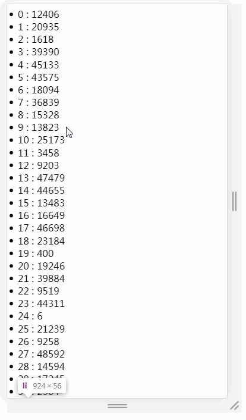

## 最粗暴的做法（一次性渲染）
```
<ul id="container"></ul>
// 记录任务开始时间
let now = Date.now();
// 插入十万条数据
const total = 100000;
// 获取容器
let ul = document.getElementById('container');
// 将数据插入容器中
for (let i = 0; i < total; i++) {
 let li = document.createElement('li');
 li.innerText = ~~(Math.random() * total)
 ul.appendChild(li);
}
console.log('JS运行时间：',Date.now() - now);
setTimeout(()=>{
 console.log('总运行时间：',Date.now() - now);
},0)
// print: JS运行时间： 187
// print: 总运行时间： 2844
```
> 我们对十万条记录进行循环操作，JS的运行时间为187ms，还是蛮快的，但是最终渲染完成后的总时间确是2844ms。

>简单说明一下，为何两次console.log的结果时间差异巨大，并且是如何简单来统计JS运行时间和总渲染时间：

>在 JS 的Event Loop中，当JS引擎所管理的执行栈中的事件以及所有微任务事件全部执行完后，才会触发渲染线程对页面进行渲染

>第一个console.log的触发时间是在页面进行渲染之前，此时得到的间隔时间为JS运行所需要的时间

>第二个console.log是放到 setTimeout 中的，它的触发时间是在渲染>

依照两次console.log的结果，可以得出**结论：**

>对于大量数据渲染的时候，JS运算并不是性能的瓶颈，性能的瓶颈主要在于渲染阶段

## 使用定时器

从上面的例子，我们已经知道，页面的卡顿是由于同时渲染大量DOM所引起的，所以我们考虑将渲染过程分批进行

在这里，我们使用setTimeout来实现分批渲染
```
<ul id="container"></ul>
复制代码
//需要插入的容器
let ul = document.getElementById('container');
// 插入十万条数据
let total = 100000;
// 一次插入 20 条
let once = 20;
//总页数
let page = total/once
//每条记录的索引
let index = 0;
//循环加载数据
function loop(curTotal,curIndex){
    if(curTotal <= 0){
        return false;
    }
    //每页多少条
    let pageCount = Math.min(curTotal , once);
    setTimeout(()=>{
        for(let i = 0; i < pageCount; i++){
            let li = document.createElement('li');
            li.innerText = curIndex + i + ' : ' + ~~(Math.random() * total)
            ul.appendChild(li)
        }
        loop(curTotal - pageCount,curIndex + pageCount)
    },0)
}
loop(total,index);
```

为什么会出现闪屏现象呢

首先，理清一些概念。FPS表示的是每秒钟画面更新次数。我们平时所看到的连续画面都是由一幅幅静止画面组成的，每幅画面称为一帧，FPS是描述帧变化速度的物理量。

大多数电脑显示器的刷新频率是60Hz，大概相当于每秒钟重绘60次，FPS为60frame/s，为这个值的设定受屏幕分辨率、屏幕尺寸和显卡的影响。

因此，当你对着电脑屏幕什么也不做的情况下，大多显示器也会以每秒60次的频率正在不断的更新屏幕上的图像。

**为什么你感觉不到这个变化？**

- 那是因为人的眼睛有视觉停留效应，即前一副画面留在大脑的印象还没消失，紧接着后一副画面就跟上来了， 这中间只间隔了16.7ms(1000/60≈16.7)，所以会让你误以为屏幕上的图像是静止不动的。

- 而屏幕给你的这种感觉是对的，试想一下，如果刷新频率变成1次/秒，屏幕上的图像就会出现严重的闪烁， 这样就很容易引起眼睛疲劳、酸痛和头晕目眩等症状。

- 大多数浏览器都会对重绘操作加以限制，不超过显示器的重绘频率，因为即使超过那个频率用户体验也不会有提升。 因此，最平滑动画的最佳循环间隔是1000ms/60，约等于16.6ms。

直观感受，不同帧率的体验：

- 帧率能够达到 50 ～ 60 FPS 的动画将会相当流畅，让人倍感舒适；

- 帧率在 30 ～ 50 FPS 之间的动画，因各人敏感程度不同，舒适度因人而异；

- 帧率在 30 FPS 以下的动画，让人感觉到明显的卡顿和不适感；

- 帧率波动很大的动画，亦会使人感觉到卡顿。

#### setTimeout 和闪屏现象

- setTimeout的执行时间并不是确定的。在JS中，setTimeout任务被放进事件队列中，只有主线程执行完才会去检查事件队列中的任务是否需要执行，因此setTimeout的实际执行时间可能会比其设定的时间晚一些。

- 刷新频率受屏幕分辨率和屏幕尺寸的影响，因此不同设备的刷新频率可能会不同，而setTimeout只能设置一个固定时间间隔，这个时间不一定和屏幕的刷新时间相同。

以上两种情况都会导致setTimeout的执行步调和屏幕的刷新步调**不一致**。

>在setTimeout中对dom进行操作，必须要等到屏幕下次绘制时才能更新到屏幕上，如果两者步调不一致，就可能导致中间某一帧的操作被跨越过去，而直接更新下一帧的元素，从而导致丢帧现象。

## requestAnimationFrame
>关于requestAnimationFrame

1. requestAnimationFrame会把每一帧中的所有DOM操作集中起来，在一次重绘或回流中就完成，并且重绘或回流的时间间隔紧紧跟随浏览器的刷新频率。
2. 在隐藏或不可见的元素中，requestAnimationFrame将不会进行重绘或回流，这当然就意味着更少的CPU、GPU和内存使用量。
3. requestAnimationFrame是由浏览器专门为动画提供的API，在运行时浏览器会自动优化方法的调用，并且如果页面不是激活状态下的话，动画会自动暂停，有效节省了CPU开销
- 与setTimeout相比，requestAnimationFrame最大的优势是由系统来决定回调函数的执行时机。

- 如果屏幕刷新率是60Hz,那么回调函数就每16.7ms被执行一次，如果刷新率是75Hz，那么这个时间间隔就变成了1000/75=13.3ms，换句话说就是，requestAnimationFrame的步伐跟着系统的刷新步伐走。它能保证回调函数在屏幕每一次的刷新间隔中只被执行一次，这样就不会引起丢帧现象。

我们使用requestAnimationFrame来进行分批渲染：
```
<ul id="container"></ul>
复制代码
//需要插入的容器
let ul = document.getElementById('container');
// 插入十万条数据
let total = 100000;
// 一次插入 20 条
let once = 20;
//每条记录的索引
let index = 0;
//循环加载数据
function loop(curTotal,curIndex){
    if(curTotal <= 0){
        return false;
    }
    //每页多少条
    let pageCount = Math.min(curTotal , once);
    window.requestAnimationFrame(function(){
        for(let i = 0; i < pageCount; i++){
            let li = document.createElement('li');
            li.innerText = curIndex + i + ' : ' + ~~(Math.random() * total)
            ul.appendChild(li)
        }
        loop(curTotal - pageCount,curIndex + pageCount)
    })
}
loop(total,index);
```

**此时页面加载的速度很快，并且滚动的时候，也很流畅没有出现闪烁丢帧的现象。**
## DocumentFragment + requestAnimationFrame
先解释一下什么是 DocumentFragment ，文献引用自MDN

>DocumentFragment，文档片段接口，表示一个没有父级文件的最小文档对象。它被作为一个轻量版的Document使用，用于存储已排好版的或尚未打理好格式的XML片段。最大的区别是因为DocumentFragment不是真实DOM树的一部分，它的变化不会触发DOM树的（重新渲染) ，且不会导致性能等问题。

>可以使用document.createDocumentFragment方法或者构造函数来创建一个空的DocumentFragment

>从MDN的说明中，我们得知DocumentFragments是DOM节点，但并不是DOM树的一部分，可以认为是存在内存中的，所以将子元素插入到文档片段时不会引起页面回流。

>通过 DocumentFragment 的使用，减少 DOM 操作次数，降低回流对性能的影响。并且可以通过 requestAniminationFrame 保证插入新节点操作在页面重绘前执行，二者结合可以实现数据渲染优化。
最后修改代码如下：

<ul id="container"></ul>
```
//需要插入的容器
let ul = document.getElementById('container');
// 插入十万条数据
let total = 100000;
// 一次插入 20 条
let once = 20;
//总页数
let page = total/once
//每条记录的索引
let index = 0;
//循环加载数据
function loop(curTotal,curIndex){
    if(curTotal <= 0){
        return false;
    }
    //每页多少条
    let pageCount = Math.min(curTotal , once);
    window.requestAnimationFrame(function(){
        let fragment = document.createDocumentFragment();
        for(let i = 0; i < pageCount; i++){
            let li = document.createElement('li');
            li.innerText = curIndex + i + ' : ' + ~~(Math.random() * total)
            fragment.appendChild(li)
        }
        ul.appendChild(fragment)
        loop(curTotal - pageCount,curIndex + pageCount)
    })
}
loop(total,index);
```

## requestAnimationFrame 兼容
具体看https://github.com/darius/requestAnimationFrame
```
// requestAnimationFrame polyfill by Erik Möller.
// Fixes from Paul Irish, Tino Zijdel, Andrew Mao, Klemen Slavič, Darius Bacon
// MIT license
if (!Date.now)
  Date.now = function() { return new Date().getTime(); };
(function() {
  'use strict';
  var vendors = ['webkit', 'moz'];
  for (var i = 0; i < vendors.length && !window.requestAnimationFrame; ++i) {
    var vp = vendors[i];
    window.requestAnimationFrame = window[vp+'RequestAnimationFrame'];
    window.cancelAnimationFrame = (window[vp+'CancelAnimationFrame']
                   || window[vp+'CancelRequestAnimationFrame']);
  }
  if (/iP(ad|hone|od).*OS 6/.test(window.navigator.userAgent) // iOS6 is buggy
    || !window.requestAnimationFrame || !window.cancelAnimationFrame) {
    var lastTime = 0;
    window.requestAnimationFrame = function(callback) {
      var now = Date.now();
      var nextTime = Math.max(lastTime + 16, now);
      return setTimeout(function() { callback(lastTime = nextTime); },
                nextTime - now);
    };
    window.cancelAnimationFrame = clearTimeout;
  }
}());
```
使用
```
(function animate(){
  requestAnimationFrame(animate);
  //动画
})();
```