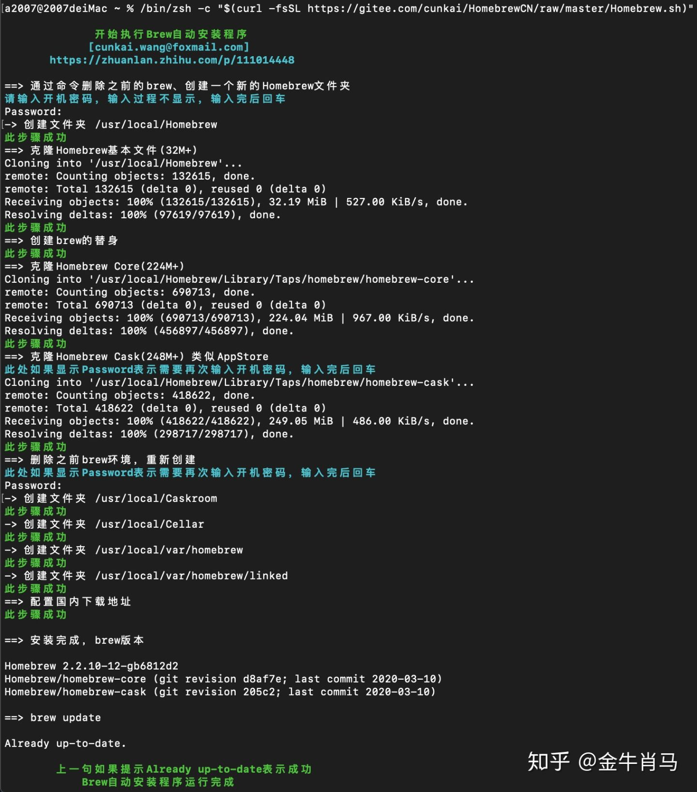
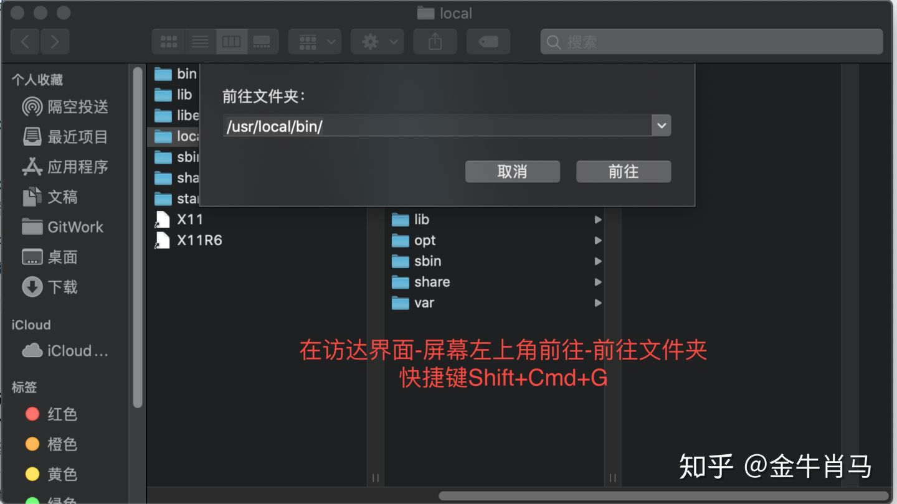

https://zhuanlan.zhihu.com/p/111014448

## 一、自动脚本(全部国内地址)（在Mac os终端中复制粘贴回车下面脚本)
（已经安装过brew的请自行备份后，再运行下面的安装脚本！！！！！）

安装脚本：
```
/bin/zsh -c "$(curl -fsSL https://gitee.com/cunkai/HomebrewCN/raw/master/Homebrew.sh)"
```

卸载脚本：
```
/bin/zsh -c "$(curl -fsSL https://gitee.com/cunkai/HomebrewCN/raw/master/HomebrewUninstall.sh)"
```


成功的话，如上图所示。

## 二、常见错误说明：

0、Mac 10.11系统版本以下的（包括10.11），brew官方已经停止对这类老系统的支持。

1、如果遇到报错中含有errno 54 / 443 / 的问题：

这种一般切换源以后没有问题，因为都是公益服务器，不稳定性很大。

2、检测到你不是最新系统，需要自动升级Ruby后失败的：
```
rm -rf /Users/$(whoami)/Library/Caches/Homebrew/

brew -v
```
如果还失败运行下面文章的脚本。

https://zhuanlan.zhihu.com/p/113176932

## 3、如果报错 command not found : brew

先运行下面命令看是否能出来Homebrew的版本号（结果看倒数3句）
```
/usr/local/Homebrew/bin/brew -v      
再运行设置临时PATH的代码：

export PATH=/usr/local/bin:/usr/bin:/bin:/usr/sbin:/sbin

brew -v
```
如果能用就是电脑PATH配置问题，重启终端运行echo $PATH打印出来自己分析一下。

## 4、如果brew -v没有报错 ， brew update出错的：

这种不影响使用，尝试再次运行brew update可能赶上服务器不稳定的一瞬间。

## 5、brew有一个自检程序，如果有问题自检试试：

```
/usr/local/bin/brew doctor
提示http://github.com的地址问题不用在意，因为换成国内地址了，所以警告
```

## 6、Error: Running Homebrew as root is extremely dangerous and no longer supported.
As Homebrew does not drop privileges on installation you would be giving all
build scripts full access to your system.

原因是执行过su命令，把账户切换到了root权限，退出root权限即可。
一般关闭终端重新打开即可，或者输入命令exit回车 或者su - 用户名

7、如何去一个目录查看：


