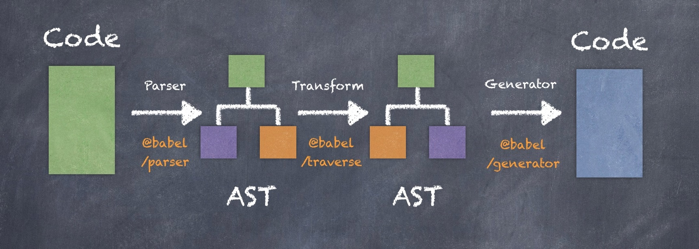

<h1>目录</h1>

&emsp;[1.对webpack的构建流程原理](#w1)

&emsp;[2.webpack，里面的webpack.config.js怎么配置](#w2)

&emsp;[3.webpack本地开发怎么解决跨域的](#w3)

&emsp;[4.如何配置多入口文件](#w4)

&emsp;[5. webpack与grunt、gulp的不同](#w5)

&emsp;[6. 有哪些常见的Loader？他们是解决什么问题的](#w6)

&emsp;[7. 有哪些常见的Plugin？他们是解决什么问题的](#w7)

&emsp;[8. Loader和Plugin的不同](#w8)

&emsp;[9. webpack的构建流程是什么](#w9)

&emsp;[10. 是否写过Loader和Plugin？描述一下编写loader或plugin的思路](#w10)

&emsp;[11. webpack的热更新是如何做到的？说明其原理](#w11)

&emsp;[12. 如何利用webpack来优化前端性能](#w12)

&emsp;[13. 如何提高webpack的构建速度](#w13)

&emsp;[14. 怎么配置单页应用？怎么配置多页应用](#w14)

&emsp;[15. 什么是bundle,什么是chunk，什么是module](#w15)

&emsp;[16. 你的 import 被 webpack 编译成了什么？](#w16)

&emsp;[17. tree shaking？](#w17)
  
&emsp;[18. Babel 工作流程](#w18)

&emsp;[19. Webpack和Rollup对比?](#w19)

&emsp;[20. webpack的resolve.modules和 resolve.alias有什么区别?怎么回事哈啊?](#w20)

&emsp;[21. webpack4 抽离公共代码和 webpack3的区别](#w21)


<h2 id='w1'>1. 对webpack的了解</h2>

[官方文档](https://www.webpackjs.com/concepts/)

2、webpack构建流程（原理）

从启动构建到输出结果一系列过程：

（1）初始化参数：解析webpack配置参数，合并shell传入和webpack.config.js文件配置的参数，形成最后的配置结果。

（2）开始编译：上一步得到的参数初始化compiler对象，注册所有配置的插件，插件监听webpack构建生命周期的事件节点，做出相应的反应，执行对象的 run 方法开始执行编译。

（3）确定入口：从配置的entry入口，开始解析文件构建AST语法树，找出依赖，递归下去。

（4）编译模块：递归中根据文件类型和loader配置，调用所有配置的loader对文件进行转换，再找出该模块依赖的模块，再递归本步骤直到所有入口依赖的文件都经过了本步骤的处理。

（5）完成模块编译并输出：递归完事后，得到每个文件结果，包含每个模块以及他们之间的依赖关系，根据entry配置生成代码块chunk。

（6）输出完成：输出所有的chunk到文件系统。

注意：在构建生命周期中有一系列插件在做合适的时机做合适事情，比如UglifyPlugin会在loader转换递归完对结果使用UglifyJs压缩覆盖之前的结果。

> 本质上，webpack 是一个现代 JavaScript 应用程序的静态模块打包器(module bundler)，将项目当作一个整体，通过一个给定的的主文件，webpack将从这个文件开始找到你的项目的所有依赖文件，使用loaders处理它们，最后打包成一个或多个浏览器可识别的js文件

核心概念：

- 入口(entry)

入口起点`(entry point)`指示 `webpack` 应该使用哪个模块，来作为构建其内部依赖图的开始

可以通过在 `webpack` 配置中配置 `entry` 属性，来指定一个入口起点（或多个入口起点）

```js
module.exports = {
  entry: './path/to/my/entry/file.js'
};
```
- 输出(output)

`output` 属性告诉 `webpack` 在哪里输出它所创建的 `bundles `，以及如何命名这些文件，默认值为 `./dist`

- loader

`loader` 让 `webpack` 能够去处理那些非 `JavaScript` 文件（`webpack` 自身只理解 `JavaScript`）

- 插件(plugins)

`loader` 被用于转换某些类型的模块，而插件则可以用于执行范围更广的任务。插件的范围包括，从打包优化和压缩，一直到重新定义环境中的变量

- 模式

通过选择 `development` 或 `production` 之中的一个，来设置 `mode` 参数，你可以启用相应模式下的 `webpack` 内置的优化

```js
module.exports = {
  mode: 'production'
};
```

<h2 id='w2'>2. webpack，里面的webpack.config.js怎么配置</h2>

```js
let webpack = require('webpack');

module.exports = {
    entry:'./entry.js',  //入口文件
    
    output:{
        //node.js中__dirname变量获取当前模块文件所在目录的完整绝对路径
        path:__dirname, //输出位置
        filename:'build.js' //输入文件
    },
    
    module:{  
        // 关于模块的加载相关，我们就定义在module.loaders中
        // 这里通过正则表达式去匹配不同后缀的文件名，然后给它们定义不同的加载器。
        // 比如说给less文件定义串联的三个加载器（！用来定义级联关系）：
        rules:[
          {
            test:/\.css$/,      //支持正则
            loader:'style-loader!css-loader'
          }
        ]
    },
    
    //配置服务
    devServer:{
        hot:true, //启用热模块替换
        inline:true 
        //此模式支持热模块替换：热模块替换的好处是只替换更新的部分,而不是页面重载.
    },
    
    //其他解决方案配置
    resolve:{ 
        extensions:['','.js','.json','.css','.scss']  
    },
    
    //插件
    plugins:[
        new webpack.BannerPlugin('This file is create by baibai')
    ]

}
```

<h2 id='w3'>3. webpack本地开发怎么解决跨域的</h2>

- 下载 webpack-dev-server 插件
- 配置 webpack.config.js 文件

```js
// webpack.config.js

var WebpackDevServer = require("webpack-dev-server");

module.exports = {
    ...
    
    devServer: {
        ...
        port: '8088', //设置端口号
        // 代理设置
        proxy: {
            '/api': {
                target: 'http://localhost:80/index.php', // 目标代理
                pathRewrite: {'^/api' : ''}, // 重写路径
                secure: false, // 是否接受运行在 HTTPS 上
                
            }
        }
    }
}
```

<h2 id='w4'>4. 如何配置多入口文件</h2>

> 配置多个入口文件

```js
entry: {
  home: resolve(__dirname, "src/home/index.js"),
  about: resolve(__dirname, "src/about/index.js")
}
```

<h2 id='w5'>5. webpack与grunt、gulp的不同</h2>

> 三者都是前端构建工具

> `grunt` 和 `gulp` 是基于任务和流的。找到一个（或一类）文件，对其做一系列链式操作，更新流上的数据， 整条链式操作构成了一个任务，多个任务就构成了整个web的构建流程

> `webpack` 是基于入口的。`webpack` 会自动地递归解析入口所需要加载的所有资源文件，然后用不同的` Loader` 来处理不同的文件，用 `Plugin` 来扩展 `webpack` 功能

> `webpack` 与前者最大的不同就是支持代码分割，模块化（AMD,CommonJ,ES2015），全局分析

[为什么选择webpack](https://webpack.docschina.org/concepts/why-webpack/)

<h2 id='w6'>6. 有哪些常见的Loader？他们是解决什么问题的</h2>

- `css-loader`：加载 `CSS`，支持模块化、压缩、文件导入等特性
- `style-loader`：把 `CSS` 代码注入到 `JavaScript 中`，通过 `DOM` 操作去加载 `CSS`
- `slint-loader`：通过 `SLint` 检查 `JavaScript` 代码
- `babel-loader`：把 `ES6` 转换成 `ES5`
- `file-loader`：把文件输出到一个文件夹中，在代码中通过相对 `URL` 去引用输出的文件
- `url-loader`：和 `file-loader` 类似，但是能在文件很小的情况下以 `base64` 的方式把文件内容注入到代码中去
- source-map-loader 加载额外的 Source Map 文件，以方便断点调试

<h2 id='w7'>7. 有哪些常见的Plugin？他们是解决什么问题的</h2>

- `define-plugin`：定义环境变量
- `commons-chunk-plugin`：提取公共代码
- `AutoWebPlugin`: 管理多个单页应用,


<h2 id='w8'>8. Loader和Plugin的不同</h2>

- loader 加载器

> `Webpack` 将一切文件视为模块，但是 `webpack` 原生是只能解析 `js` 文件. `Loader` 的作用是让 `webpack` 拥有了加载和解析非 `JavaScript` 文件的能力

> 在 `module.rules` 中配置，也就是说他作为模块的解析规则而存在，类型为数组

- Plugin 插件

> 扩展 `webpack` 的功能，让 `webpack` 具有更多的灵活性

> 在 `plugins` 中单独配置。类型为数组，每一项是一个 `plugin` 的实例，参数都通过构造函数传入

<h2 id='w9'>9. webpack的构建流程是什么</h2>

1. 初始化参数：从配置文件和 `Shell` 语句中读取与合并参数，得出最终的参数
2. 开始编译：用上一步得到的参数初始化 `Compiler` 对象，加载所有配置的插件，执行对象的 `run` 方法开始执行编译
3. 确定入口：根据配置中的 `entry` 找出所有的入口文件
4. 编译模块：从入口文件出发，调用所有配置的 `Loader` 对模块进行翻译，再找出该模块依赖的模块，再递归本步骤直到所有入口依赖的文件都经过了本步骤的处理
5. 完成模块编译：在经过第4步使用 `Loader` 翻译完所有模块后，得到了每个模块被翻译后的最终内容以及它们之间的依赖关系
6. 输出资源：根据入口和模块之间的依赖关系，组装成一个个包含多个模块的 `Chunk`，再把每个 `Chunk` 转换成一个单独的文件加入到输出列表，这步是可以修改输出内容的最后机会
7. 输出完成：在确定好输出内容后，根据配置确定输出的路径和文件名，把文件内容写入到文件系统

> 在以上过程中，`Webpack` 会在特定的时间点广播出特定的事件，插件在监听到感兴趣的事件后会执行特定的逻辑，并且插件可以调用 `Webpack` 提供的 `API` 改变 `Webpack` 的运行结果

### 初始化阶段
事件名	解释
- 初始化参数	从配置文件和 Shell 语句中读取与合并参数，得出最终的参数。 这个过程中还会执行配置文件中的插件实例化语句 new Plugin()。
- 实例化 Compiler	用上一步得到的参数初始化 Compiler 实例，Compiler 负责文件监听和启动编译。Compiler 实例中包含了完整的 Webpack 配置，全局只有一个 Compiler 实例。
- 加载插件	依次调用插件的 apply 方法，让插件可以监听后续的所有事件节点。同时给插件传入 compiler 实例的引用，以方便插件通过 compiler 调用 Webpack 提供的 API。
- environment	开始应用 Node.js 风格的文件系统到 compiler 对象，以方便后续的文件寻找和读取。
- entry-option	读取配置的 Entrys，为每个 Entry 实例化一个对应的 EntryPlugin，为后面该 Entry 的递归解析工作做准备。
- after-plugins	调用完所有内置的和配置的插件的 apply 方法。
- after-resolvers	根据配置初始化完 resolver，resolver 负责在文件系统中寻找指定路径的文件。
### 编译阶段
事件名	解释
- run	启动一次新的编译
- watch-run	和run类似，区别在于它是在监听模式下启动的编译，在这个事件中可以获取到是哪些文件发生了变化导致重新启动一次新的编译
- compile	该事件是为了告诉插件一次新的编译将要启动，同时会给插件带上compiler对象。
- compilation	当webpack以开发模式运行时，每当检测到文件变化，一次新的Compilation将被创建。一个Compilation对象包含了当前的模块资源、编译生成资源、变化的文件等。Compilation对象也提供了很多时间回调供插件做扩展。
- make	一个新的Comilation创建完毕，即将从Entry开始读取文件，根据文件类型和配置的Loader对文件进行编译，编译完后再找出该文件依赖的文件，递归的编译和解析。
- after-compile	一次Compilation执行完成
- invalid	当遇到文件不存在、文件编译错误等异常时会触发该事件，该事件不会导致Webpack退出。

> 在编译阶段中，最重要的要数compilation事件了，因为在compilation阶段调用了Loader完成了每个模块的转换操作，在compilation阶段又包括很多小的事件，它们分别是：

事件名	解释
- build-module	使用对应的Loader去转换一个模块
- normal-module-loader	在用Loader对一个模块转换完后，使用acorn解析转换后的内容，输出对应的抽象语法树（AST），以方便Webpack后面对代码的分析
- program	从配置的入口模块开始，分析其AST，当遇到require等导入其它模块语句时，便将其加入到依赖的模块列表，同时对新找出的依赖模块递归分析，最终搞清所有模块的依赖关系。
- seal	所有模块及其依赖的模块都通过Loader转换完成后，根据依赖关系开始生成Chunk
### 输出阶段
事件名	解释
- should-emit	所有需要输出的文件已经生成好，询问插件哪些文件需要输出，哪些不需要
- emit	确定好要输出哪些文件，执行文件输出，可以在这里获取和修改输出内容
- after-emit	文件输出完毕
- done	成功完成一次玩的编译和输出流程
- failed	如果在编译和输出流程中遇到异常导致webpack退出时，就会直接跳转到本步骤，插件可以在本事件中获取到具体的错误原因
在输出阶段已经得到了各个模块经过转换后的结果和其依赖关系，并且把相关模块组合在一起形成一个个Chunk。在输出阶段会根据Chunk的类型，使用对应模板生成最终要输出的文件内容。


<h2 id='w10'>10. 是否写过Loader和Plugin？描述一下编写loader或plugin的思路， 如何在 loader 里做一些异步的操作？</h2>

> 编写 `Loader` 时要遵循单一原则，每个 `Loader` 只做一种"转义"工作。 每个 `Loader` 的拿到的是源文件内容`（source）`，可以通过返回值的方式将处理后的内容输出，也可以调用 `this.callback()` 方法，将内容返回给 `webpack` 。 还可以通过 `this.async() `（在我们所写的 loader 当中，加入异步操作，那么我们需要调用官方提供给我们的 this.async() 这个 api 来实现）生成一个 `callback` 函数，再用这个 `callback`` 将处理后的内容输出出去

> 相对于 `Loader` 而言，`Plugin` 的编写就灵活了许多。 `webpack` 在运行的生命周期中会广播出许多事件，`Plugin` 可以监听这些事件，在合适的时机通过 `Webpack` 提供的 `API` 改变输出结果

<h2 id='w11'>11. webpack的热更新是如何做到的？说明其原理</h2>

webpack的热更新又称热替换（Hot Module Replacement），缩写为HMR。 这个机制可以做到不用刷新浏览器而将新变更的模块替换掉旧的模块。

原理：


**首先要知道server端和client端都做了处理工作**

- 第一步，在 webpack 的 watch 模式下，文件系统中某一个文件发生修改，webpack 监听到文件变化，根据配置文件对模块重新编译打包，并将打包后的代码通过简单的 JavaScript 对象保存在内存中。
- 第二步是 webpack-dev-server 和 webpack 之间的接口交互，而在这一步，主要是 dev-server 的中间件 webpack-dev-middleware 和 webpack 之间的交互，webpack-dev-middleware 调用 webpack 暴露的 API对代码变化进行监控，并且告诉 webpack，将代码打包到内存中。
- 第三步是 webpack-dev-server 对文件变化的一个监控，这一步不同于第一步，并不是监控代码变化重新打包。当我们在配置文件中配置了devServer.watchContentBase 为 true 的时候，Server 会监听这些配置文件夹中静态文件的变化，变化后会通知浏览器端对应用进行 live reload。注意，这儿是浏览器刷新，和 HMR 是两个概念。
- 第四步也是 webpack-dev-server 代码的工作，该步骤主要是通过 sockjs（webpack-dev-server 的依赖）在浏览器端和服务端之间建立一个 websocket 长连接，将 webpack 编译打包的各个阶段的状态信息告知浏览器端，同时也包括第三步中 Server 监听静态文件变化的信息。浏览器端根据这些 socket 消息进行不同的操作。当然服务端传递的最主要信息还是新模块的 hash 值，后面的步骤根据这一 hash 值来进行模块热替换。
webpack-dev-server/client 端并不能够请求更新的代码，也不会执行热更模块操作，而把这些工作又交回给了 webpack，webpack/hot/dev-server 的工作就是根据 webpack-dev-server/client 传给它的信息以及 dev-server 的配置决定是刷新浏览器呢还是进行模块热更新。当然如果仅仅是刷新浏览器，也就没有后面那些步骤了。
HotModuleReplacement.runtime 是客户端 HMR 的中枢，它接收到上一步传递给他的新模块的 hash 值，它通过 JsonpMainTemplate.runtime 向 server 端发送 Ajax 请求，服务端返回一个 json，该 json 包含了所有要更新的模块的 hash 值，获取到更新列表后，该模块再次通过 jsonp 请求，获取到最新的模块代码。这就是上图中 7、8、9 步骤。
而第 10 步是决定 HMR 成功与否的关键步骤，在该步骤中，HotModulePlugin 将会对新旧模块进行对比，决定是否更新模块，在决定更新模块后，检查模块之间的依赖关系，更新模块的同时更新模块间的依赖引用。
- 最后一步，当 HMR 失败后，回退到 live reload 操作，也就是进行浏览器刷新来获取最新打包代码。

具体可以参考 [这里](https://github.com/Jocs/jocs.github.io/issues/15)

<h2 id='w12'>12. 如何利用webpack来优化前端性能</h2>

- 压缩代码。删除多余的代码、注释、简化代码的写法等等方式
- 利用 `CDN` 加速。在构建过程中，将引用的静态资源路径修改为 `CDN` 上对应的路径
- 删除死代码 `Tree Shaking）`。将代码中永远不会走到的片段删除掉
- 优化图片，对于小图可以使用 `base64` 的方式写入文件中
- 按照路由拆分代码，实现按需加载，提取公共代码
- 给打包出来的文件名添加哈希，实现浏览器缓存文件

<h2 id='w13'>13. 如何提高webpack的构建速度</h2>
- 多入口情况下，使用CommonsChunkPlugin来提取公共代码
- 通过externals配置来提取常用库
- 利用DllPlugin和DllReferencePlugin预编译资源模块 通过DllPlugin来对那些我们引用但是绝对不会修改的npm包来进行预编译，再通过DllReferencePlugin将预编译的模块加载进来。
- 使用Happypack 实现多线程加速编译
- 使用webpack-uglify-parallel来提升uglifyPlugin的压缩速度。 原理上webpack-uglify-parallel采用了多核并行压缩来提升压缩速度
- 使用Tree-shaking和Scope Hoisting来剔除多余代码


参考 [这里](https://gaodaqian.com/webpack4/11%E6%8F%90%E5%8D%87%20webpack%20%E7%9A%84%E6%9E%84%E5%BB%BA%E9%80%9F%E5%BA%A6.html)

<h2 id='w14'>14. 怎么配置单页应用？怎么配置多页应用</h2>

- 单页应用可以理解为 `webpack` 的标准模式，直接在 `entry` 中指定单页应用的入口即可
- 多页应用的话，可以使用 `webpack` 的 `AutoWebPlugin` 来完成简单自动化的构建，但是前提是项目的目录结构必须遵守他预设的规范

<h2 id='w15'>15. 什么是bundle,什么是chunk，什么是module</h2>

- `bundle` 是由 `webpack` 打包出来的文件，
- `chunk` 是指 `webpack` 在进行模块的依赖分析的时候，代码分割出来的代码块。
- `module`是开发中的单个模块

<h2 id='w16'>16. 你的 import 被 webpack 编译成了什么？</h2>

import moduleName from 'xxModule'和import('xxModule')经过webpack编译打包后最终变成了什么？在浏览器中是怎么运行的？

> import经过webpack打包以后变成一些Map对象，key为模块路径，value为模块的可执行函数；

> 代码加载到浏览器以后从入口模块开始执行，其中执行的过程中，最重要的就是webpack定义的c，负责实际的模块加载并执行这些模块内容，返回执行结果，其实就是读取Map对象，然后执行相应的函数；

> 当然其中的**异步方法**（import('xxModule')）比较特殊一些，它会单独打成一个包，采用动态加载的方式，具体过程：当用户触发其加载的动作时，会动态的在head标签中创建一个script标签，然后发送一个http请求，加载模块，模块加载完成以后自动执行其中的代码，主要的工作有两个，更改缓存中模块的状态，另一个就是执行模块代码。

<h2 id='w17'>17. tree shaking?</h2>

> 什么是 tree shaking，即 webpack 在打包的过程中会将没用的代码进行清除(dead code)。一般 dead code 具有一下的特征：

1. 代码不会被执行，不可到达
2. 代码执行的结果不会被用到
3. 代码只会影响死变量（只写不读）
是不是很神奇，那么需要怎么做才能使 tree shaking 生效呢? 

<h2 id='w18'>18. Babel 工作流程?</h2>
> Babel 其实就是一个纯粹的 JavaScript 的编译器，任何一个编译器工作流程大致都可以分为如下三步：

- Parser 解析源文件

- Transfrom 转换

- Generator 生成新文件

Babel 也不例外，如下图所示：


> 因为 Babel 使用是 acorn 这个引擎来做解析，这个库会先将源码转化为抽象语法树 (AST)，再对 AST 作转换，最后将转化后的 AST 输出，便得到了被 Babel 编译后的文件。

那 Babel 是如何知道该怎么转化的呢？答案是通过插件，Babel 为每一个新的语法提供了一个插件，在 Babel 的配置中配置了哪些插件，就会把插件对应的语法给转化掉。插件被命名为 @babel/plugin-xxx 的格式。


<h2 id='w19'>19. Webpack和Rollup对比?</h2>
 
Webpack和Rollup在不同场景下，都能发挥自身优势作用。Webpack对于代码分割和静态资源导入有着“先天优势”，并且支持热模块替换(HMR)，而Rollup并不支持，所以当项目需要用到以上，则可以考虑选择Webpack。但是，Rollup对于代码的Tree-shaking和ES6模块有着算法优势上的支持，若你项目只需要打包出一个简单的bundle包，并是基于ES6模块开发的，可以考虑使用Rollup。
其实Webpack从2.0开始支持Tree-shaking，并在使用babel-loader的情况下支持了es6 module的打包了，实际上，Rollup已经在渐渐地失去了当初的优势了。但是它并没有被抛弃，反而因其简单的API、使用方式被许多库开发者青睐，如React、Vue等，都是使用Rollup作为构建工具的。而Webpack目前在中大型项目中使用得非常广泛。
最后，用一句话概括就是：**在开发应用时使用 Webpack，开发库时使用 Rollup**。


<h2 id='w21'>21. webpack4 抽离公共代码和 webpack3的区别</h2>

从webpack4开始官方移除了commonchunk插件，改用了optimization属性进行更加灵活的配置，这也应该是从V3升级到V4的代码修改过程中最为复杂的一部分
