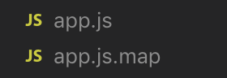
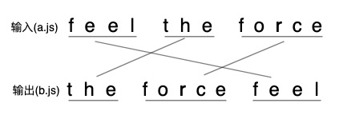
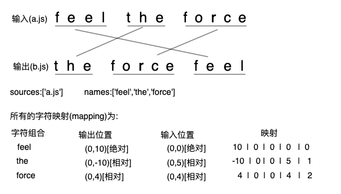

https://segmentfault.com/a/1190000020213957

## 为啥用sourceMap
> 这几天在搞前端错误日志，做过线上发布的都知道，我们发布到生产环境的代码，一般都有如下步骤：

- 压缩混淆，减小体积
- 多个文件合并，减少HTTP请求数
- 通过编译或者转译，将其他语言编译成JavaScript
这三个步骤，都使得实际运行的代码不同于开发代码，不管是 debug 还是捕获线上的报错，都会变得困难重重。

解决这个问题的方法，就是使用sourceMap。

## 啥是sourceMap
- 简单说，sourceMap就是一个文件，里面储存着位置信息。

- 仔细点说，这个文件里保存的，是转换后代码的位置，和对应的转换前的位置。
- 有了它，出错的时候，通过断点工具可以直接显示原始代码，而不是转换后的代码。

## sourceMap长啥样
通过webpack等工具，我们可以使用 sourceMap，这里不细说配置方法，可以看[这里](https://webpack.docschina.org/configuration/devtool/)

sourceMap是一个map文件，与源码在同一个目录下。




在压缩代码的最后一行，会有这样的一个引用：

```
//# sourceMappingURL=app.js.map
```

指向的就是我们的map文件。

sourceMap的格式如下：

```
{
    version : 3, //SourceMap的版本，目前为3
    sources: ["foo.js", "bar.js"], //转换前的文件，该项是一个数组，表示可能存在多个文件合并
    names: ["src", "maps", "are", "fun"], //转换前的所有变量名和属性名
    mappings: "AACvB,gBAAgB,EAAE;AAClB;", //记录位置信息的字符串
    file: "out.js", //转换后的文件名
    sourcesContent: ["\t// The module cache\n", "xxx"], //转换前的文件内容列表，与sources列表依次对应
    sourceRoot : "" //转换前的文件所在的目录。如果与转换前的文件在同一目录，该项为空
}
```
其他的都很好解释，我们详细说一下mappings属性。

## mappings
以"AACvB,gBAAgB,EAAE;AAClB;"为例:

- 每个分号对应转换后源码的一行；
- 每个逗号对应转换后源码的一个位置；
- AACvB代表该位置转换前的源码位置，以VLQ编码表示；

## 位置对应的原理
位置关系的保存经历了诸多步骤和优化，这个不详细说了，想看的可以看[这里](http://www.qiutianaimeili.com/html/page/2019/05/89jrubx1soc.html)，我们只说最后的结果。

在每个位置中：

第一位，表示这个位置在【转换后代码】的第几列。
第二位，表示这个位置属于【sources属性】中的哪一个文件。
第三位，表示这个位置属于【转换前代码】的第几行。
第四位，表示这个位置属于【转换前代码】的第几列。
第五位，表示这个位置属于【names属性】的哪一个变量。

## 举例
假设现在有a.js，内容为feel the force，处理后为b.js，内容为the force feel



以the为例，它在输出中的位置是(0,0)，a.js是sources的第1个(这里只是举例)，输入中的位置是(0,5)，the是names的第2个(这里只是举例)。

那么映射关系为：
0 1 0 5 2

最后将 01052 表示为 Base64 VLQ 即可。

**说明：**

- 所有的值都是以0作为基数
- 第五位不是必需的，如果该位置没有对应names属性中的变量，可以省略第五位
- 每一位都采用VLQ编码表示，由于VLQ编码是可变长的，所以每一位可以由多个字符构成
- 为什么不保存转换后代码的行号，因为我们输出的文件总是一行，这样输出的行号就可以省略，因为都是0，没必要写出来
- 对于输出后的位置来说，到后边会发现它的列号特别大，为了避免这个问题，采用相对位置进行描述
相对位置是啥呢，看示意图：



第一次记录的输入位置和输出位置是绝对的，往后的输入位置和输出位置都是相对上一次的位置移动了多少，例如the的输出位置为(0,-10),因为the在feel的左边数10下才能到这个位置。

## VLQ编码
VLQ是Variable-length quantity 的缩写，是一种通用的、使用任意位数的二进制来表示一个任意大的数字的一种编码方式。这种编码最早用于MIDI文件，后来被多种格式采用，它的特点就是可以非常精简地表示很大的数值，用来节省空间。

这种编码需要用最高位表示连续性，如果是1，代表这组字节后面的一组字节也属于同一个数；如果是0，表示该数值到这就结束了。

这样干巴巴说不太容易懂，还是举个栗子说明一下吧。

如何对数值137进行VLQ编码：

步骤 |	结果
-|-
将137改写成二进制形式	| 10001001
七位一组做分组，不足的补0 | 0000001 0001001
最后一组开头补0，其余补1 |10000001 00001001

所以，137的VLQ编码形式为10000001 00001001

## Base64 VLQ
### 与一般的VLQ的区别：

- 一个Base64字符只能表示 6bit(2^6)的数据
- Base64 VLQ需要能够表示负数，于是用最后一位来作为符号标志位。
- 由于只能用6位进行存储，而第一位表示是否连续的标志，最后一位表示正数/负数。中间只有4位，因此一个单元表示的范围为[-15,15]，如果超过了就要用连续标识位了。

### 表示正负的方式：

如果这组数是某个数值的VLQ编码的第一组字节，那它的最后一位代表"符号"，0为正，1为负；
如果不是，这个位没有特殊含义，被算作数值的一部分。
我们再来举个栗子说明下使用方法。

如何对数值137进行Base64 VLQ编码：

步骤 |	结果
-|-
将137改写成二进制形式	| 10001001
127是正数，末位补0	| 100010010
五位一组做分组，不足的补0	| 01000 10010
将组倒序排序	| 10010 01000
最后一组开头补0，其余补1 |	110010 001000
转64进制	| y和I
所以 137 通过Base64 VLQ表示为yl

### 可以看出：

- 在Base64 VLQ中，编码顺序是从低位到高位
- 而在VLQ中，编码顺序是从高位到低位
