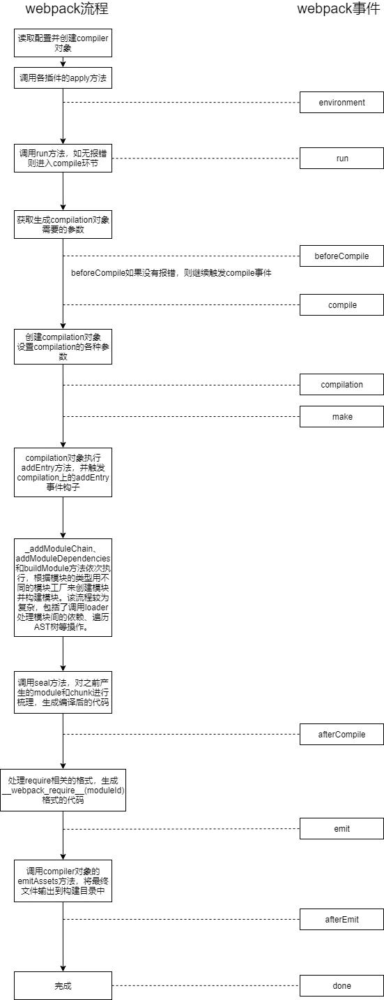

## webpack版本号为4.35.0

### 创建一个最基础的Plugin
首先我们不来扯别的原理，先来看看一个最为基本的webpack plugin结构。

```
// 声明一个js函数
function ExamplePlugin(option) {
  this.option = option
}
// 在函数的原型上声明一个apply方法
ExamplePlugin.prototype.apply = function(compiler) {}
```

你也可以采用ES6来进行编写

```
// 采用ES6
class ExamplePlugin {
  constructor(option) {
    this.option = option
  }
  apply(compiler) {}
}
```

> 以上就是一个最为基本的plugin结构。webpack plugin最为核心的便是这个**apply**方法。
webpack执行时，先生成了插件的实例对象，之后会调用插件上的apply方法，并将compiler对象(webpack实例对象，包含了webpack的各种配置信息...)作为参数传递给apply。
之后我们便可以在apply方法中使用compiler对象去监听webpack在不同时刻触发的各种事件来进行我们想要的操作了。

接下来看一个简单的示例

```
class plugin1 {
  constructor(option) {
    this.option = option
    console.log(option.name + '初始化')
  }
  apply(compiler) {
    console.log(this.option.name + ' apply被调用')

    //在webpack的emit生命周期上添加一个方法
    compiler.hooks.emit.tap('plugin1', (compilation) => {
      console.log('生成资源到 output 目录之前执行的生命周期')
    })
  }
}

class plugin2 {
  constructor(option) {
    this.option = option
    console.log(option.name + '初始化')
  }
  apply(compiler) {
    console.log(this.option.name + ' apply被调用')

    //在webpack的afterPlugins生命周期上添加一个方法
    compiler.hooks.afterPlugins.tap('plugin2', (compilation) => {
      console.log('webpack设置完初始插件之后执行的生命周期')
    })
  }
}

module.exports = {
  entry: './index.js',
  output: {
    filename: 'bundle.js'
  },
  plugins: [
    new plugin1({ name: 'plugin1' }),
    new plugin2({ name: 'plugin2' })
  ]
}

//执行webpack命令后输出结果如下:
/*
plugin1初始化
plugin2初始化
plugin1 apply被调用
plugin2 apply被调用
webpack设置完初始插件之后执行的生命周期
生成资源到 output 目录之前执行的生命周期
*/
```

> 首先webpack会按顺序实例化plugin对象，之后再依次调用plugin对象上的apply方法。
也就是对应输出 plugin1初始化、plugin2初始化、 plugin1 apply被调用、plugin2 apply被调用。
在webpack源代码中我们也可以看到这么一行，options.plugins便是配置文件中的被实例化的plugin数组。


之前我们也提到了，webpack在运行过程中会触发各种事件，而在apply方法中我们能接收一个compiler对象，我们可以通过这个对象监听到webpack触发各种事件的时刻，然后执行对应的操作函数。这套机制类似于Node.js的**EventEmitter**，总的来说就是一个发布订阅模式。

compiler.hooks中定义了各式各样的事件钩子，这些钩子会在不同的时机被执行。而上文中的**compiler.hooks.emit和compiler.hooks.afterPlugin**这两个生命周期钩子，分别对应了设置完初始插件以及生成资源到 output 目录之前这两个时间节点，afterPlugin是在emit之前被触发的，所以输出顺序更靠前。

compiler对象上具体的钩子也可以查看官方文档 compiler钩子。

在继续记下来的内容之前，我们先来对**compiler和compilation**做一个更为详细的介绍。

### compiler和compilation介绍
webpack的compiler模块是其核心部分。其包含了webpack配置文件传递的所有选项，包含了诸如loader、plugins等信息。

我们可以看看Compiler类中定义的一些核心方法。

```
//继承自Tapable类，使得自身拥有发布订阅的能力
class Compiler extends Tapable {
  //构造函数，context实际传入值为process.cwd()，代表当前的工作目录
  constructor(context) {
    super();
    // 定义了一系列的事件钩子，分别在不同的时刻触发
    this.hooks = {
      shouldEmit: new SyncBailHook(["compilation"]),
      done: new AsyncSeriesHook(["stats"]),
      //....更多钩子
    };
    this.running = true;
    //其他一些变量声明
  }

  //调用该方法之后会监听文件变更，一旦变更则重新执行编译
  watch(watchOptions, handler) {
    this.running = true;
    return new Watching(this, watchOptions, handler)
  }
  
  //用于触发编译时所有的工作
  run(callback) {
    //编译之后的处理，省略了部分代码
    const onCompiled = (err, compilation) => {
      this.emitAssets(compilation, err => {...})
    }
  }

  //负责将编译输出的文件写入本地
  emitAssets(compilation, callback) {}

  //创建一个compilation对象，并将compiler自身作为参数传递
  createCompilation() {
    return new Compilation(this);
  }

  //触发编译，在内部创建compilation实例并执行相应操作
  compile() {}


  //以上核心方法中很多会通过this.hooks.someHooks.call来触发指定的事件
  
}
```

> 可以看到，compiler中设置了一系列的事件钩子和各种配置参数，并定义了webpack诸如启动编译、观测文件变动、将编译结果文件写入本地等一系列核心方法。在plugin执行的相应工作中我们肯定会需要通过compiler拿到webpack的各种信息。

#### 接下来看看compilation

如果把compiler算作是总控制台，那么compilation则专注于编译处理这件事上。

在启用Watch模式后，webpack将会监听文件是否发生变化，每当检测到文件发生变化，将会执行一次新的编译，并同时生成新的编译资源和新的compilation对象。

compilation对象中包含了模块资源、编译生成资源以及变化的文件和被跟踪依赖的状态信息等等，以供插件工作时使用。如果我们在插件中需要完成一个自定义的编译过程，那么必然会用到这个对象。

注意: 在webpack-dev-server和webpack-dev-middleware里Watch模式默认开启

### 插件编写示例
首先看一个插件示例，这个插件在我们构建完相关的文件后，会输出一个记录所有构建文件名的filelist.md文件。

```
class myPlugin {
  constructor(option) {
    this.option = option
  }
  apply(compiler) {
    compiler.hooks.emit.tap('myPlugin', compilation => {
      let filelist = '构建后的文件: \n'
      for (var filename in compilation.assets) {
        filelist += '- ' + filename + '\n';
      }

      compilation.assets['filelist.md'] = {
        source: function() {
          return filelist
        },
        size: function() {
          return filelist.length
        }
      }
    })
  }
}
```

在webpack的emit事件被触发之后，我们的插件会执行指定的工作，并将包含了编译生成资源的compilation作为参数传入了函数。我们可以通过compilation.assets拿到生成的文件，并获取其中的filename值。

同样的，我们也可以获取到构建后的文件内容。
接下来我们编写一个插件，将编译后的.js和.css文件进行gzip压缩。

```
const zlib = require('zlib')

class gzipPlugin {
  constructor(option) {
    this.option = option
  }
  apply(compiler) {
    compiler.hooks.emit.tap('myPlugin', compilation => {

      for (var filename in compilation.assets) {
        if (/(.js|.css)/.test(filename)) {
          const gzipFile = zlib.gzipSync(compilation.assets[filename]._value, {
            //压缩等级

            level: this.option.level || 7
          })

          compilation.assets[filename + '.gz'] = {
            source: function () {
              return gzipFile 
            },
            size: function () {
              return gzipFile.length
            }
          }
        }
      }
    })
  }
}

//webpack.config.js中调用
{
  ...
  plugins: [
    new gzipPlugin({
      //设置压缩等级
      level: 9
    })
  ]
}
```

在这个插件中，我们同样监听compiler的emit事件，通过compilation.assets[filename]._value拿到文件内容，之后通过node自带的zlib库便可生成gzip文件了。

压缩后结果如下：


关于gzip的更多实践内容，可以去这篇文章查看 [gzip压缩实践](https://www.jianshu.com/p/89abf4ac1470)

### 异步事件钩子

webpack有些事件钩子是支持异步的。
具体可以通过tapAsync或者tapPromise来实现，接下来看分别看一个示例。

```
class AsyncPlugin {
  apply(compiler) {
    compiler.hooks.emit.tapAsync('asyncEmit', (compilation, callback) => {
      console.log('asyncEmit')
      setTimeout(() => {
        //异步完成后调用callback函数以继续流程
        callback()
      }, 2000)
    })
  }
}

class LogPlugin {
  apply(compiler) {
    compiler.hooks.emit.tapAsync('log', (compilation, callback) => {
      console.log('LogPlugin')
    })
    compiler.hooks.done.tap('done', () => {
      console.log('done')
    })
  }
}

//webpack.config.js中调用
{
  //...
  plugins: [
    new AsyncPlugin(),
    new LogPlugin()
  ]
}
```

以上代码输出顺序如下：asyncEmit，2秒后输出LogPlugin，紧跟着输出done。

使用tapPromise也同理，只需稍稍改变一下写法即可：

```
class AsyncPlugin {
  apply(compiler) {
    compiler.hooks.emit.tapPromise('asyncEmit', compilation => {
      // 返回一个 Promise，在我们的异步任务完成时 resolve……
      return new Promise((resolve, reject) => {
        setTimeout(function() {
          console.log('异步工作完成……')
          resolve()
        }, 1000);
      })
    })
  }
}
```

### 结合Tapable在插件中使用自定义事件

Tapable是一个小型的库，类似于Node.js的EventEmitter类，负责自定义事件的注册和触发。

```
const {SyncHook} = require('tapable')

class MainPlugin {
    apply(compiler) {
        //在hooks上自定义一个名为mainPlugin的钩子
        compiler.hooks.mainPlugin = new SyncHook(['data'])

        //在webpack的environment事件触发时，广播自定义的mainPlugin事件，并传参
        compiler.hooks.environment.tap('mainPlugin', (compilation) => {
            compiler.hooks.mainPlugin.call({
                text: 'MainPlugin Call'
            })
        })
    }
}

class ListenPlugin {
    apply(compiler) {
        //监听自定义的mainPlugin被触发后，执行对应的函数，输出data.text
        compiler.hooks.mainPlugin.tap('listenPlugin', (data) => {
            console.log(data.text)
        })
        
    }
}

//在webpack.config.js中引用

{
  // ...
  plugins: [
    new MainPlugin(),
    new ListenPlugin()
  ]
}
```

> 可以看到，借助tapable我们可以在webpack插件中自定义一些事件，用来进行特定的操作。插件之间也可以通过自定义事件互相调用部分逻辑。

注意：webpack自身的compiler、complation类也是继承自tapable来实现自身事件的注册和触发的。

通过以上的学习，我们接下来对上面的内容进行一个小小的总结。

1. webpack插件本质上是一个函数，它的原型上存在一个名为apply函数。webpack在初始化时 (在最早触发的environment事件之前) 会执行这个函数，并将一个包含了webpack所有配置信息的compiler作为参数传递给apply函数。
2. 插件可以通过监听webpack本身触发的事件，在不同的时间阶段介入进行你想做的操作。
3. 通过获取到的compiler对象，我们可以结合tapable在插件中自定义事件并将其广播。
4. 在插件中监听一些特定的事件 (thisCompilation到afterEmit这个阶段的事件)，你可以拿到一个compilation对象，里面包含了各种编译资源，你可以通过操作这个对象对生成的资源进行添加和修改等操作。

通过上面的学习，相信大家插件的编写和大致原理有了一定的了解和认识。


### webpack执行流程

最后我们来对webpack本身的执行流程进行一个概述，并将其和compiler事件钩子的触发时机进行一个对照。



- webpack首先会读取配置文件，创建compiler对象，之后调用所有插件中的apply方法，并将参数传入其中。

- 在完成之后会广播environment这个事件钩子。然后读取配置文件的entry属性，遍历所有入口js文件。

- 接下来compiler对象会调用run方法，正式开始启动各方面的工作。

- webpack开始为创建compilation对象做准备工作，首先会调用一个newCompilationParams方法，创建compilation对象所需的参数，紧接着立刻广播beforeCompile和compile这两个事件。之后compilation对象被创建，并广播compilation和make事件。

- webpack接下来就开始了编译相关的工作。调用loader处理各模块之间的依赖，对每一个require调用对应的loader进行加工，再将加工后的文件处理生成AST抽象语法树并遍历这颗抽象语法树，构建该模块所依赖的模块。最后再将所有模块中的require语法转换成 __webpack_require__。

- 以上步骤完成之后webpack会触发emit事件，你可以在这个事件中通过compilation.assets拿到生成的各种资源。最后，webpack通过compiler的emitAssets方法将文件输出到对应的构建目录中，操作完成。

本文篇幅有限，对webpack流程只是进行了一个简单的介绍，但通过对流程的学习和了解，你能够更合理地运用、编写插件。
[Webpack揭秘——走向高阶前端的必经之路](https://juejin.im/post/5badd0c5e51d450e4437f07a)

[
细说 webpack 之流程篇](https://juejin.im/entry/6844903446114484237)
